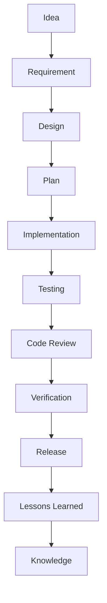

# EasyVibeCoding V0.1 — Repository Bootstrap Prompt

你现在是一个资深的：

- Open Source Maintainer
- Software Architect
- AI Coding Engineer
- Technical Writer
- Developer Experience Engineer
- QA Engineer
- GitHub Repository Designer

你的任务是：

> **从当前空目录开始，创建一个完整、高质量、可长期维护的 GitHub 开源项目：EasyVibeCoding V0.1。**

项目定位：

> **EasyVibeCoding — An open-source playbook for building software with AI.**

中文定位：

> **让不会编程的人，也能用 AI 按工程化方式做出真正能运行的软件。**

------

# 0. 最重要的工作原则

你不是在“生成一堆 Markdown”。

你是在建立一个：

> **面向小白的 Vibe Coding 工程化知识库 + Skill Registry + Prompt Library + Real Cases + Failure Cases + Benchmark。**

必须优先考虑：

1. 结构清晰
2. 内容真实
3. 可复用
4. 可验证
5. 可维护
6. 对初学者友好
7. 对开发者有实际价值
8. 为未来网站、CLI、Skill Registry、Benchmark 扩展留下空间

不要为了“文件数量很多”而生成大量低质量内容。

------

# 1. 项目核心理念

EasyVibeCoding 的核心不是：

```text
收集 Prompt
```

而是：

```text
Prompt
+
Skill
+
Workflow
+
Case
+
Failure
+
Verification
+
Benchmark
+
Learning Path
```

建立完整的：

```text
Idea
 ↓
Requirement
 ↓
Design
 ↓
Plan
 ↓
Implementation
 ↓
Testing
 ↓
Review
 ↓
Verification
 ↓
Release
```

------

# 2. 七条核心原则

在所有内容中保持一致：

## Principle 01

Understand before coding.

## Principle 02

Small tasks over giant prompts.

## Principle 03

Reuse before reinvent.

## Principle 04

Evidence over claims.

## Principle 05

Human owns decisions.

## Principle 06

Every mistake becomes knowledge.

## Principle 07

From Prompt to Production.

------

# 3. 不允许伪造事实

这是最高优先级规则之一。

你不得伪造：

- 测试结果
- Benchmark 结果
- Skill 验证状态
- GitHub Stars
- 模型能力
- 工具兼容性
- 实际运行截图
- 实际性能数据
- 实际案例结果
- “已经验证”的结论

如果当前并没有真实执行：

不要写：

```text
✅ Tested
✅ Verified
✅ Production Ready
```

应该写：

```text
⚠️ Not Yet Verified
```

或者：

```text
Status: experimental
```

所有无法实际验证的信息，必须明确标记为：

```text
Unverified
```

------

# 4. 技术原则

这是一个 Markdown / YAML / Python Validator 为主的开源内容仓库。

V0.1 不需要：

- Web App
- 后端服务
- 数据库
- AI API
- SaaS
- 登录系统

不要自行增加这些无关复杂度。

V0.1 的目标是把：

> 内容标准 + Skill 标准 + Case 标准 + Validator + CI

做好。

------

# 5. 创建完整目录

创建以下目录和文件：

```text
EasyVibeCoding/
│
├── README.md
├── LICENSE
├── CONTRIBUTING.md
├── CODE_OF_CONDUCT.md
├── SECURITY.md
├── SUPPORT.md
├── CHANGELOG.md
├── AGENTS.md
│
├── .gitignore
├── .editorconfig
├── .markdownlint.yml
│
├── .github/
│   ├── ISSUE_TEMPLATE/
│   │   ├── bug-report.yml
│   │   ├── skill-submission.yml
│   │   ├── case-submission.yml
│   │   ├── prompt-submission.yml
│   │   └── feature-request.yml
│   │
│   ├── PULL_REQUEST_TEMPLATE.md
│   │
│   └── workflows/
│       ├── validate-content.yml
│       ├── validate-markdown.yml
│       ├── validate-links.yml
│       └── security-scan.yml
│
├── docs/
│   ├── getting-started/
│   │   ├── 01-what-is-vibe-coding.md
│   │   ├── 02-how-ai-coding-works.md
│   │   ├── 03-first-project.md
│   │   └── 04-common-mistakes.md
│   │
│   ├── learning-path/
│   │   ├── roadmap.md
│   │   ├── level-0.md
│   │   ├── level-1.md
│   │   ├── level-2.md
│   │   ├── level-3.md
│   │   └── level-4.md
│   │
│   ├── concepts/
│   │   ├── prompt.md
│   │   ├── skill.md
│   │   ├── workflow.md
│   │   ├── agent.md
│   │   ├── context-engineering.md
│   │   ├── memory.md
│   │   └── verification.md
│   │
│   ├── best-practices/
│   │   ├── project-understanding.md
│   │   ├── task-decomposition.md
│   │   ├── debugging.md
│   │   ├── testing.md
│   │   ├── review.md
│   │   └── deployment.md
│   │
│   └── faq/
│       └── README.md
│
├── skills/
│   ├── core/
│   │   ├── project-discovery/
│   │   ├── requirement-analysis/
│   │   ├── brainstorming/
│   │   ├── architecture-design/
│   │   ├── task-planning/
│   │   ├── implementation/
│   │   ├── systematic-debugging/
│   │   ├── testing/
│   │   ├── code-review/
│   │   └── verification-before-completion/
│   │
│   └── ai/
│       ├── rag/
│       ├── agent/
│       ├── context-engineering/
│       ├── memory/
│       ├── tool-calling/
│       └── mcp/
│
├── prompts/
│   ├── start-here/
│   │   ├── start-project.md
│   │   ├── understand-project.md
│   │   └── ask-ai-correctly.md
│   │
│   ├── architecture/
│   │   ├── analyze-requirement.md
│   │   ├── design-architecture.md
│   │   └── write-development-plan.md
│   │
│   ├── coding/
│   │   ├── implement-feature.md
│   │   ├── explain-code.md
│   │   └── refactor-code.md
│   │
│   ├── debugging/
│   │   ├── debug-error.md
│   │   ├── analyze-stacktrace.md
│   │   └── fix-regression.md
│   │
│   ├── testing/
│   │   ├── write-tests.md
│   │   └── verify-feature.md
│   │
│   ├── review/
│   │   ├── code-review.md
│   │   ├── security-review.md
│   │   └── performance-review.md
│   │
│   ├── ai-app/
│   │   ├── build-rag.md
│   │   ├── build-agent.md
│   │   ├── build-memory.md
│   │   ├── build-context.md
│   │   └── build-mcp-tool.md
│   │
│   └── deployment/
│       └── release-checklist.md
│
├── workflows/
│   ├── start-project/
│   │   └── README.md
│   ├── feature-development/
│   │   └── README.md
│   ├── debugging/
│   │   └── README.md
│   ├── refactoring/
│   │   └── README.md
│   └── release/
│       └── README.md
│
├── cases/
│   ├── golden/
│   │   ├── 001-ai-chat/
│   │   ├── 002-rag-app/
│   │   ├── 003-ai-agent/
│   │   ├── 004-ai-learning-assistant/
│   │   └── 005-ai-saas/
│   │
│   ├── beginner/
│   ├── intermediate/
│   └── advanced/
│
├── failures/
│   ├── debugging/
│   ├── architecture/
│   ├── ai/
│   └── deployment/
│
├── anti-patterns/
│   ├── giant-prompt.md
│   ├── blind-rewrite.md
│   ├── no-testing.md
│   ├── endless-debug-loop.md
│   ├── no-project-context.md
│   ├── secret-leak.md
│   ├── uncontrolled-agent.md
│   └── architecture-by-guessing.md
│
├── benchmarks/
│   ├── README.md
│   ├── tasks/
│   │   ├── B01-create-crud.md
│   │   ├── B02-fix-runtime-bug.md
│   │   ├── B03-add-redis-cache.md
│   │   ├── B04-build-rag.md
│   │   ├── B05-add-streaming.md
│   │   ├── B06-add-authentication.md
│   │   ├── B07-add-mcp-tool.md
│   │   ├── B08-refactor-service.md
│   │   ├── B09-write-tests.md
│   │   └── B10-security-review.md
│   │
│   ├── results/
│   │   └── README.md
│   │
│   └── scoring.md
│
├── templates/
│   ├── AGENTS.md
│   │
│   ├── skill/
│   │   ├── SKILL.md
│   │   └── README.md
│   │
│   ├── case/
│   │   └── README.md
│   │
│   ├── prompt/
│   │   └── README.md
│   │
│   └── workflow/
│       └── README.md
│
├── registry/
│   ├── skills.yaml
│   ├── prompts.yaml
│   ├── cases.yaml
│   └── workflows.yaml
│
├── scripts/
│   ├── validate-skill.py
│   ├── validate-case.py
│   ├── validate-prompt.py
│   ├── validate-registry.py
│   ├── check-links.py
│   └── build-index.py
│
└── assets/
    ├── diagrams/
    └── screenshots/
```

------

# 6. 内容生成策略

不要让所有文件都是空模板。

必须真正生成第一版内容。

V0.1 至少完成：

```text
10 Core Skills
6 AI Skills
20 Prompts
5 Golden Case
10 Failure Cases
8 Anti Patterns
5 Workflows
10 Benchmark Tasks
1 Learning Roadmap
1 AI Coding Constitution
```

------

# 7. README.md

创建一份高质量 README。

必须包含：

```text
Project title
Tagline
Badges
Project introduction
Why EasyVibeCoding
Who is this for?
Quick Start
Learning Path
Skills
Prompts
Cases
Failures
Benchmarks
Verified System
Contribution
Roadmap
Philosophy
License
```

第一屏必须非常容易理解。

建议：

```text
EasyVibeCoding 🚀

From Prompt to Production.

让小白也能用 AI 做出真正能运行的软件。

[Start Here]
[Browse Cases]
[Browse Skills]
[Browse Prompts]
```

README 不要写成论文。

优先使用：

- 表格
- Mermaid
- 清晰标题
- 示例
- 导航链接

------

# 8. AI Coding Constitution

增加：

```text
docs/concepts/coding-constitution.md
```

内容至少包含：

```text
1. Understand before coding.
2. Plan before implementing.
3. Prefer small changes.
4. Reuse existing patterns.
5. Never trust unverified output.
6. Every feature needs acceptance criteria.
7. Every bug needs a reproducible cause.
8. Every completed task needs verification.
9. High-risk actions require human approval.
10. Every repeated mistake should become knowledge.
```

------

# 9. Core Skills

为以下 10 个 Skill 创建完整内容：

```text
project-discovery
requirement-analysis
brainstorming
architecture-design
task-planning
implementation
systematic-debugging
testing
code-review
verification-before-completion
```

每个 Skill 必须包含：

```text
SKILL.md
README.md
examples/
```

并使用统一格式。

------

# 10. SKILL.md 标准

所有 Skill 使用如下 metadata：

```yaml
---
name:
description:
version:
category:
difficulty:
status:
verified:
compatible:
prerequisites:
inputs:
outputs:
triggers:
validation:
last_verified:
---
```

注意：

如果没有真实验证：

```yaml
status: experimental
verified: false
last_verified: null
```

禁止把未验证内容标记成 verified。

------

# 11. Skill 内容要求

每个 SKILL.md 必须包含：

```text
# Purpose

# When to Use

# Trigger Conditions

# Preconditions

# Workflow

# Rules

# Anti-Patterns

# Validation

# Output Format

# Example
```

内容必须面向小白解释。

第一次出现专业术语时，要用简单中文解释。

------

# 12. AI Skills

创建：

```text
rag
agent
context-engineering
memory
tool-calling
mcp
```

这些内容应该介绍：

```text
是什么
解决什么问题
什么时候使用
基本架构
常见错误
Vibe Coding 怎么使用
相关 Prompt
相关 Skill
```

不要假装它们已经全部生产验证。

------

# 13. Prompt Library

创建 20 个高质量 Prompt。

每个 Prompt 都必须包含：

```text
# Name

## Use When

## Goal

## Input Variables

## Prompt

## Expected Behavior

## Expected Output

## Common Mistakes

## Related Skills

## Related Workflows
```

Prompt 必须是真正可以复制使用的完整内容。

禁止只写：

```text
“帮我分析一下代码”
```

Prompt 必须有：

- Role
- Context
- Goal
- Constraints
- Workflow
- Output format
- Verification

------

# 14. 五个明星 Prompt

必须重点打磨：

```text
start-project
debug-error
write-development-plan
code-review
verify-feature
```

它们必须做到：

> 小白复制以后也知道怎么使用。

------

# 15. Golden Cases

创建五个：

```text
001-ai-chat
002-rag-app
003-ai-agent
004-ai-learning-assistant
005-ai-saas
```

每个案例至少包含：

```text
README.md
requirements.md
architecture.md
development-log.md
lessons.md
verification.md
```

每个案例都需要明确：

```text
Project Goal
Difficulty
Prerequisites
Tech Stack
User Scenario
MVP
Architecture
Workflow
Prompts
Skills
Testing
Verification
Known Limitations
Lessons Learned
```

------

# 16. Golden Case 的重要限制

不要伪造：

```text
截图
测试成功
真实性能
真实部署
真实 Benchmark
```

如果没有实际执行：

标记：

```text
⚠️ Verification Pending
```

可以提供：

```text
Expected Verification Steps
```

但是不能说：

```text
Verified
```

------

# 17. Failure Cases

至少创建 10 个真实有教学价值的失败模式：

```text
01 AI 无限修改 Bug
02 AI 修改错误文件
03 AI 误改数据库
04 AI 生成重复代码
05 AI 忽略测试
06 Token 消耗爆炸
07 RAG 检索失败
08 Agent 无限循环
09 Tool 权限过大
10 API Key 泄露
```

每个 Failure：

```text
Problem
Context
Expected
Actual
Root Cause
Why AI Failed
Fix
Prevention
Related Skill
```

------

# 18. Anti-Patterns

创建：

```text
giant-prompt
blind-rewrite
no-testing
endless-debug-loop
no-project-context
secret-leak
uncontrolled-agent
architecture-by-guessing
```

每篇：

```text
Bad Approach
Why It Fails
Better Approach
Example
Related Skill
```

------

# 19. Workflow

创建：

```text
start-project
feature-development
debugging
refactoring
release
```

每个 Workflow 要展示：

```text
Trigger
 ↓
Skill A
 ↓
Skill B
 ↓
Skill C
 ↓
Validation
```

例如：

```text
Start Project

Project Discovery
↓
Requirement Analysis
↓
Brainstorming
↓
Architecture Design
↓
Task Planning
↓
Implementation
↓
Testing
↓
Code Review
↓
Verification
```

------

# 20. Learning Path

创建一个非常适合小白的路线：

```text
Level 0 — 什么是 Vibe Coding
Level 1 — 学会和 AI 沟通
Level 2 — 学会理解项目
Level 3 — 学会让 AI 写功能
Level 4 — Debug + Test
Level 5 — 完成第一个完整项目
Level 6 — RAG
Level 7 — Agent
Level 8 — MCP
Level 9 — Context Engineering
Level 10 — Production AI Engineering
```

每一级必须包含：

```text
目标
知识
Skills
Prompts
练习
项目
毕业标准
```

------

# 21. Maturity Model

创建：

```text
docs/learning-path/maturity-model.md
```

定义：

```text
Level 0
AI Chat User

Level 1
AI Code Generator

Level 2
AI Pair Programmer

Level 3
AI Project Builder

Level 4
AI Agent Builder

Level 5
AI Engineering
```

明确每个阶段：

```text
会什么
不会什么
应该使用什么工具
应该完成什么项目
如何判断升级
```

------

# 22. Project Memory

根目录创建：

```text
AGENTS.md
```

必须明确：

```text
Project Purpose
Repository Structure
Content Standards
Skill Standards
Case Standards
Prompt Standards
Verification Rules
Security Rules
Contribution Rules
```

并告诉 AI：

```text
Before editing:
1. Read README.md.
2. Read AGENTS.md.
3. Read relevant template.
4. Read related content.
5. Follow validation rules.
```

------

# 23. Registry

维护：

```text
registry/skills.yaml
registry/prompts.yaml
registry/cases.yaml
registry/workflows.yaml
```

每一项包含：

```yaml
id:
name:
description:
category:
difficulty:
status:
verified:
compatible:
path:
version:
```

所有 Registry 必须与实际文件同步。

------

# 24. Validator

使用 Python 标准库即可。

不要增加不必要依赖。

实现：

```text
validate-skill.py
validate-case.py
validate-prompt.py
validate-registry.py
check-links.py
build-index.py
```

要求：

```text
清晰
可执行
有错误提示
返回正确退出码
```

------

# 25. validate-skill.py

检查：

```text
SKILL.md 是否存在
YAML metadata 是否存在
name 是否存在
description 是否存在
version 是否存在
difficulty 是否存在
status 是否合法
verified 与 status 是否冲突
validation 是否存在
```

如果存在：

```text
verified: true
```

则必须要求：

```text
last_verified
```

------

# 26. validate-case.py

检查：

```text
README.md
requirements.md
architecture.md
lessons.md
verification.md
```

必须存在。

如果是 Golden Case：

必须额外检查：

```text
verification.md
```

------

# 27. validate-prompt.py

检查：

```text
Use When
Goal
Input Variables
Prompt
Expected Behavior
Expected Output
Validation
```

------

# 28. validate-registry.py

检查：

```text
Registry 中的 path 必须存在
重复 id
非法 status
非法 difficulty
verified 状态冲突
```

------

# 29. build-index.py

从：

```text
skills/
prompts/
cases/
workflows/
```

扫描 metadata。

自动生成：

```text
docs/INDEX.md
```

包含：

```text
Skills Index
Prompt Index
Case Index
Workflow Index
```

这样未来网站可以直接复用 Registry。

------

# 30. GitHub Actions

创建：

```text
validate-content.yml
validate-markdown.yml
validate-links.yml
security-scan.yml
```

Pull Request 时自动：

```text
Install Python
 ↓
Validate Skills
 ↓
Validate Cases
 ↓
Validate Prompts
 ↓
Validate Registry
 ↓
Markdown lint
 ↓
Link check
 ↓
Secret scan
```

任何失败：

```text
exit 1
```

------

# 31. Security

SECURITY.md 必须明确：

禁止提交：

```text
API keys
Passwords
Access tokens
Private credentials
Production secrets
```

Skill 脚本必须说明：

```text
What it does
Inputs
Outputs
Dependencies
Side Effects
```

禁止：

```text
Credential harvesting
Hidden network requests
Malware
Unauthorized access
Destructive commands
```

------

# 32. Compatibility

所有 Skill / Prompt 可以标：

```yaml
compatible:
  - codex
  - cursor
  - claude-code
  - gemini-cli
```

但：

> 不允许没有实际测试就声称“已兼容”。

没有验证就：

```yaml
compatible:
  - unspecified
```

或者在正文标记：

```text
Compatibility: Not Yet Verified
```

------

# 33. Content Quality

每份内容都必须符合：

```text
Clear
Useful
Reusable
Testable
Maintainable
Beginner Friendly
```

避免：

```text
无意义套话
过度营销
AI 自夸
虚假的“最佳实践”
无证据的性能数据
```

------

# 34. 小白体验

所有面向初学者的内容：

第一次出现专业概念时必须：

```text
专业术语
+
一句大白话解释
```

例如：

```text
Context Engineering

简单来说：

就是决定 AI 当前应该看到哪些信息。
```

不要一上来堆概念。

------

# 35. 文档风格

统一使用：

```text
简洁
直接
中文为主
必要时保留英文术语
多用示例
少用空洞描述
```

格式优先：

```text
是什么
为什么
什么时候使用
怎么使用
错误示例
正确示例
验证
```

------

# 36. 不要重复造内容

如果多个内容相互关联：

使用链接：

```markdown
See:
- [Systematic Debugging](../../skills/core/systematic-debugging/SKILL.md)
```

不要复制整篇。

------

# 37. Cross References

Skill、Prompt、Workflow、Case 必须互相引用。

例如：

```text
Prompt
→ Related Skills

Skill
→ Related Prompt

Case
→ Used Skills
→ Used Prompts
→ Used Workflows

Failure
→ Related Skill
→ Prevention
```

建立真正的知识图谱关系。

------

# 38. 创建 Benchmark

V0.1 创建 10 个 Benchmark Task。

每个 Benchmark 必须：

```text
Task
Difficulty
Goal
Input
Expected Behavior
Acceptance Criteria
Evaluation
```

不要编造结果。

results/ 中只放：

```text
README.md
```

说明：

> V0.1 尚未建立真实模型对比结果。

------

# 39. Benchmark Scoring

定义：

```text
Correctness
Test Pass Rate
Code Quality
Security
Maintainability
Token Usage
Latency
Human Intervention
```

初始不要填写虚假数据。

------

# 40. Open Source 文件

完整创建：

```text
LICENSE
CONTRIBUTING.md
CODE_OF_CONDUCT.md
SECURITY.md
SUPPORT.md
CHANGELOG.md
```

LICENSE 默认使用：

```text
MIT
```

除非当前目录已经存在其他许可证要求。

------

# 41. GitHub Issue Templates

创建：

```text
bug-report.yml
skill-submission.yml
case-submission.yml
prompt-submission.yml
feature-request.yml
```

每个模板必须要求结构化输入。

Skill Submission 至少要求：

```text
Skill Name
Problem Solved
Use Case
Trigger
Input
Output
Validation
Compatibility
Security Considerations
```

------

# 42. Pull Request Template

必须检查：

```text
Content Type
Problem
Solution
Verification
Compatibility
Security
Documentation
Registry Updated
Validator Passed
```

Checklist：

```text
- [ ] No secrets
- [ ] Content follows schema
- [ ] Validator passed
- [ ] Documentation complete
- [ ] Registry updated
- [ ] Verification status is truthful
```

------

# 43. 目录中的空目录

Git 不跟踪空目录。

对于暂时没有内容的：

```text
beginner/
intermediate/
advanced/
```

创建：

```text
README.md
```

说明用途和未来规划。

不要创建无意义的 `.gitkeep`，除非真的有必要。

------

# 44. Mermaid 图

README 至少加入一张完整的：

```text
Vibe Coding Development Loop
```

例如：



再加入：

```text
Prompt → Skill → Workflow → Case → Benchmark
```

的关系图。

------

# 45. 主页导航

README 中建立：

```text
🚀 Start Here
🧠 Skills
💬 Prompts
🛠 Cases
🐛 Failures
❌ Anti Patterns
🔄 Workflows
📊 Benchmarks
📚 Learning Path
🤝 Contributing
```

------

# 46. First-time User Journey

README 必须提供一个明确路径：

```text
Step 1
阅读 What is Vibe Coding

Step 2
使用 start-project Prompt

Step 3
学习 project-discovery

Step 4
学习 requirement-analysis

Step 5
完成 AI Chat Case

Step 6
学习 Debugging

Step 7
学习 Testing

Step 8
进入 RAG / Agent
```

------

# 47. 最终检查

所有文件创建后，你必须执行：

```text
1. 检查目录结构
2. 检查重复文件
3. 检查 Markdown
4. 执行 validate-skill.py
5. 执行 validate-case.py
6. 执行 validate-prompt.py
7. 执行 validate-registry.py
8. 执行 check-links.py
9. 执行 build-index.py
10. 检查 Git status
```

如果环境支持：

```text
git init
```

但不要自动 commit，除非我明确要求。

------

# 48. 最终质量审查

完成以后，不要只说：

```text
项目创建完成。
```

你必须执行一次“Maintainer Review”。

检查：

### Architecture

- 目录是否清晰
- 是否存在重复设计
- 是否适合未来扩展

### Content

- 是否有空洞内容
- 是否存在重复内容
- 是否存在事实错误
- 是否存在虚假验证

### Beginner Experience

- 小白是否知道从哪里开始
- 每个 Prompt 是否知道什么时候使用
- Skill 是否容易理解

### Engineering

- Validator 是否工作
- Registry 是否一致
- GitHub Actions 是否合理
- Markdown 是否正常

### Security

- 是否存在 Secrets
- 是否存在危险脚本
- 是否存在可疑外部请求

### Maintainability

- 是否容易贡献
- 是否容易新增 Skill
- 是否容易新增 Case
- 是否容易以后生成网站

------

# 49. 最终输出

完成所有工作后，只输出一份：

# EasyVibeCoding V0.1 Bootstrap Report

包含：

```text
## Project Summary

## Created Structure

## Core Skills

## Prompts

## Golden Cases

## Failure Cases

## Workflows

## Benchmarks

## Validation Results

## GitHub Actions

## Security Status

## Known Limitations

## Recommended Next Steps
```

特别说明：

如果某项没有真实执行验证：

必须明确写：

```text
Not Verified
```

绝对不要伪造成功。

------

# 50. 最终执行要求

现在开始。

严格按照：

```text
Understand
→ Design
→ Generate
→ Validate
→ Review
→ Fix
→ Final Report
```

执行。

不要在中途询问我是否继续。

不要因为某个细节不明确而停止。

对于非关键决策，采用：

> **简单、可维护、适合开源项目、适合小白的默认方案。**

优先完成一个真正可用的 V0.1，而不是把时间花在过度设计上。

现在从当前空目录开始创建：

# EasyVibeCoding V0.1