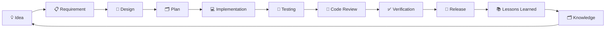
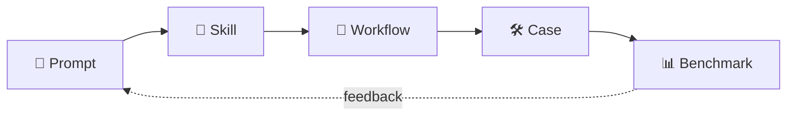

<div align="right">
  <strong>🌏 English</strong> · <a href="README.md">🇨🇳 简体中文</a> · <a href="README.zh-TW.md">🇹🇼 繁體中文</a>
</div>

# EasyVibeCoding 🚀

> **From Prompt to Production.**
> Engineering-grade playbook so that people who can't code can still build real, running software with AI.

[Start Here](docs/getting-started/01-what-is-vibe-coding.md) · [Browse Cases](cases/golden/) · [Browse Skills](skills/) · [Browse Prompts](prompts/)

> 🌏 **Switch languages**: use the banner at the top-right. See [docs/i18n-contributing.md](docs/i18n-contributing.md) to add a new language translation.


---

## Introduction

**EasyVibeCoding** is an open-source **Vibe Coding engineering methodology** — a reusable, composable, verifiable **operating manual for AI coding**.

> Glossary tip: **Vibe Coding** — you don't write code; you describe the idea in plain language and ask AI to generate runnable code. The hard part is not the generation, it's the engineering: how to decompose, how to reuse, how to verify, and how to stop AI from hallucinating.

It is not another framework. It is the full path from "a one-sentence idea" to "runnable software": **Prompt → Skill → Workflow → Case → Benchmark**.

---

## Navigation

| Entry | What |
| --- | --- |
| 🚀 [Start Here](docs/getting-started/01-what-is-vibe-coding.md) | Your very first article |
| 🧠 [Skills](skills/) | Reusable AI-coding skills |
| 💬 [Prompts](prompts/) | Curated prompt templates |
| 🛠 [Cases](cases/golden/) | Full walkthrough cases |
| 🐛 [Failures](failures/) | Lessons from failures |
| ❌ [Anti Patterns](anti-patterns/) | What NOT to do |
| 🔄 [Workflows](workflows/) | Pipelines composed from Skills |
| 📊 [Benchmarks](benchmarks/) | AI-coding capability benchmarks |
| 📚 [Learning Path](docs/learning-path/roadmap.md) | Learning roadmap |
| 🤝 [Contributing](CONTRIBUTING.md) | How to contribute |

---

## Why EasyVibeCoding

The typical story when people code with AI is: "One sentence → generates something → doesn't run → ask again → still broken → give up." The problem is not AI; it's the **lack of an engineering method**.

EasyVibeCoding solves three things:

1. **Reusable** — Repeatable tasks are stored as Skills / Prompts, so you never start from scratch.
2. **Verifiable** — Every step has objective evidence (runnable, testable, reproducible), not just an AI claiming "done".
3. **Accumulable** — Every mistake becomes explicit knowledge (Failures / Anti-Patterns) so you avoid it next time.

> Glossary tip: **Skill** = a reusable unit of procedure (e.g. project discovery, requirement breakdown); **Workflow** = a pipeline composed of several Skills.

---

## Who is this for?

| Persona | What you get |
| --- | --- |
| 🐣 Beginner (can't code) | Follow a Case and let AI build **real, running software** |
| 🎯 Product Manager | Break requirements into AI-ready steps, reduce rework |
| 🛠 Indie developer | Reuse Skills / Prompts to ship faster alone |
| 🤖 AI engineer aspirant | Systematically understand Prompt → Skill → Workflow → Benchmark |

---

## Quick Start

```bash
# 1. Clone
git clone https://github.com/beiluoL/EasyVibeCoding.git
cd EasyVibeCoding

# 2. Read the very first article (understand what Vibe Coding is)
#    Open docs/getting-started/01-what-is-vibe-coding.md

# 3. Pick your first prompt to start a project
#    Open prompts/start-here/start-project.md

# 4. Follow the 8-step First-time User Journey below
# 5. To contribute, read CONTRIBUTING.md
```

> No heavy install required. V0.1 is pure Markdown + Python validators — read first, then try, then contribute.

---

## First-time User Journey

Start here if you're new. Eight steps from "zero" to "can independently ship software with AI":

1. **Step 1** Read [docs/getting-started/01-what-is-vibe-coding.md](docs/getting-started/01-what-is-vibe-coding.md) — Understand what Vibe Coding is.
2. **Step 2** Use [prompts/start-here/start-project.md](prompts/start-here/start-project.md) — Start your first project.
3. **Step 3** Learn [skills/core/project-discovery](skills/core/project-discovery) — Understand first, then code.
4. **Step 4** Learn [skills/core/requirement-analysis](skills/core/requirement-analysis) — Decompose requirements for AI.
5. **Step 5** Complete [cases/golden/001-ai-chat](cases/golden/001-ai-chat) — Ship a full case.
6. **Step 6** Learn [skills/core/systematic-debugging](skills/core/systematic-debugging) — Systematic debugging when things break.
7. **Step 7** Learn [skills/core/testing](skills/core/testing) — Make AI-written code actually verifiable.
8. **Step 8** Level up with [skills/ai/rag](skills/ai/rag) and [skills/ai/agent](skills/ai/agent) — Start RAG & Agent.

> ⚠️ Not Yet Verified: Some links point to V0.1 planned content. See each directory's README for status.

---

## Vibe Coding Development Loop

From "Idea" to "Release" to "Knowledge沉淀" is a closed loop:



How the core assets relate: a Prompt seeds a Skill, Skills compose a Workflow, a Case comes out, then a Benchmark measures and feeds back to improve Prompts.



---

## Key Directories

- 🧠 **[Skills](skills/)** — Reusable skills (core / ai / ... categories)
- 💬 **[Prompts](prompts/)** — Prompt template library
- 🛠 **[Cases](cases/golden/)** — Full walkthroughs (beginner / intermediate / advanced / golden)
- 🐛 **[Failures](failures/)** — Lessons from failures
- ❌ **[Anti Patterns](anti-patterns/)** — What NOT to do
- 🔄 **[Workflows](workflows/)** — Pipelines composed from Skills
- 📊 **[Benchmarks](benchmarks/)** — AI-coding capability benchmarks

> Glossary tip: **Golden Case** = a fully verified reference case; **Anti-Pattern** = an approach that looks fine but blows up later.

---

## Learning Path

Full progressive route at [📚 Learning Path](docs/learning-path/roadmap.md). Suggested order: core before ai, read before practice, write one Lesson back each time you complete a Case.

---

## Verified System (Honesty First)

Honesty is the #1 rule. **No fabrication ever**:

- Unverified items are always marked `⚠️ Not Yet Verified` or `Status: experimental`.
- `✅ Tested / Verified / Production Ready` is forbidden for unverified content.
- No fake GitHub stars, no fake test results, no fake screenshots.

> V0.1 is a freshly bootstrapped baseline. **No runtime verification has been performed yet**. "Complete" means files are in place, not that things have been run end-to-end. See [CHANGELOG.md](CHANGELOG.md).

---

## Contributing

Contributions welcome — Skills / Prompts / Cases / Workflows / Failures / Anti-Patterns. Start by reading [🤝 CONTRIBUTING.md](CONTRIBUTING.md) and obey [SECURITY.md](SECURITY.md) + [AGENTS.md](AGENTS.md).

To contribute a translation, see [docs/i18n-contributing.md](docs/i18n-contributing.md).

---

## Roadmap

| Version | Goal | Status |
| --- | --- | --- |
| V0.1 | Content standards + Validators + CI scaffolding | ⚠️ Not Yet Verified (files in place, not run) |
| V0.2 | Docs site preview | Planned |
| V0.3 | CLI tool | Planned |
| V0.4 | Skill Registry automation | Planned |
| V0.5 | Benchmark real model comparison | Planned |

> All milestones are "Planned / Not Yet Verified".

---

## Philosophy: 7 Principles

| # | Principle | Plain English |
| --- | --- | --- |
| 01 | Understand before coding | Understand first, then code |
| 02 | Small tasks over giant prompts | Decompose — never pack everything into one prompt |
| 03 | Reuse before reinvent | Reuse before you reinvent the wheel |
| 04 | Evidence over claims | Demand evidence, don't trust the AI's self-report |
| 05 | Human owns decisions | Humans take the high-stakes calls |
| 06 | Every mistake becomes knowledge | Every failure becomes explicit knowledge |
| 07 | From Prompt to Production | From a prompt to shippable software |

---

## License

[MIT](LICENSE) © 2026 EasyVibeCoding Contributors
