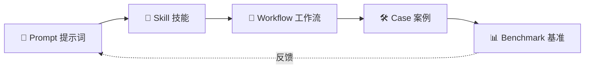

# EasyVibeCoding 🚀

> **From Prompt to Production.**
> 让不会编程的人，也能用 AI 按工程化方式做出真正能运行的软件。

[Start Here](docs/getting-started/01-what-is-vibe-coding.md) · [Browse Cases](cases/golden/) · [Browse Skills](skills/) · [Browse Prompts](prompts/)


---

## 项目介绍

**EasyVibeCoding** 是一套开源的「Vibe Coding 工程化方法论」——一本可复用、可沉淀、可验证的 **AI 编程操作手册**。

> 术语小贴士：**Vibe Coding**（凭感觉编程）——你不写代码，而是用自然语言描述需求，让 AI 生成可运行的代码。难点不在“生成”，而在“工程化”：怎么拆任务、怎么复用、怎么验证、怎么不让 AI 胡编。

它不是又一个代码框架，而是一套从“一句话想法”到“可运行软件”的**完整路径**：Prompt（提示词）→ Skill（技能）→ Workflow（工作流）→ Case（案例）→ Benchmark（基准）。

---

## 导航

| 入口 | 说明 |
| --- | --- |
| 🚀 [Start Here](docs/getting-started/01-what-is-vibe-coding.md) | 从零开始的第一篇 |
| 🧠 [Skills](skills/) | 可复用的 AI 编程技能 |
| 💬 [Prompts](prompts/) | 经过验证的提示词模板 |
| 🛠 [Cases](cases/golden/) | 完整案例 |
| 🐛 [Failures](failures/) | 失败教训库 |
| ❌ [Anti Patterns](anti-patterns/) | 反模式 |
| 🔄 [Workflows](workflows/) | 工作流编排 |
| 📊 [Benchmarks](benchmarks/) | 模型能力基准测试 |
| 📚 [Learning Path](docs/learning-path/roadmap.md) | 学习路径 |
| 🤝 [Contributing](CONTRIBUTING.md) | 参与贡献 |

---

## 为什么是 EasyVibeCoding

很多人用 AI 写代码的常态是：“一句话生成 → 跑不通 → 再问一句 → 又跑不通 → 放弃”。问题不在 AI，而在**缺少工程化方法**。

EasyVibeCoding 解决三件事：

1. **可复用**：把反复出现的操作沉淀成 Skill / Prompt，不每次从零开始。
2. **可验证**：每一步都有证据——能跑、能测、能复现，而不是 AI 说“完成了”就完事。
3. **可沉淀**：每次犯错都变成知识（Failures / Anti-Patterns），下次不再踩。

> 术语小贴士：**Skill**（技能）= 可复用的操作单元（比如“项目发现”“需求拆解”）；**Workflow**（工作流）= 把多个 Skill 串成一条完整流水线。

---

## 这是给谁用的

| 人群 | 你能拿到什么 |
| --- | --- |
| 🐣 小白（不会编程） | 跟着案例，用 AI 做出真正能运行的软件 |
| 🎯 产品经理 | 用工程化方式把需求拆给 AI，减少返工 |
| 🛠 独立开发者 | 复用 Skill / Prompt，加速单人交付 |
| 🤖 想学 AI 工程的人 | 系统理解 Prompt→Skill→Workflow→Benchmark 的全链路 |

---

## 快速开始

```bash
# 1. 克隆仓库
git clone https://github.com/easyvibecoding/EasyVibeCoding.git
cd EasyVibeCoding

# 2. 看第一篇入门（理解什么是 Vibe Coding）
#    打开 docs/getting-started/01-what-is-vibe-coding.md

# 3. 挑一个提示词开始你的项目
#    打开 prompts/start-here/start-project.md

# 4. 跟着 First-time User Journey 走完 8 步
# 5. 想贡献？看 CONTRIBUTING.md
```

> 不需要先装一堆依赖。V0.1 是纯 Markdown 知识库 + Python 校验器，先读、先用、再贡献。

---

## 首次用户旅程（First-time User Journey）

第一次来？按这 8 步走，能从“零基础”走到“能独立用 AI 做软件”：

1. **Step 1** 读 [docs/getting-started/01-what-is-vibe-coding.md](docs/getting-started/01-what-is-vibe-coding.md) —— 理解 Vibe Coding 是什么
2. **Step 2** 用 [prompts/start-here/start-project.md](prompts/start-here/start-project.md) —— 启动你的第一个项目
3. **Step 3** 学 [skills/core/project-discovery](skills/core/project-discovery) —— 学会“先搞懂再动手”
4. **Step 4** 学 [skills/core/requirement-analysis](skills/core/requirement-analysis) —— 把需求拆给 AI
5. **Step 5** 完成 [cases/golden/001-ai-chat](cases/golden/001-ai-chat) —— 跑通一个完整案例
6. **Step 6** 学 [skills/core/systematic-debugging](skills/core/systematic-debugging) —— 出错时怎么系统排查
7. **Step 7** 学 [skills/core/testing](skills/core/testing) —— 让 AI 写的代码可验证
8. **Step 8** 进阶 [skills/ai/rag](skills/ai/rag) 与 [skills/ai/agent](skills/ai/agent) —— 接触 RAG 与 Agent

> ⚠️ Not Yet Verified：以上部分链接指向 V0.1 规划内容，尚未全部填充。详见各目录 README 的状态标注。

---

## Vibe Coding 开发循环

从“想法”到“发布”再到“知识沉淀”，是一个闭环：

```mermaid
flowchart LR
  Idea[💡 Idea 创意] --> Requirement[📋 Requirement 需求]
  Requirement --> Design[🎨 Design 设计]
  Design --> Plan[🗂 Plan 规划]
  Plan --> Implementation[💻 Implementation 实现]
  Implementation --> Testing[🧪 Testing 测试]
  Testing --> CodeReview[👀 Code Review 评审]
  CodeReview --> Verification[✅ Verification 验证]
  Verification --> Release[🚀 Release 发布]
  Release --> Lessons[📚 Lessons Learned 复盘]
  Lessons --> Knowledge[🗂 Knowledge 知识沉淀]
  Knowledge --> Idea
```



核心资产之间的关系：Prompt 是种子，长成 Skill，串成 Workflow，产出 Case，用 Benchmark 度量，再反馈优化 Prompt。



---

## 核心目录

- 🧠 **[Skills](skills/)** —— 可复用技能（core / ai / devops / frontend / backend 等分类）
- 💬 **[Prompts](prompts/)** —— 提示词模板库
- 🛠 **[Cases](cases/golden/)** —— 完整案例（beginner / intermediate / advanced / golden）
- 🐛 **[Failures](failures/)** —— 失败教训，每次踩坑都变成知识
- ❌ **[Anti Patterns](anti-patterns/)** —— 反模式：什么不该做
- 🔄 **[Workflows](workflows/)** —— 把 Skill 串成流水线
- 📊 **[Benchmarks](benchmarks/)** —— 模型能力基准测试

> 术语小贴士：**Golden Case**（金标准案例）= 经过完整验证、可作为范本的案例；**Anti-Pattern**（反模式）= 看似合理实则埋雷的做法。

---

## 学习路径

完整的由浅入深路线见 [📚 Learning Path](docs/learning-path/roadmap.md)。建议顺序：先 core 后 ai，先读后练，每完成一个 Case 就回写一条 Lesson。

---

## 验证体系（诚实第一）

EasyVibeCoding 把“诚实”放在最高优先级。**绝不造假**：

- 未经验证的内容一律标 `⚠️ Not Yet Verified` 或 `Status: experimental`。
- 禁止写 `✅ Tested / Verified / Production Ready` 来给未验证内容背书。
- 不伪造 GitHub stars、不伪造测试结果、不伪造运行截图。

> V0.1 是刚刚 bootstrap 的初始版本，**尚未进行任何运行时验证**。你看到的“完成”仅指内容已就位，不代表已跑通。详见 [CHANGELOG.md](CHANGELOG.md)。

---

## 贡献

欢迎贡献 Skill / Prompt / Case / Workflow / Failure / Anti-Pattern。开始前请读 [🤝 CONTRIBUTING.md](CONTRIBUTING.md)，并遵守 [SECURITY.md](SECURITY.md) 与 [AGENTS.md](AGENTS.md) 的规则。

---

## 路线图

| 版本 | 目标 | 状态 |
| --- | --- | --- |
| V0.1 | 内容标准 + Validator + CI 脚手架 | ⚠️ Not Yet Verified（已就位，未运行验证） |
| V0.2 | 网站预览（docs 站点） | 计划中 |
| V0.3 | CLI 工具 | 计划中 |
| V0.4 | Skill Registry 自动化 | 计划中 |
| V0.5 | Benchmark 真实模型对比 | 计划中 |

> 全部版本均为计划状态，**Not Yet Verified**。

---

## 哲学：7 条核心原则

| # | 原则 | 大白话 |
| --- | --- | --- |
| 01 | Understand before coding | 先搞懂再动手 |
| 02 | Small tasks over giant prompts | 拆小任务，别一句话塞太多 |
| 03 | Reuse before reinvent | 先复用，别重造轮子 |
| 04 | Evidence over claims | 要证据，别听 AI 自吹 |
| 05 | Human owns decisions | 关键决策人来拍板 |
| 06 | Every mistake becomes knowledge | 每次犯错都沉淀成知识 |
| 07 | From Prompt to Production | 从提示词到能上线的软件 |

---

## License

[MIT](LICENSE) © 2026 EasyVibeCoding Contributors
