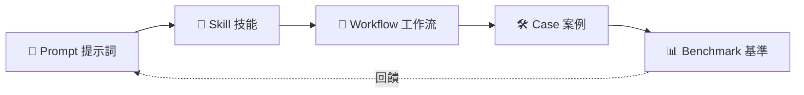

<div align="right">
  <a href="README.en.md">🌏 English</a> · <a href="README.md">🇨🇳 简体中文</a> · <strong>🇹🇼 繁體中文</strong>
</div>

# EasyVibeCoding 🚀

> **From Prompt to Production.**
> 讓不會寫程式的人，也能使用 AI 以工程化方式，做出真正能執行的軟體。

[開始使用](docs/getting-started/01-what-is-vibe-coding.md) · [瀏覽案例](cases/golden/) · [瀏覽技能](skills/) · [瀏覽提示詞](prompts/)

> 🌏 **可切換的多語言版本**：點擊右上角橫幅選擇 English / 简体中文。如何貢獻新語言翻譯請見 [docs/i18n-contributing.md](docs/i18n-contributing.md)。


---

## 專案介紹

**EasyVibeCoding** 是一套開源的「Vibe Coding 工程化方法論」——一本可複用、可沉澱、可驗證的 **AI 程式撰寫操作手冊**。

> 術語小提醒：**Vibe Coding**（憑感覺編程）——你不寫程式，而是用自然語言描述需求，請 AI 生成可執行的程式碼。難點不在「生成」，而在「工程化」：如何拆解任務、如何複用、如何驗證、如何避免 AI 胡說八道。

它不是另一個程式框架，而是從「一句話想法」到「可執行軟體」的**完整路徑**：Prompt（提示詞）→ Skill（技能）→ Workflow（工作流）→ Case（案例）→ Benchmark（基準測試）。

---

## 導覽

| 入口 | 說明 |
| --- | --- |
| 🚀 [開始使用](docs/getting-started/01-what-is-vibe-coding.md) | 從零開始的第一篇 |
| 🧠 [Skills](skills/) | 可複用的 AI 程式撰寫技能 |
| 💬 [Prompts](prompts/) | 經過整理的提示詞模板 |
| 🛠 [Cases](cases/golden/) | 完整案例 |
| 🐛 [Failures](failures/) | 失敗教訓庫 |
| ❌ [Anti Patterns](anti-patterns/) | 反模式（什麼不該做） |
| 🔄 [Workflows](workflows/) | 以 Skill 串接的工作流 |
| 📊 [Benchmarks](benchmarks/) | 模型能力基準測試 |
| 📚 [學習路徑](docs/learning-path/roadmap.md) | 學習路線圖 |
| 🤝 [貢獻指南](CONTRIBUTING.md) | 如何參與貢獻 |

---

## 為什麼選擇 EasyVibeCoding

多數人用 AI 寫程式的常態是：「一句話生成 → 跑不起來 → 再問一句 → 還是不行 → 放棄」。問題不在 AI，而在**缺少工程化方法**。

EasyVibeCoding 解決三件事：

1. **可複用**：把重複出現的操作沉澱成 Skill / Prompt，不用每次從零開始。
2. **可驗證**：每一步都有事實證據——可執行、可測試、可重現，而不是 AI 說「完成了」就算數。
3. **可沉澱**：每次犯錯都變成明確的知識（Failures / Anti-Patterns），下次不再踩坑。

> 術語小提醒：**Skill**（技能）= 可複用的操作單元（例如「專案發現」「需求拆解」）；**Workflow**（工作流）= 把多個 Skill 串成一條完整流水線。

---

## 這是給誰用的

| 族群 | 你能得到什麼 |
| --- | --- |
| 🐣 新手（不會寫程式） | 跟著案例，用 AI 做出真正可執行的軟體 |
| 🎯 產品經理 | 用工程化方式把需求拆給 AI，減少重做 |
| 🛠 獨立開發者 | 複用 Skill / Prompt，加速單人交付 |
| 🤖 想學 AI 工程的人 | 系統性理解 Prompt→Skill→Workflow→Benchmark 全鏈路 |

---

## 快速開始

```bash
# 1. 克隆倉庫
git clone https://github.com/beiluoL/EasyVibeCoding.git
cd EasyVibeCoding

# 2. 閱讀第一篇入門（理解 Vibe Coding 是什麼）
#    開啟 docs/getting-started/01-what-is-vibe-coding.md

# 3. 挑一個提示詞啟動你的專案
#    開啟 prompts/start-here/start-project.md

# 4. 照下方「首次使用者旅程」走完 8 步
# 5. 想要貢獻？看 CONTRIBUTING.md
```

> 不需要先安裝一堆相依。V0.1 是純 Markdown 知識庫 + Python 校驗器，先讀、先用，再來貢獻。

---

## 首次使用者旅程（First-time User Journey）

第一次來？按這 8 步走，能從「零基礎」走到「能獨立用 AI 做軟體」：

1. **Step 1** 讀 [docs/getting-started/01-what-is-vibe-coding.md](docs/getting-started/01-what-is-vibe-coding.md) —— 理解 Vibe Coding 是什麼。
2. **Step 2** 使用 [prompts/start-here/start-project.md](prompts/start-here/start-project.md) —— 啟動你的第一個專案。
3. **Step 3** 學 [skills/core/project-discovery](skills/core/project-discovery) —— 先搞懂再動手。
4. **Step 4** 學 [skills/core/requirement-analysis](skills/core/requirement-analysis) —— 把需求拆給 AI。
5. **Step 5** 完成 [cases/golden/001-ai-chat](cases/golden/001-ai-chat) —— 跑通一個完整案例。
6. **Step 6** 學 [skills/core/systematic-debugging](skills/core/systematic-debugging) —— 出錯時如何系統化除錯。
7. **Step 7** 學 [skills/core/testing](skills/core/testing) —— 讓 AI 寫的程式可驗證。
8. **Step 8** 進階 [skills/ai/rag](skills/ai/rag) 與 [skills/ai/agent](skills/ai/agent) —— 接觸 RAG 與 Agent。

> ⚠️ Not Yet Verified：以上部分連結指向 V0.1 規劃內容，尚未全部填充。詳見各目錄 README 的狀態標註。

---

## Vibe Coding 開發循環

從「想法」到「發布」再到「知識沉澱」，是一個閉環：

```mermaid
flowchart LR
  Idea[💡 Idea 創意] --> Requirement[📋 Requirement 需求]
  Requirement --> Design[🎨 Design 設計]
  Design --> Plan[🗂 Plan 規劃]
  Plan --> Implementation[💻 Implementation 實作]
  Implementation --> Testing[🧪 Testing 測試]
  Testing --> CodeReview[👀 Code Review 評審]
  CodeReview --> Verification[✅ Verification 驗證]
  Verification --> Release[🚀 Release 發布]
  Release --> Lessons[📚 Lessons Learned 覆盤]
  Lessons --> Knowledge[🗂 Knowledge 知識沉澱]
  Knowledge --> Idea
```



核心資產之間的關係：Prompt 是種子，長成 Skill，串成 Workflow，產出 Case，用 Benchmark 度量，再回饋優化 Prompt。



---

## 核心目錄

- 🧠 **[Skills](skills/)** —— 可複用技能（core / ai / 等分類）
- 💬 **[Prompts](prompts/)** —— 提示詞模板庫
- 🛠 **[Cases](cases/golden/)** —— 完整案例（beginner / intermediate / advanced / golden）
- 🐛 **[Failures](failures/)** —— 失敗教訓，每次踩坑都變成知識
- ❌ **[Anti Patterns](anti-patterns/)** —— 反模式：什麼不該做
- 🔄 **[Workflows](workflows/)** —— 把 Skill 串成流水線
- 📊 **[Benchmarks](benchmarks/)** —— 模型能力基準測試

> 術語小提醒：**Golden Case**（金標準案例）= 經過完整驗證、可做為範本的案例；**Anti-Pattern**（反模式）= 看似合理實則埋雷的做法。

---

## 學習路徑

完整的由淺入深路線請見 [📚 學習路徑](docs/learning-path/roadmap.md)。建議順序：先 core 後 ai，先讀後練，每完成一個 Case 就回寫一條 Lesson。

---

## 驗證體系（誠實優先）

EasyVibeCoding 把「誠實」放在最高優先級。**絕不造假**：

- 未經驗證的內容一律標 `⚠️ Not Yet Verified` 或 `Status: experimental`。
- 禁止撰寫 `✅ Tested / Verified / Production Ready` 為未驗證內容背書。
- 不偽造 GitHub stars、不偽造測試結果、不偽造執行截圖。

> V0.1 是剛剛 bootstrap 的初始版本，**尚未進行任何執行時驗證**。你看到的「完成」僅指內容已就定位，不代表已全流程跑通。詳見 [CHANGELOG.md](CHANGELOG.md)。

---

## 貢獻

歡迎貢獻 Skill / Prompt / Case / Workflow / Failure / Anti-Pattern。開始前請閱讀 [🤝 CONTRIBUTING.md](CONTRIBUTING.md)，並遵守 [SECURITY.md](SECURITY.md) 與 [AGENTS.md](AGENTS.md) 的規則。

想要貢獻翻譯，請參閱 [docs/i18n-contributing.md](docs/i18n-contributing.md)。

---

## 路線圖

| 版本 | 目標 | 狀態 |
| --- | --- | --- |
| V0.1 | 內容標準 + Validator + CI 腳手架 | ⚠️ Not Yet Verified（檔案已就定位，尚未執行驗證） |
| V0.2 | 網站預覽（docs 站點） | 規劃中 |
| V0.3 | CLI 工具 | 規劃中 |
| V0.4 | Skill Registry 自動化 | 規劃中 |
| V0.5 | Benchmark 真實模型對比 | 規劃中 |

> 全部版本均為「規劃中 / Not Yet Verified」。

---

## 哲學：7 條核心原則

| # | 原則 | 白話版 |
| --- | --- | --- |
| 01 | Understand before coding | 先搞懂，再動手 |
| 02 | Small tasks over giant prompts | 拆小任務，別一句話塞滿東西 |
| 03 | Reuse before reinvent | 先複用，別重造輪子 |
| 04 | Evidence over claims | 要證據，別聽 AI 自吹 |
| 05 | Human owns decisions | 關鍵決策由人來拍板 |
| 06 | Every mistake becomes knowledge | 每次犯錯都沉澱成知識 |
| 07 | From Prompt to Production | 從提示詞，做到能上線的軟體 |

---

## License

[MIT](LICENSE) © 2026 EasyVibeCoding Contributors
