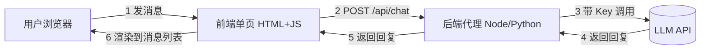

# Golden Case 001 — AI 聊天应用 · EasyVibeCoding Reference Case

> ⚠️ Verification Pending — 本案例尚未实际运行验证。内容已就位，但不代表已跑通。

## Project Goal（项目目标）

从零用 AI 做一个能聊天的 Web 应用：单页输入消息 → 调用 LLM → 显示回复 → 保留对话历史。让完全不会编程的人也能跟着做出"自己和 AI 聊天"的网页。

## Difficulty（难度）

beginner（入门级）

## Prerequisites（前置条件）

- 会用浏览器打开网页
- 有一台装了 Node.js 或 Python 的电脑（任选其一）
- ⚠️ 自备一个 LLM API Key（如 OpenAI / 通义千问 / DeepSeek），**不要把 key 提交到仓库**

> 术语小贴士：**LLM（大语言模型）**= 像 ChatGPT 这种能根据你给的文字接着往下写的 AI。**API Key** = 一串证明"你本人"的密钥，相当于你在 AI 服务商那儿的门禁卡。

## Tech Stack（技术栈）

| 项 | 选择 | 说明 |
| --- | --- | --- |
| 前端 | HTML + Vanilla JS | 不用框架，单文件即跑，小白最易理解 |
| 后端代理 | Node (Express) 或 Python (Flask) | 隐藏 API Key，二选一 |
| LLM | 任一支持 Chat Completions 的 API | ⚠️ 版本与额度由用户自备自验 |
| 部署 | 本地 `localhost` 起服务 | ⚠️ 未部署到公网 |

## User Scenario（用户场景）

一个完全不会编程的人想做一个"自己和 AI 聊天"的网页：打开网页 → 在输入框打字 → 点发送 → 看到 AI 的回复 → 历史消息一直留着，能连续追问。

## MVP（最小可行版本）

单页 + 消息列表 + 输入框 + 调用 LLM + 渲染回复。砍掉：用户登录、多会话、流式输出（可后续加）。

## Architecture（架构）

前端单页 ↔ 后端代理（隐藏 key）↔ LLM API。

详见 [architecture.md](architecture.md)。

> 为什么不直接前端调 LLM API？因为前端代码人人能看，key 写进去等于把门禁卡贴在公告栏——谁都能拿走。后端代理把 key 锁在自己机器里，前端只跟自己的后端说话。

## Workflow（工作流）

构建步骤（每步只做一件事，详见 [development-log.md](development-log.md)）：

1. 项目骨架 → 2. 聊天 UI → 3. 后端接口 → 4. 渲染回复 → 5. 错误兜底

对应的工作流：[`../../../workflows/feature-development/README.md`](../../../workflows/feature-development/README.md)

## Prompts（提示词）

- [`../../../prompts/start-here/start-project.md`](../../../prompts/start-here/start-project.md) — 启动项目
- [`../../../prompts/architecture/analyze-requirement.md`](../../../prompts/architecture/analyze-requirement.md) — 分析需求
- [`../../../prompts/coding/implement-feature.md`](../../../prompts/coding/implement-feature.md) — 逐步实现
- [`../../../prompts/debugging/debug-error.md`](../../../prompts/debugging/debug-error.md) — 排错
- [`../../../prompts/review/security-review.md`](../../../prompts/review/security-review.md) — 查 key 泄露

## Skills（技能）

- [`../../../skills/core/project-discovery/SKILL.md`](../../../skills/core/project-discovery/SKILL.md) — 项目发现
- [`../../../skills/core/requirement-analysis/SKILL.md`](../../../skills/core/requirement-analysis/SKILL.md) — 需求分析
- [`../../../skills/core/architecture-design/SKILL.md`](../../../skills/core/architecture-design/SKILL.md) — 架构设计
- [`../../../skills/core/implementation/SKILL.md`](../../../skills/core/implementation/SKILL.md) — 小步实现
- [`../../../skills/core/systematic-debugging/SKILL.md`](../../../skills/core/systematic-debugging/SKILL.md) — 系统化排障
- [`../../../skills/core/verification-before-completion/SKILL.md`](../../../skills/core/verification-before-completion/SKILL.md) — 完成前验证

## Testing（测试）

- 手动：发一条消息看是否有回复；断网看是否有错误提示；刷新看历史是否还在（如用 localStorage）
- 自动化（可选）：用 [`../../../skills/core/testing/SKILL.md`](../../../skills/core/testing/SKILL.md) 给后端接口写最小测试（正常 + 错误路径）

> ⚠️ 本案例 V0.1 尚未实际编写或运行任何测试。

## Verification（验证）

⚠️ **Verification Pending** — 尚未实际运行。Expected Verification Steps 见 [verification.md](verification.md)。

## Known Limitations（已知局限）

- 无用户系统，所有人共用一个页面
- 无流式输出（打字机效果），回复一次性返回
- 无多会话管理，清空即丢
- ⚠️ 未做真实性能测试
- ⚠️ 未部署到公网

## Lessons Learned（经验总结）

详见 [lessons.md](lessons.md)。核心：key 别碰前端、AI 一次别写太多、必须有超时与错误兜底。

## Reference Case Highlights（参考案例要点）

> 本案例是 EasyVibeCoding 的 Reference Case——展示"AI 应该如何工作"的完整流程。

| 步骤 | 用了哪个 Skill | 用了哪个 Prompt | 展示了什么 |
| --- | --- | --- | --- |
| Idea | brainstorming | start-project | 从一句话想法到项目目标 |
| Requirement | requirement-analysis | analyze-requirement | 把模糊想法变成验收标准 |
| Architecture | architecture-design | design-architecture | 前端 + 后端代理 + LLM 三层 |
| Implementation | implementation | implement-feature | 5 步小步实现 |
| Debug | systematic-debugging | debug-error | 排查"回复不显示"的根因 |
| Testing | testing | write-tests | 给后端接口配测试 |
| Review | code-review | security-review | 检查 API Key 是否泄露 |
| Verification | verification-before-completion | verify-feature | 逐条验收，证据说话 |

> 重点不是最终代码，而是：为什么这么拆、为什么这个 Prompt 有效、AI 哪里出错、如何纠正、如何验证。
