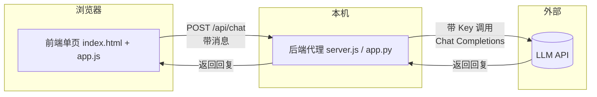

# Architecture — AI 聊天应用

> ⚠️ Verification Pending — 架构为设计方案，尚未实际落地验证。

## 总览

三个角色，一条链路：

> 术语解释：**后端代理（Backend Proxy）**= 一个跑在你自己机器上的小程序，前端不直接找 LLM，而是先找它，它再带着 key 去找 LLM。相当于你雇了个前台，客人（前端）只跟前台说话，钥匙（key）只有前台有。

## 模块划分

| 模块 | 职责 | 文件 |
| --- | --- | --- |
| 前端界面 | 输入框、发送按钮、消息列表渲染 | `index.html` + `app.js` |
| 后端代理 | 接收前端消息、带 key 调 LLM、返回回复 | `server.js`（Node）或 `app.py`（Python） |
| 配置 | API Key、模型名、超时——从环境变量读 | `.env`（不入库） |

## 数据流（单次问答）

1. 用户在输入框打字 → 点发送
2. 前端 `fetch('/api/chat', { messages })` 发到后端
3. 后端从环境变量读 key，组装请求调 LLM
4. LLM 返回回复 → 后端透传给前端
5. 前端把回复渲染进消息列表

## 关键决策：为什么不直接前端调 LLM API

| 方案 | key 在哪 | 风险 |
| --- | --- | --- |
| ❌ 前端直连 LLM | 写在前端 JS，浏览器可见 | 任何人 F12 即可偷走 key |
| ✅ 后端代理 | 只在本机环境变量 | 前端只跟自己后端说话，key 不出本机 |

> 大白话：前端代码是"明信片"，谁都能看；后端是"你家"，key 锁在自家抽屉里。让前端直接拿 key，等于把家门钥匙挂在门外。

## 技术栈选型理由

| 项 | 选择 | 理由 |
| --- | --- | --- |
| 前端 | HTML + Vanilla JS | 不装框架、不打包，小白双击即看 |
| 后端 | Node/Python 二选一 | 取用户更熟的一个；都只需一个文件 |
| LLM | 任一 Chat Completions 兼容 API | ⚠️ 版本/额度由用户自备自验 |
| Key 管理 | 环境变量 + `.env`（git 忽略） | key 不入库 |

## 风险与应对

| 风险 | 应对 |
| --- | --- |
| key 误提交 | `.gitignore` 加 `.env`；提交前 grep 自查 |
| LLM 超时/不可达 | 设 30s 超时，前端显示错误提示 |
| 回复含恶意 HTML | 渲染前转义 `<` `>`，防 XSS |
| 上下文超长 | 可选：只带最近 N 轮历史（V0.1 暂不实现） |

> 术语解释：**XSS（跨站脚本）**= 攻击者把恶意脚本塞进页面被执行。把回复当纯文本显示而非直接插入 HTML 即可防。
