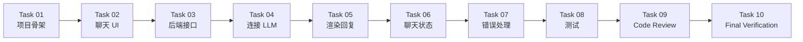

# Development Plan — AI 聊天应用

> ⚠️ Illustrative Example — 以下任务拆解为计划方案，尚未实际执行。
>
> 为什么小任务比超级 Prompt 更可靠？因为每个小任务做完就能验证"这条过了没有"，错了也知道错在哪一步。一句话让 AI 做完整个项目，出了问题根本分不清是哪步的锅。

## 任务总览

| Task | 目标 | 预估 | 依赖 | 状态 |
| --- | --- | --- | --- | --- |
| 01 | 初始化项目 | 15 min | 无 | ⚠️ 未执行 |
| 02 | 创建基础页面 | 20 min | 01 | ⚠️ 未执行 |
| 03 | 创建 Chat API | 30 min | 01 | ⚠️ 未执行 |
| 04 | 连接 LLM | 20 min | 03 | ⚠️ 未执行 |
| 05 | 渲染回复 | 20 min | 02, 04 | ⚠️ 未执行 |
| 06 | 保存聊天状态 | 15 min | 05 | ⚠️ 未执行 |
| 07 | 错误处理 | 20 min | 05 | ⚠️ 未执行 |
| 08 | 测试 | 30 min | 07 | ⚠️ 未执行 |
| 09 | Code Review | 15 min | 08 | ⚠️ 未执行 |
| 10 | Final Verification | 15 min | 09 | ⚠️ 未执行 |

---

## Task 01 — 初始化项目

**Goal**: 建目录结构、初始化项目文件、配好 `.env` 与 `.gitignore`

**Input**: 无（从零开始）

**Files**:
- `index.html`（空白页）
- `server.js` 或 `app.py`（空文件）
- `.env.example`（模板，不含真实 key）
- `.gitignore`（含 `.env`、`node_modules`、`__pycache__`）

**Implementation**:
1. 创建项目目录
2. `npm init -y` 或 `pip install flask openai`
3. 创建空白 `index.html`
4. 创建 `.gitignore`，确保 `.env` 在内
5. 创建 `.env.example` 写 `API_KEY=your-key-here # safe: example`

**Acceptance Criteria**:
- [ ] 目录结构就位
- [ ] `.gitignore` 包含 `.env`
- [ ] `index.html` 能在浏览器打开（空白页也算）
- [ ] `.env.example` 有但 `.env` 不存在（或存在但被 git 忽略）

**Validation**: `git status` 确认 `.env` 不在跟踪列表

**Related Skill**: [project-discovery](../../../skills/core/project-discovery/SKILL.md)
**Related Prompt**: [start-project](../../../prompts/start-here/start-project.md)

---

## Task 02 — 创建基础页面

**Goal**: 画输入框 + 发送按钮 + 消息列表容器，`app.js` 能把用户输入追加到列表

**Input**: Task 01 的 `index.html`

**Files**:
- `index.html`（加 UI 结构）
- `app.js`（新建，处理发送事件）

**Implementation**:
1. `index.html` 加：输入框 `<input>` + 发送按钮 `<button>` + 消息列表容器 `
`
2. `app.js` 绑定发送按钮点击事件
3. 点击时把输入框内容追加到消息列表（此时不接 LLM）
4. 发送后清空输入框

**Acceptance Criteria**:
- [ ] 页面有输入框和发送按钮
- [ ] 打字点发送，消息出现在列表
- [ ] 发送后输入框清空
- [ ] 此时还不调 LLM——纯前端行为

**Validation**: 浏览器打开页面，打字点发送，看到消息出现

**Related Skill**: [implementation](../../../skills/core/implementation/SKILL.md)
**Related Prompt**: [implement-feature](../../../prompts/coding/implement-feature.md)

---

## Task 03 — 创建 Chat API

**Goal**: 后端开 `POST /api/chat` 接口，能接收前端消息

**Input**: Task 01 的 `server.js`/`app.py`

**Files**:
- `server.js` 或 `app.py`（实现路由）

**Implementation**:
1. 起 HTTP 服务（Express 或 Flask）
2. 开 `POST /api/chat` 路由
3. 从请求体读 `messages` 数组
4. 此时先返回固定回复 `{"reply": "Hello from server"}`——不接 LLM
5. 从环境变量读 API Key（但此时还不用）

**Acceptance Criteria**:
- [ ] 服务启动无报错
- [ ] `curl -X POST localhost:3000/api/chat -H "Content-Type: application/json" -d '{"messages":[{"role":"user","content":"hi"}]}'` 返回 JSON
- [ ] API Key 从环境变量读，不写死在代码里

**Validation**: 用 curl/Postman 发请求，拿到回复

**Related Skill**: [architecture-design](../../../skills/core/architecture-design/SKILL.md)
**Related Prompt**: [implement-feature](../../../prompts/coding/implement-feature.md)

---

## Task 04 — 连接 LLM

**Goal**: 后端用 API Key 调用 LLM 的 Chat Completions，返回真实回复

**Input**: Task 03 的 Chat API + `.env` 中的 API Key

**Files**:
- `server.js` 或 `app.py`（替换固定回复为真实 LLM 调用）

**Implementation**:
1. 安装 LLM SDK（如 `openai` npm 包或 pip 包）
2. 用环境变量中的 Key 初始化 client
3. `POST /api/chat` 收到消息后，调 LLM Chat Completions
4. 设 30s 超时
5. 把 LLM 回复返回给前端
6. 错误时返回 500 + 错误信息（不泄露 key）

**Acceptance Criteria**:
- [ ] curl 发请求，拿到 LLM 真实回复（不是 "Hello from server"）
- [ ] key 从 `.env` 读，代码中无硬编码 key
- [ ] LLM 超时或不可达时返回错误而非崩溃
- [ ] 错误响应中不含 key

**Validation**: curl 发请求确认拿到真实 AI 回复

**Related Skill**: [implementation](../../../skills/core/implementation/SKILL.md)
**Related Prompt**: [implement-feature](../../../prompts/coding/implement-feature.md)

---

## Task 05 — 前端渲染回复

**Goal**: 前端 `fetch` 调 `/api/chat`，把回复渲染进消息列表，区分用户/AI 气泡

**Input**: Task 02 的前端 + Task 04 的后端

**Files**:
- `app.js`（加 fetch 逻辑 + 渲染）

**Implementation**:
1. 发送消息时，`fetch('/api/chat', { method: 'POST', body: JSON.stringify({messages}) })`
2. 等待响应，把回复渲染进消息列表
3. 用户消息和 AI 消息用不同样式区分（如左右对齐或颜色）
4. 回复内容用 `textContent` 或先转义再插入——防 XSS
5. 发送期间禁用发送按钮，防止重复发送

**Acceptance Criteria**:
- [ ] 浏览器发消息 → 看到 AI 回复
- [ ] 用户/AI 消息视觉可区分
- [ ] 连续追问，历史消息保留
- [ ] 回复含 `<script>` 时作为文本显示而非执行
- [ ] 发送期间按钮禁用

**Validation**: 浏览器发"你好"→看到回复；连续追问→历史保留

**Related Skill**: [implementation](../../../skills/core/implementation/SKILL.md)
**Related Prompt**: [implement-feature](../../../prompts/coding/implement-feature.md)

---

## Task 06 — 保存聊天状态

**Goal**: 刷新页面后历史消息不丢（用 localStorage）；加"清空历史"按钮

**Input**: Task 05 的前端

**Files**:
- `app.js`（加 localStorage 读写 + 清空逻辑）
- `index.html`（加清空按钮）

**Implementation**:
1. 每次发消息/收回复后，把消息列表存入 `localStorage`
2. 页面加载时从 `localStorage` 恢复消息列表
3. 加"清空历史"按钮
4. 点击清空时：清空 `localStorage` + 清空 DOM 消息列表

**Acceptance Criteria**:
- [ ] 发几条消息后刷新页面，历史还在
- [ ] 点"清空历史"，列表清空
- [ ] 清空后再刷新，不恢复旧消息

**Validation**: 发消息→刷新→历史在；点清空→列表空

**Related Skill**: [implementation](../../../skills/core/implementation/SKILL.md)
**Related Prompt**: [implement-feature](../../../prompts/coding/implement-feature.md)

---

## Task 07 — 错误处理

**Goal**: 前端加请求超时（30s）与 try/catch；断网/key 失效显示可读错误

**Input**: Task 05 的前端

**Files**:
- `app.js`（加错误兜底）

**Implementation**:
1. `fetch` 加 `AbortController`，30s 超时
2. `try/catch` 包住请求
3. 失败时在消息列表显示"⚠️ 请求失败：<原因>"
4. 网络错误显示"网络连接失败，请检查网络"
5. 服务器 500 显示"服务异常，请稍后重试"
6. 超时显示"请求超时（30s），请重试"

**Acceptance Criteria**:
- [ ] 断网发消息 → 看到错误提示不白屏
- [ ] 后端停了发消息 → 看到错误提示不卡死
- [ ] LLM 超过 30s → 看到超时提示
- [ ] 错误提示可读（不是 JS 报错信息）

**Validation**: 断网发消息→看到提示；停后端发消息→看到提示

**Related Skill**: [systematic-debugging](../../../skills/core/systematic-debugging/SKILL.md)
**Related Prompt**: [debug-error](../../../prompts/debugging/debug-error.md)

---

## Task 08 — 测试

**Goal**: 给后端 `POST /api/chat` 写最小测试

**Input**: Task 04 + Task 07 的后端

**Files**:
- `test/chat.test.js` 或 `test/test_chat.py`（新建）

**Implementation**:
1. 测试正常消息 → 返回 200 + 有回复
2. 测试空消息 → 返回 400
3. 测试 key 缺失 → 返回 500 且不泄露 key
4. 测试超时行为（可选：mock 慢响应）

**Acceptance Criteria**:
- [ ] 正常消息测试通过
- [ ] 空消息测试通过
- [ ] key 缺失测试通过且响应不含 key
- [ ] 所有测试 `npm test` / `pytest` 一键跑

**Validation**: 跑测试，全绿

**Related Skill**: [testing](../../../skills/core/testing/SKILL.md)
**Related Prompt**: [write-tests](../../../prompts/testing/write-tests.md)

---

## Task 09 — Code Review

**Goal**: 检查代码质量、安全、一致性

**Input**: 所有已完成代码

**Files**:
- 无新文件（review 结果记录在 development-log.md）

**Implementation**:
1. 检查：API Key 是否出现在前端代码或仓库中
2. 检查：回复是否做了 HTML 转义（防 XSS）
3. 检查：是否有不必要的复杂度
4. 检查：代码风格是否一致
5. 检查：错误处理是否覆盖所有失败路径

**Acceptance Criteria**:
- [ ] `grep -rn "sk-" .` 无真实 key
- [ ] 回复渲染用 textContent 或转义
- [ ] 无明显冗余代码
- [ ] 错误处理覆盖网络失败/超时/服务器错误

**Validation**: 逐项检查 + grep 自查

**Related Skill**: [code-review](../../../skills/core/code-review/SKILL.md)
**Related Prompt**: [security-review](../../../prompts/review/security-review.md)

---

## Task 10 — Final Verification

**Goal**: 逐条核对验收标准，有证据才算完成

**Input**: 所有已完成代码 + requirements.md 中的验收标准

**Files**:
- 无新文件（验证结果记录在 verification.md）

**Implementation**:
1. 起 local 服务
2. 逐条执行 requirements.md 中的验收标准
3. 每条记录：✅/❌ + 证据（截图/命令输出）
4. 全部 ✅ 才算完成；有 ❌ 回对应 Task 修复

**Acceptance Criteria**:
- [ ] requirements.md 中 6 条验收标准全部 ✅
- [ ] 每条有客观证据
- [ ] 无 ❌ 项

**Validation**: 逐条验收

**Related Skill**: [verification-before-completion](../../../skills/core/verification-before-completion/SKILL.md)
**Related Prompt**: [verify-feature](../../../prompts/testing/verify-feature.md)

---

## 状态总览

| Task | 状态 | 验证 |
| --- | --- | --- |
| 01 初始化 | ⚠️ 未执行 | — |
| 02 基础页面 | ⚠️ 未执行 | — |
| 03 Chat API | ⚠️ 未执行 | — |
| 04 连接 LLM | ⚠️ 未执行 | — |
| 05 渲染回复 | ⚠️ 未执行 | — |
| 06 聊天状态 | ⚠️ 未执行 | — |
| 07 错误处理 | ⚠️ 未执行 | — |
| 08 测试 | ⚠️ 未执行 | — |
| 09 Code Review | ⚠️ 未执行 | — |
| 10 Final Verification | ⚠️ 未执行 | — |
