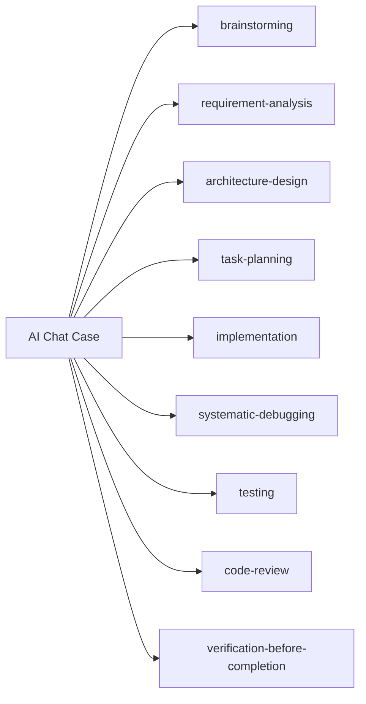

# Skills Used — AI 聊天应用

> 本 Case 使用了以下 EasyVibeCoding Skills。每条标注在哪个步骤用到、用了什么能力。

## Skill 映射表

| 步骤 | Skill | 用了什么 | 链接 |
| --- | --- | --- | --- |
| Idea | brainstorming | 从一句话想法到项目目标 | [brainstorming](../../../skills/core/brainstorming/SKILL.md) |
| Requirement | requirement-analysis | 把模糊想法变成验收标准 | [requirement-analysis](../../../skills/core/requirement-analysis/SKILL.md) |
| Architecture | architecture-design | 前端 + 后端代理 + LLM 三层架构 | [architecture-design](../../../skills/core/architecture-design/SKILL.md) |
| Task Planning | task-planning | 拆成 10 个可独立验收的 Task | [task-planning](../../../skills/core/task-planning/SKILL.md) |
| Implementation | implementation | 每次只做一个 Task，跑通了再下一个 | [implementation](../../../skills/core/implementation/SKILL.md) |
| Debug | systematic-debugging | 排查"回复不显示"的根因 | [systematic-debugging](../../../skills/core/systematic-debugging/SKILL.md) |
| Testing | testing | 给后端接口配正常 + 错误路径测试 | [testing](../../../skills/core/testing/SKILL.md) |
| Review | code-review | 检查 key 泄露 + XSS + 错误处理 | [code-review](../../../skills/core/code-review/SKILL.md) |
| Verification | verification-before-completion | 逐条验收，证据说话 | [verification-before-completion](../../../skills/core/verification-before-completion/SKILL.md) |

## Case ↔ Skill 关系图

## 使用频率

| Skill | 使用次数 | 说明 |
| --- | --- | --- |
| implementation | 6 次 | Task 01-06 各用一次 |
| systematic-debugging | 1-3 次 | 看实际遇到几个 Bug |
| testing | 1 次 | Task 08 |
| code-review | 1 次 | Task 09 |
| verification-before-completion | 1 次 | Task 10 |
| 其他 | 各 1 次 | 前期规划各一次 |

> 最常用的 Skill 是 implementation——因为大部分时间在做小步实现。最关键的是 verification-before-completion——它防止"AI 说做完了但其实没做完"。
