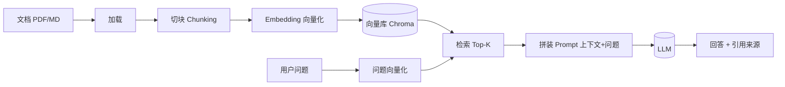

# Golden Case 002 — RAG 问答应用

> ⚠️ Verification Pending — 本案例尚未实际运行验证。内容已就位，但不代表已跑通。

## Project Goal（项目目标）

做一个基于文档问答的 RAG 应用：把一份本地文档（PDF/MD）喂进去 → 针对文档内容提问 → 回答并引用出处。

## Difficulty（难度）

intermediate（中级）

## Prerequisites（前置条件）

- 会用命令行装 Python 包
- 理解 Case 001 的"调 LLM"基本概念
- ⚠️ 自备 LLM API Key + Embedding 模型访问，**不入库**
- ⚠️ 向量库（如 Chroma）版本需用户自行验证兼容性

> 术语小贴士：**RAG（检索增强生成）**= 先从你的文档里检索相关片段，再连同问题一起交给 AI，让它"看着资料答题"而不是凭记忆硬编。**Embedding（向量化）**= 把文字变成一串数字坐标，意思相近的文字坐标也近，便于"按意思搜"。

## Tech Stack（技术栈）

| 项 | 选择 | 说明 |
| --- | --- | --- |
| 语言 | Python | 生态最适合 RAG |
| 文档加载 | PyMuPDF / markdown | PDF 与 MD 解析 |
| 切块 | langchain text splitter 或自写 | ⚠️ 版本需自验 |
| 向量库 | Chroma（本地持久化） | ⚠️ 版本需自验 |
| Embedding | 任一 Embedding API | ⚠️ key 自备 |
| LLM | 任一 Chat Completions 兼容 API | ⚠️ key 自备 |
| 部署 | 本地命令行运行 | ⚠️ 未部署 |

## User Scenario（用户场景）

有一份本地文档（产品手册 / 论文 / 笔记），想针对它提问并得到带出处的回答，而不是让 AI 凭记忆瞎编。

## MVP（最小可行版本）

上传文档 → 切块 → 向量化入库 → 提问 → 检索 TopK → 拼 prompt → LLM 答 + 引用来源。

## Architecture（架构）

详见 [architecture.md](architecture.md)。

> RAG 一句大白话：与其让 AI 凭"记忆"硬答，不如先把"参考书"翻到对的那一页，再把那页内容连同问题一起递给它。详见 [`../../../skills/ai/rag/SKILL.md`](../../../skills/ai/rag/SKILL.md)。

## Workflow（工作流）

构建步骤（每步只做一件事，详见 [development-log.md](development-log.md)）：

1. 文档加载 → 2. 切块 → 3. Embedding → 4. 入库 → 5. 检索 → 6. 拼 prompt → 7. 问答 → 8. 引用来源

对应工作流：[`../../../workflows/feature-development/README.md`](../../../workflows/feature-development/README.md)

## Prompts（提示词）

- [`../../../prompts/start-here/start-project.md`](../../../prompts/start-here/start-project.md) — 启动项目
- [`../../../prompts/architecture/analyze-requirement.md`](../../../prompts/architecture/analyze-requirement.md) — 分析需求
- [`../../../prompts/ai-app/build-rag.md`](../../../prompts/ai-app/build-rag.md) — 搭建最小 RAG 原型
- [`../../../prompts/coding/implement-feature.md`](../../../prompts/coding/implement-feature.md) — 逐步实现
- [`../../../prompts/debugging/debug-error.md`](../../../prompts/debugging/debug-error.md) — 排错

## Skills（技能）

- [`../../../skills/core/requirement-analysis/SKILL.md`](../../../skills/core/requirement-analysis/SKILL.md) — 需求分析
- [`../../../skills/core/architecture-design/SKILL.md`](../../../skills/core/architecture-design/SKILL.md) — 架构设计
- [`../../../skills/ai/rag/SKILL.md`](../../../skills/ai/rag/SKILL.md) — 检索增强生成（核心）
- [`../../../skills/ai/context-engineering/SKILL.md`](../../../skills/ai/context-engineering/SKILL.md) — 上下文工程（控上下文窗口）
- [`../../../skills/core/implementation/SKILL.md`](../../../skills/core/implementation/SKILL.md) — 小步实现
- [`../../../skills/core/testing/SKILL.md`](../../../skills/core/testing/SKILL.md) — 测试
- [`../../../skills/core/verification-before-completion/SKILL.md`](../../../skills/core/verification-before-completion/SKILL.md) — 完成前验证

## Testing（测试）

- 文档内问题：答对且引用对应原文片段
- 文档外问题：应答"文档未覆盖"而非编造
- 检索召回：用已知答案的问题测 Recall@K（⚠️ 未实测）

> ⚠️ 本案例 V0.1 尚未实际编写或运行任何测试。

## Verification（验证）

⚠️ **Verification Pending** — 尚未实际运行。Expected Verification Steps 见 [verification.md](verification.md)。

## Known Limitations（已知局限）

- 仅支持 PDF / MD，暂不支持网页/Office
- 无多文档集合管理（一次一份）
- 无 Rerank（重排）步骤
- 无多轮记忆（每问独立检索）
- ⚠️ 检索延迟与准确率未实测
- ⚠️ 未部署

## Lessons Learned（经验总结）

详见 [lessons.md](lessons.md)。核心：切块大小要适中、检索不准要调块、要防幻觉、上下文别超窗口。
