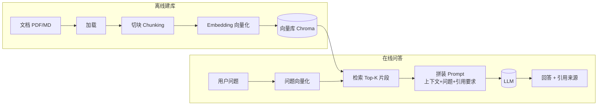

# Architecture — RAG 问答应用

> ⚠️ Verification Pending — 架构为设计方案，尚未实际落地验证。

## RAG 原理一句大白话

与其让 AI 凭"记忆"硬答，不如先把"参考书"翻到对的那一页，再把那页内容连同问题一起递给它。详见 [`../../../skills/ai/rag/SKILL.md`](../../../skills/ai/rag/SKILL.md)。

## 全链路流程

## 模块划分

| 模块 | 职责 | 关键点 |
| --- | --- | --- |
| 文档加载 | 读 PDF/MD 成纯文本 | 保留段落结构，便于出处引用 |
| 切块 | 切成可检索单元 | 块大小影响召回粒度（见 lessons） |
| Embedding | 文本→向量 | ⚠️ 模型版本需自验 |
| 向量库 | 存向量、相似度检索 | Chroma 本地持久化 |
| 检索 | 问题向量→Top-K 片段 | K 值默认 3-5 |
| 拼 Prompt | 上下文+问题+引用指令 | 控制总长不超窗口 |
| LLM | 基于上下文生成回答 | 要求标注出处 |
| 引用 | 回答附文件名+片段号 | 可回查原文 |

## 数据流

### 离线建库（一次）

文档 → 加载文本 → 切块 → 每块 Embedding → 存向量库

### 在线问答（每次）

问题 → Embedding → 向量库检索 Top-K → 拼 Prompt（上下文+问题+引用要求）→ LLM → 回答+引用

## 关键决策

### 为什么切块而非整篇塞

- 整篇超 LLM 上下文窗口
- 检索粒度越细，命中越准
- 块太大召回粗、块太小语义断（见 [lessons.md](lessons.md)）

### 为什么用向量检索而非关键词

- 向量按"意思"搜，能命中同义不同字
- 关键词搜不到换种说法的答案

> ⚠️ 实际效果需用问题集回归验证，未实测。

## 技术栈选型理由

| 项 | 选择 | 理由 |
| --- | --- | --- |
| Python | 语言 | RAG 生态最全 |
| Chroma | 向量库 | 本地、零配置、持久化 |
| langchain splitter | 切块 | 现成递归切分器，⚠️ 版本需自验 |
| Embedding API | 向量化 | ⚠️ key 自备，版本自验 |
| LLM API | 生成 | ⚠️ key 自备 |

## 风险与应对

| 风险 | 应对 |
| --- | --- |
| 切块不当致检索不准 | 用问题集回归调块大小（见 lessons） |
| 幻觉（答非文档内容） | Prompt 强制"仅基于上下文答，无依据说不知道" |
| 上下文超窗口 | 检索片段总长截断或择优 |
| Embedding/Chroma 版本不兼容 | ⚠️ 用户自行锁定版本验证 |
| key 误入库 | `.gitignore` + 环境变量 + grep 自查 |
