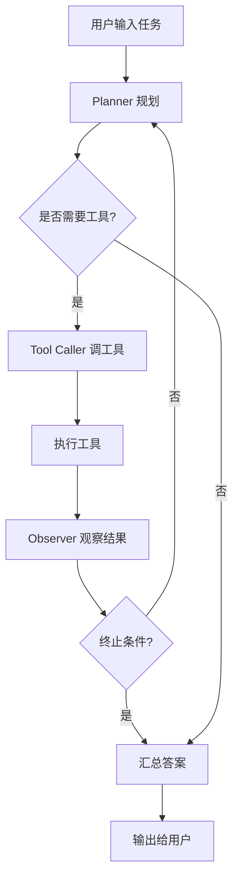

# 架构 - AI Agent

## 一句话
Agent = 一个"会自己想下一步干嘛、能动手调工具、知道什么时候该停"的循环程序。

## Mermaid

## 关键模块
- Planner：把当前状态转成"下一步做什么"
- Tool Caller：按 schema 生成 JSON 调用
- Observer：看工具返回，决定是否够用
- 终止条件：任务完成 / 循环上限 / 不可恢复错误
- 权限白名单：auto / confirm / deny

## 终止条件（重点）
- LLM 明确表示"任务完成"
- 循环次数 ≥ 上限（默认 5）
- 工具连续失败 ≥ 阈值
- 触发 deny 类工具

## 权限控制（重点）
每个工具带 permission 字段：
- auto：直接执行
- confirm：暂停，等人确认
- deny：拒绝执行并报原因

## 相关
- [skills/ai/agent.md](../../../skills/ai/agent.md)
- [skills/ai/tool-calling.md](../../../skills/ai/tool-calling.md)
