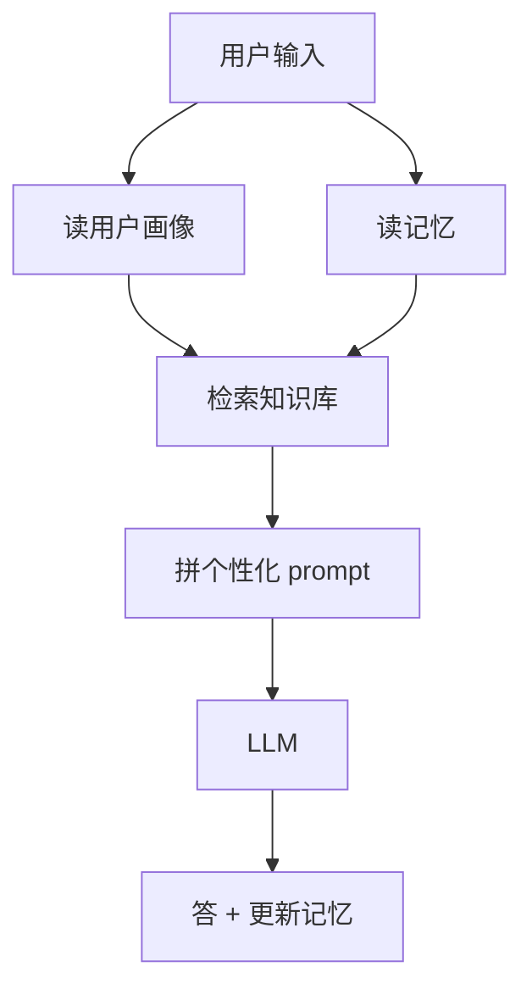

# 架构 - 学习助手

## 一句话
学习助手 = 一个"带着你的学习档案 + 历史问答 + 知识库"去问 LLM 的程序。

## Mermaid

## 关键模块
- 用户画像：水平 / 目标 / 偏好
- 知识库：学习路线 + 概念（RAG 检索）
- 记忆：已学 / 已问（读写）
- 个性化 prompt：把画像 + 记忆 + 检索结果拼进去

## 相关
- [skills/ai/rag.md](../../../skills/ai/rag/SKILL.md)
- [skills/ai/memory.md](../../../skills/ai/memory/SKILL.md)
