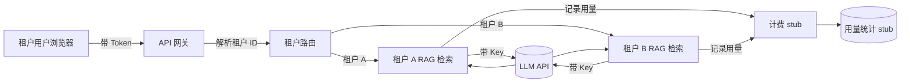

# Golden Case 005 — 多租户 AI SaaS 平台 MVP

> ⚠️ Verification Pending — 本案例尚未实际运行验证。内容已就位，但不代表已跑通。

## Project Goal（项目目标）

做一个面向企业客户的多租户 AI SaaS 平台 MVP：多个企业租户共用一套系统，但各自拥有独立知识库与对话，平台按用量统计费用（计费为 stub，不接真实支付）。让小白理解"多租户隔离 + 鉴权 + RAG + 计费"如何拼成最小可用的 SaaS。

## Difficulty（难度）

advanced（高级）

## Prerequisites（前置条件）

- 理解 Case 001（调 LLM）与 Case 002（RAG 检索）的基本概念
- 会用命令行跑后端服务
- ⚠️ 自备 LLM API Key + Embedding 模型访问，**不入库**
- ⚠️ 后端框架（如 Express / FastAPI）、向量库（如 Chroma）版本需用户自行验证兼容性

> 术语小贴士：**多租户（Multi-Tenant）**= 一栋写字楼里多家公司共用电梯和门牌，但各自办公室的门锁不同、互看不到对方资料。**租户（Tenant）**= 在这里就是一家企业客户。**计费 stub（占位）**= 先放一个"假装在计费"的假模块，只累加数字，不真扣钱，等以后接支付时再替换。

## Tech Stack（技术栈）

| 项 | 选择 | 说明 |
| --- | --- | --- |
| 前端 | Web 前端（HTML+JS 或轻量框架） | 登录页 + 文档上传 + 问答框 |
| 后端 | Node(Express) 或 Python(FastAPI) | 多租户隔离 + 鉴权 + 路由 |
| 鉴权 | JWT 或 Session | 登录态绑定租户 ID |
| RAG | 切块 + Embedding + 向量库 | 每租户独立 collection |
| 向量库 | Chroma（按租户分 collection） | ⚠️ 版本需自验 |
| LLM | 任一 Chat Completions 兼容 API | ⚠️ key 自备 |
| 计费 | stub（内存/计数器，⚠️ 未对接真实支付） | 只统计用量，不真扣费 |
| 部署 | 本地起服务 | ⚠️ 未部署到公网 |

> ⚠️ 以上各依赖版本均需用户自行验证兼容性。

## User Scenario（用户场景）

平台运营方把系统卖给多家企业客户。A 公司租户管理员登录后，上传本公司产品手册，员工提问得到基于自家文档的回答；B 公司同理，但两家公司互相看不到对方上传的文档，也查不到对方的对话。平台后台能看到各租户的用量（调用次数/Token）用于出账（stub）。

## MVP（最小可行版本）

租户隔离 + 登录鉴权 + 各租户独立知识库问答 + 用量统计（stub）。砍掉：真实支付对接、流式输出、多模型路由、组织内成员分级权限、SLA 监控（可后续加）。

## Architecture（架构）

详见 [architecture.md](architecture.md)。

> 一句大白话：网关是"大门保安"，先看你的工牌（Token）确认你是哪家公司（租户 ID），再把你领到你自己公司的资料柜（独立 collection），答完题把通话时长记到你这家的账本上（计费 stub）。别人公司的柜子你根本摸不到。

## Workflow（工作流）

构建步骤（每步只做一件事，详见 [development-log.md](development-log.md)）：

1. 租户模型 → 2. 鉴权登录 → 3. 隔离边界 → 4. 上传文档 → 5. RAG 入库 → 6. 问答 → 7. 用量统计 → 8. 计费 stub → 9. 发布检查

对应工作流：[`../../../workflows/feature-development/README.md`](../../../workflows/feature-development/README.md)

## Prompts（提示词）

- [`../../../prompts/start-here/start-project.md`](../../../prompts/start-here/start-project.md) — 启动项目
- [`../../../prompts/architecture/analyze-requirement.md`](../../../prompts/architecture/analyze-requirement.md) — 分析需求
- [`../../../prompts/architecture/design-architecture.md`](../../../prompts/architecture/design-architecture.md) — 设计多租户架构
- [`../../../prompts/ai-app/build-rag.md`](../../../prompts/ai-app/build-rag.md) — 搭最小 RAG
- [`../../../prompts/coding/implement-feature.md`](../../../prompts/coding/implement-feature.md) — 逐步实现
- [`../../../prompts/review/security-review.md`](../../../prompts/review/security-review.md) — 查跨租户泄露与 key 泄露

## Skills（技能）

- [`../../../skills/core/requirement-analysis/SKILL.md`](../../../skills/core/requirement-analysis/SKILL.md) — 需求分析
- [`../../../skills/core/architecture-design/SKILL.md`](../../../skills/core/architecture-design/SKILL.md) — 架构设计（含隔离边界）
- [`../../../skills/ai/rag/SKILL.md`](../../../skills/ai/rag/SKILL.md) — 检索增强生成（核心）
- [`../../../skills/ai/context-engineering/SKILL.md`](../../../skills/ai/context-engineering/SKILL.md) — 上下文工程
- [`../../../skills/core/implementation/SKILL.md`](../../../skills/core/implementation/SKILL.md) — 小步实现
- [`../../../skills/core/code-review/SKILL.md`](../../../skills/core/code-review/SKILL.md) — 代码评审
- [`../../../skills/core/verification-before-completion/SKILL.md`](../../../skills/core/verification-before-completion/SKILL.md) — 完成前验证

## Testing（测试）

- 隔离测试：A 租户上传文档后，B 租户提问检索不到 A 的内容
- 鉴权测试：未登录 / 错 Token / 伪造租户 ID 应被拒
- 计费 stub：每次问答后用量计数 +1，可按租户查询累计
- 兜底测试：断网 / 超限 / key 失效时有可读错误，不串租户

> ⚠️ 本案例 V0.1 尚未实际编写或运行任何测试。

## Verification（验证）

⚠️ **Verification Pending** — 尚未实际运行。Expected Verification Steps 见 [verification.md](verification.md)。

## Known Limitations（已知局限）

- 计费为 stub，⚠️ 未对接真实支付，不产生真实账单
- 无成员分级权限（租户内所有成员等权）
- 无流式输出
- ⚠️ 隔离强度未做安全审计，仅做应用层 collection 分离
- ⚠️ 未做真实压测与多租户性能验证
- ⚠️ 未部署到公网

## Lessons Learned（经验总结）

详见 [lessons.md](lessons.md)。核心：跨租户数据泄露是头号风险、key 永远不上前端、计费要防误计、隔离要做彻底不留后门。
