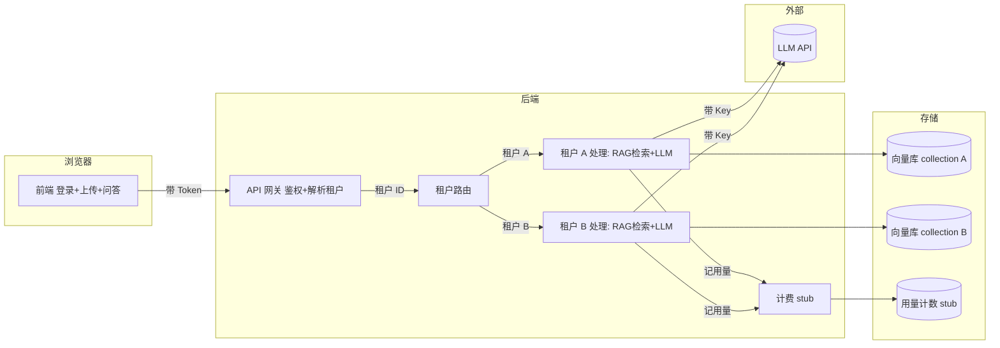

# Architecture — 多租户 AI SaaS 平台 MVP

> ⚠️ Verification Pending — 架构为设计方案，尚未实际落地验证。

## 总览

一条带"门卫"的链路：网关鉴权 → 租户路由 → 各自独立的 RAG + LLM → 计费 stub 记账。

> 术语解释：**网关（Gateway）**= 所有请求的"大门"，先验工牌再放行。**租户路由（Tenant Routing）**= 按你的租户 ID 把你领到对应资料柜。**collection（向量库集合）**= 向量库里按租户分的独立抽屉，A 抽屉与 B 抽屉物理/逻辑分开。

## 模块划分

| 模块 | 职责 | 关键点 |
| --- | --- | --- |
| 前端 | 登录、上传、问答 | Token 存前端，租户 ID 不前端自报（由后端从 Token 解） |
| API 网关 | 鉴权 + 解析租户 ID | 未登录/伪造租户 ID 一律拒 |
| 租户路由 | 按 Token 中的租户 ID 分流 | 租户 ID 来自 Token，不来自请求体 |
| RAG 处理 | 切块/向量化/检索/拼 prompt | 检索强制带 `tenant_id` 过滤 |
| 计费 stub | 每次问答 +1 用量 | 仅本地计数，无支付请求 |
| 配置 | LLM/Embedding Key 等 | 从环境变量读，不入库 |

## 隔离边界（重点）

隔离是本案例头等大事。两层防线：

| 层 | 做法 | 防什么 |
| --- | --- | --- |
| 数据层 | 向量库按租户分 collection，关系库每行带 `tenant_id` | 防跨租户读到对方数据 |
| 应用层 | 所有查询默认 `WHERE tenant_id = ?`；租户 ID 取自 Token，不接受前端传参 | 防伪造租户 ID 越权 |

> 大白话：数据层是"每家锁不同的柜子"，应用层是"门卫只认工牌不认你嘴上说的公司名"。两层都要有，单靠一层不够——柜子锁好了，门卫放错人也不行。

### 关键决策：租户 ID 从哪来

| 方案 | 租户 ID 来源 | 风险 |
| --- | --- | --- |
| ❌ 前端传参 | 请求体 / URL 带 tenant_id | 用户改一下就能冒充别人 |
| ✅ Token 解析 | 登录时签进 JWT，后端解 Token 取 | 伪造 Token 需破签名，难冒充 |

> 即便用 Token，也要防"对象级授权"漏洞：拿到 Token 后访问 `/docs/{id}` 时，必须校验该 doc 属于本租户，否则仍会越权读别人文档。

## 密钥管理（重点）

| 密钥 | 存放 | 谁能看 |
| --- | --- | --- |
| LLM API Key | 后端环境变量 / `.env`（git 忽略） | 仅后端进程 |
| Embedding Key | 同上 | 仅后端进程 |
| JWT 签名密钥 | 同上 | 仅后端进程 |
| 租户用户密码 | 仅存哈希（bcrypt 等） | 谁都看不到原文 |

> 三条红线：① key 不入库；② key 不上前端；③ 用户密码只存哈希。提交前 grep `sk-` / `api_key` / `secret` 自查。

## 计费 stub（重点）

| 项 | 说明 |
| --- | --- |
| 做什么 | 每次问答成功后，给该租户用量计数 +1（或 +Token 数） |
| 不做什么 | 不调任何支付接口、不生成真实账单、不扣款 |
| 为什么 stub | MVP 先跑通链路，真实计费/支付风险高、合规重，留后续 |

> ⚠️ 计费 stub 仅用于演示用量统计链路，不构成真实计费能力。

## 技术栈选型理由

| 项 | 选择 | 理由 |
| --- | --- | --- |
| 鉴权 | JWT | 无状态、易带租户 ID；⚠️ 需自行实现续签/吊销 |
| 向量库 | Chroma 按 collection 隔离 | 本地易起；⚠️ 生产级隔离与权限需用户自验 |
| 计费 | 内存/计数器 stub | 最简，无外部依赖 |
| 部署 | 本地 | ⚠️ 未上公网 |

## 风险与应对

| 风险 | 应对 |
| --- | --- |
| 跨租户数据泄露 | 两层隔离 + 对象级授权校验 + 隔离测试用例 |
| key 误提交 | `.gitignore` 加 `.env`；提交前 grep 自查 |
| 计费误计（失败也算钱） | 仅在问答成功后 +1，失败/超时不计 |
| 隔离不彻底（某接口漏过滤） | 关键路径日志带租户 ID，便于审计发现 |
| LLM 超时 | 30s 超时兜底，不串租户 |

> ⚠️ 隔离强度未做安全审计；上述为设计目标，未经渗透测试验证。
