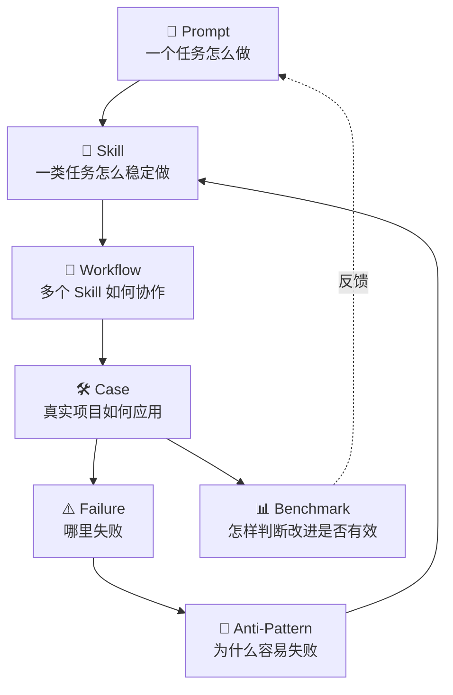
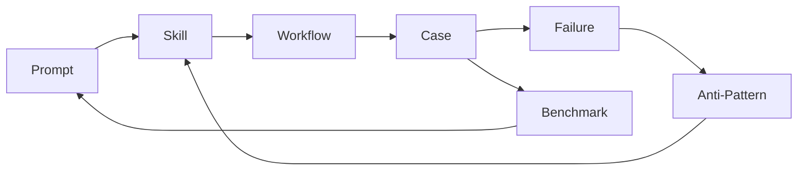

# Content Model 内容模型

> EasyVibeCoding 的 7 类核心资产及其关系。

---

## 7 类核心资产

| 资产 | 定义 | 大白话 | 示例 |
| --- | --- | --- | --- |
| Prompt | 让 AI 完成一个具体任务 | 你给 AI 的那句指令 | "实现用户注册 API" |
| Skill | 让 AI 用稳定的方法完成一类任务 | 可复用的操作手册 | systematic-debugging |
| Workflow | 多个 Skill 协作完成一个完整过程 | 把操作手册串成流水线 | feature-development |
| Case | 在真实项目中应用这些方法 | 跟着做一遍的完整例子 | AI Chat 应用 |
| Failure | 记录真实失败及其原因 | 踩过的坑 | AI 无限 Debug Loop |
| Anti-Pattern | 总结反复出现的错误方式 | 什么不该做 | Giant Prompt |
| Benchmark | 判断一个方法到底有没有变好 | 用数据说话 | 任务完成率对比 |

---

## 关系图

---

## 从上到下读

1. **Prompt** 回答："这一个具体任务怎么做？"
2. **Skill** 回答："这一类任务怎么稳定地做？"
3. **Workflow** 回答："多个任务怎么串成完整流程？"
4. **Case** 回答："真实项目里这套方法怎么用？"
5. **Failure** 回答："什么时候会出错？"
6. **Anti-Pattern** 回答："为什么会反复出错？怎么避免？"
7. **Benchmark** 回答："用了这套方法到底有没有变好？"

---

## 从下到上反馈

1. **Benchmark** 的数据反馈到 **Prompt**：哪个 Prompt 效果好？哪个差？
2. **Anti-Pattern** 反馈到 **Skill**：把"不要做什么"写进 Skill 的 Anti-Patterns 章节
3. **Failure** 反馈到 **Anti-Pattern**：反复出现的失败提炼成反模式
4. **Case** 反馈到 **Workflow**：实战中发现 Workflow 缺少的步骤
5. **Workflow** 反馈到 **Skill**：发现 Skill 没覆盖的场景

---

## 知识闭环

> **目标**：形成知识闭环——不是孤立的 Markdown 文件，而是一套互相链接、互相验证、持续改进的方法论。

---

## 延伸阅读

- [Core Methodology](./core-methodology.md) — 9 步核心流程
- [Verification Ladder](./verification-ladder.md) — 7 级验证等级
- [Learning Path](../learning-path/roadmap.md) — 由浅入深的学习路线
- [Decision Tree](../getting-started/decision-tree.md) — 场景导航
