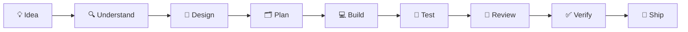
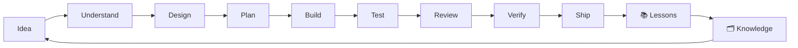
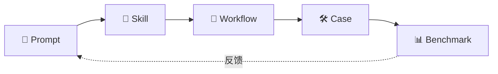

# Core Methodology 核心方法论

> ⚠️ Not Yet Verified — 方法论已定义，尚未在多个真实项目中完整验证。

EasyVibeCoding 的核心主张：

> **不要只是让 AI 写代码，而是建立一套让 AI 持续、稳定、可验证地帮助人构建软件的方法。**

---

## 为什么不推荐"一条超级 Prompt 直接生成整个项目"

很多人第一次用 AI 写代码，会这样写 Prompt：

```
帮我做一个笔记系统，要登录、列表、新建、编辑、删除、搜索、
标签分类、导出 PDF、部署上线，用 React + Node + Postgres，
风格好看点，做完直接能跑。
```

这叫 **Giant Prompt**（巨型提示词）。看起来高效——一句话搞定全部。但几乎必然翻车：

| 问题 | 原因 |
| --- | --- |
| AI 漏约束 | 需求越多，AI 注意力越分散，常漏掉关键约束 |
| 出错难定位 | 一次吐出几千行，报错时分不清是哪段逻辑的锅 |
| 无法验证 | 没有验收标准，"看着能跑"不等于"真的对" |
| 不可维护 | 代码结构是临时凑的，加新功能时全是债 |

> 详见反模式：[Giant Prompt](../../anti-patterns/giant-prompt.md)

**EasyVibeCoding 的回答**：把"一句话生成整个项目"拆成 **9 步工程化流程**，每步小而可验证，人掌握关键决策。

---

## 9 步核心流程



| 步骤 | 大白话 | 对应 Skill | 对应 Prompt | 对应 Workflow |
| --- | --- | --- | --- | --- |
| 💡 Idea | 你想做什么 | [brainstorming](../../skills/core/brainstorming/SKILL.md) | [start-project](../../prompts/start-here/start-project.md) | [start-project](../../workflows/start-project/README.md) |
| 🔍 Understand | 先搞懂项目/需求 | [project-discovery](../../skills/core/project-discovery/SKILL.md) | [understand-project](../../prompts/start-here/understand-project.md) | start-project |
| 🎨 Design | 定架构和技术栈 | [architecture-design](../../skills/core/architecture-design/SKILL.md) | [design-architecture](../../prompts/architecture/design-architecture.md) | start-project |
| 🗂 Plan | 拆任务、定顺序 | [task-planning](../../skills/core/task-planning/SKILL.md) | [write-development-plan](../../prompts/architecture/write-development-plan.md) | start-project |
| 💻 Build | 一次一个小任务 | [implementation](../../skills/core/implementation/SKILL.md) | [implement-feature](../../prompts/coding/implement-feature.md) | [feature-development](../../workflows/feature-development/README.md) |
| 🧪 Test | 给功能配可验证测试 | [testing](../../skills/core/testing/SKILL.md) | [write-tests](../../prompts/testing/write-tests.md) | feature-development |
| 👀 Review | 改完逐项评审 | [code-review](../../skills/core/code-review/SKILL.md) | [code-review](../../prompts/review/code-review.md) | feature-development |
| ✅ Verify | 有证据才算完成 | [verification-before-completion](../../skills/core/verification-before-completion/SKILL.md) | [verify-feature](../../prompts/testing/verify-feature.md) | feature-development |
| 🚀 Ship | 发布前过清单 | — | [release-checklist](../../prompts/deployment/release-checklist.md) | [release](../../workflows/release/README.md) |

> 术语小贴士：**Skill**（技能）= 可复用的操作单元；**Workflow**（工作流）= 把多个 Skill 串成一条完整流水线。

---

## 9 步的核心原则

每一步都遵循 EasyVibeCoding 的 [7 条核心原则](../../README.md#哲学7-条核心原则) 和 [10 条编程宪法](./coding-constitution.md)：

| 原则 | 在 9 步中的体现 |
| --- | --- |
| Understand before coding | Step 2 Understand 在 Step 5 Build 之前 |
| Small tasks over giant prompts | Step 4 Plan 把大需求拆成小任务，Step 5 每次只做一个 |
| Reuse before reinvent | Step 2-3 先查项目已有的工具/组件，不重新造 |
| Evidence over claims | Step 8 Verify 要求客观证据，不听 AI 自吹 |
| Human owns decisions | 每个 Workflow 的 [When to Pause](../../workflows/start-project/README.md#when-to-pause--何时暂停--人工确认) 章节定义了人工确认点 |
| Every mistake becomes knowledge | 出错时走 [debugging workflow](../../workflows/debugging/README.md)，修完沉淀到 [failures](../../failures/) |
| From Prompt to Production | 9 步从一句话想法走到可发布软件 |

---

## 闭环：不是线性，而是循环

9 步不是"走一遍就结束"的直线流程，而是一个**闭环**：



每次发布后：
1. **复盘**（Lessons Learned）：什么做对了、什么踩了坑
2. **沉淀**（Knowledge）：把经验写进 Failure / Anti-Pattern / Skill
3. **反馈**：下次的 Idea 阶段就能复用上次的知识

> 详见 [Vibe Coding 开发循环](../../README.md#vibe-coding-开发循环)

---

## 核心资产之间的关系



| 资产 | 定义 | 大白话 |
| --- | --- | --- |
| Prompt | 让 AI 完成一个具体任务 | 你给 AI 的那句指令 |
| Skill | 让 AI 用稳定的方法完成一类任务 | 可复用的操作手册 |
| Workflow | 多个 Skill 协作完成一个完整过程 | 把操作手册串成流水线 |
| Case | 在真实项目中应用这些方法 | 跟着做一遍的完整例子 |
| Failure | 记录真实失败及其原因 | 踩过的坑 |
| Anti-Pattern | 总结反复出现的错误方式 | 什么不该做 |
| Benchmark | 判断一个方法到底有没有变好 | 用数据说话 |

---

## 与"超级 Prompt"的对比

| 维度 | 超级 Prompt | EasyVibeCoding 9 步 |
| --- | --- | --- |
| 拆解 | 不拆，一句话全塞 | 拆成 9 步，每步 1-2 个任务 |
| 复用 | 每次从零写 Prompt | Skill / Prompt 可复用 |
| 验证 | "看着能跑" | 每步有验收标准 + 测试 |
| 决策 | AI 自己定 | 关键决策人拍板 |
| 纠错 | 报错就再问一句，无限循环 | 走 systematic-debugging 6 步 |
| 沉淀 | 经验只存在于一次对话 | 沉淀到 Failure / Anti-Pattern |
| 可维护 | 代码结构临时凑 | 先设计再实现 |

---

## 延伸阅读

- [Coding Constitution 编程宪法](./coding-constitution.md)——10 条底线规则
- [Verification 验证](./verification.md)——5 级验证等级
- [Skill 概念](./skill.md)——Skill 的定义与标准
- [Workflow 概念](./workflow.md)——Workflow 的定义与标准
- [Prompt 概念](./prompt.md)——Prompt 的设计原则
- [Giant Prompt 反模式](../../anti-patterns/giant-prompt.md)——为什么不推荐超级 Prompt
- [Start Project Workflow](../../workflows/start-project/README.md)——第一个完整工作流
- [Learning Path 学习路径](../learning-path/roadmap.md)——由浅入深的学习路线
