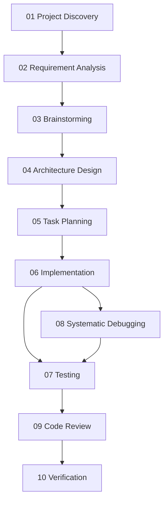

# Core Skills Dependency Map 核心技能依赖图

> 10 个 Core Skills 如何协作完成一次完整开发。

## 依赖关系图

## 说明

> Debugging 不是开发结束以后才发生。它可能在 Implementation、Testing、Integration 等多个阶段发生。

| 阶段 | 可能触发 Debugging | 可能触发 Code Review |
| --- | --- | --- |
| Implementation | ✅ 写完跑不起来 | ✅ 实现完想合并 |
| Testing | ✅ 测试不通过 | ✅ 测试覆盖率不够 |
| Integration | ✅ 集成后出错 | ❌ |
| Verification | ✅ 验收不过 | ❌ |

## 线性流程 vs 实际流程

| 类型 | 流程 |
| --- | --- |
| 理想流程 | 01→02→03→04→05→06→07→08→09→10 一次走完 |
| 实际流程 | 06→08→06→07→08→06→09→10 反复迭代 |

> 实际开发中，Debugging 和 Implementation 会反复切换。关键是每次切换都有明确目标。

## 延伸阅读

- [Core Skills Matrix](./core-skills-matrix.md) — 每个技能的输入/输出/触发时机
- [Skill Selector](../getting-started/skill-selector.md) — 根据场景选技能
- [Skill Lifecycle](./skill-lifecycle.md) — 技能成熟度演进
