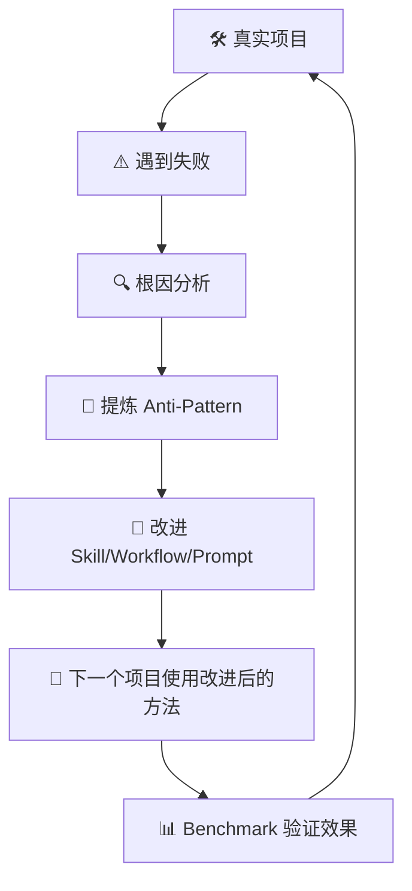

# Knowledge Feedback Loop 知识反馈闭环

> EasyVibeCoding 的长期核心增长机制：从真实项目失败中提炼经验，反哺 Skill/Workflow/Prompt。

## 反馈闭环



## 与 Knowledge Loop 的关系

[Knowledge Loop](./knowledge-loop.md) 讲的是"从项目到知识"的闭环。本文讲的是"从失败到改进"的闭环——更聚焦于失败如何反哺 Workflow。

## 示例

```
1. 做 AI Chat 项目
2. AI 没验证就说"完成了" → Failure
3. 根因：Workflow 没有 Stop Condition
4. 反哺：Workflow 增加 Verification Gate
5. 下个项目：AI 到 Verification Gate 自动停下来验证
6. Benchmark：有 Gate vs 无 Gate 的"假完成"率
```

## 检查清单

每次遇到失败后检查：

- [ ] 是否记录到了 failures/？
- [ ] 是否提炼成了 anti-patterns/？
- [ ] 是否更新了对应 Workflow 的 Stop Condition？
- [ ] 是否更新了对应 Skill 的 Rules？
- [ ] 是否更新了对应 Prompt 的 Hard Gate？

## 延伸阅读

- [Knowledge Loop](./knowledge-loop.md)
- [Content Model](./content-model.md)
- [Workflow System](./workflow.md)
