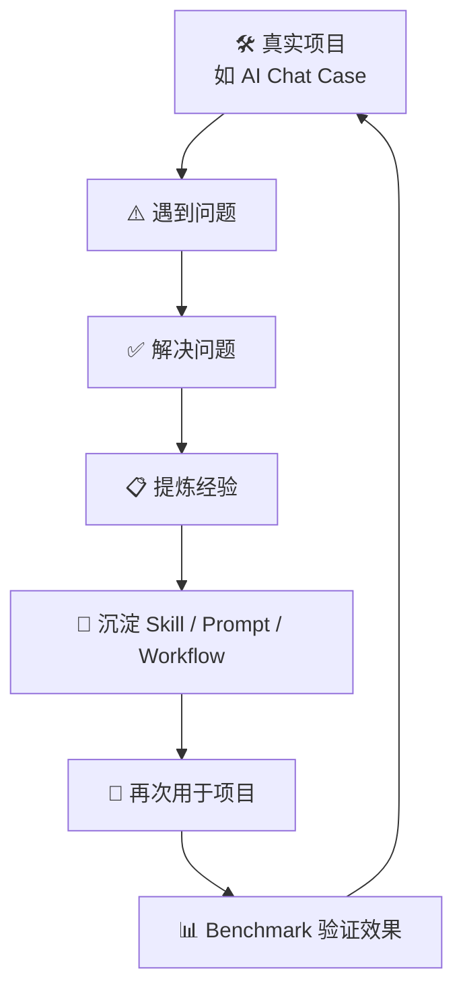
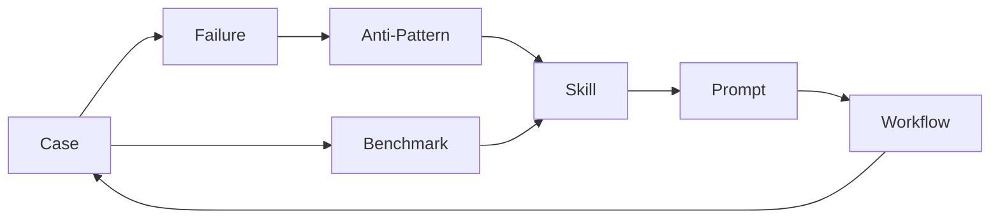

# Knowledge Loop 知识闭环

> EasyVibeCoding 最核心的长期增长机制：从真实项目中提炼经验，沉淀为可复用资产，再用于下一个项目。

---

## 闭环流程



| 阶段 | 做什么 | 产出什么 | 例子 |
| --- | --- | --- | --- |
| 真实项目 | 用 EasyVibeCoding 方法做项目 | 项目代码 + 开发日志 | AI Chat 应用 |
| 遇到问题 | 遇到 Bug / 失败 / 困境 | 问题描述 + 上下文 | AI 改错文件 |
| 解决问题 | 用 Skill 排查修复 | 根因 + 修复方案 | 走 project-discovery 理解调用链 |
| 提炼经验 | 从解决方案中提炼共性 | 教训 / 规则 | "改之前先理解调用链" |
| 沉淀资产 | 写进知识库 | Skill / Prompt / Failure / Anti-Pattern | wrong-file-editing anti-pattern |
| 再次使用 | 下个项目用这套方法 | 更快的开发 | 新项目先用 project-discovery |
| Benchmark | 对比有无 Skill 的效果 | 数据证据 | 用了 Skill 的修改正确率更高 |

---

## 闭环示例

以 AI Chat Case 为例：

```
1. 做 AI Chat 项目
2. AI 改错了文件（前端改了，问题在后端）
3. 用 systematic-debugging 排查，找到根因在后端
4. 提炼："改之前先理解调用链"
5. 沉淀：
   - Failure: failures.md 的 Failure 01
   - Anti-Pattern: wrong-file-editing.md
   - Skill: project-discovery 的 14 项检测清单
6. 下个项目：先走 project-discovery，不再改错文件
7. Benchmark: 对比"直接改" vs "先理解再改"的正确率
```

---

## 闭环与 7 类资产的关系



> **目标**：不是孤立的 Markdown 文件，而是一套互相链接、互相验证、持续改进的方法论。

---

## 闭环检查清单

每次完成一个真实项目后，检查：

- [ ] 遇到的问题是否记录到了 failures/？
- [ ] 反复出现的问题是否提炼成了 anti-patterns/？
- [ ] 解决问题的方法是否更新到了 skills/？
- [ ] 使用的 Prompt 是否沉淀到了 prompts/？
- [ ] 多步操作是否串成了 workflows/？
- [ ] 有没有 Benchmark 数据证明方法有效？

---

## 延伸阅读

- [Content Model](./content-model.md) — 7 类资产的关系
- [Core Methodology](./core-methodology.md) — 9 步核心流程
- [Verification Ladder](./verification-ladder.md) — 7 级验证等级
- [AI Chat Reference Case](../../cases/golden/001-ai-chat/README.md) — 闭环的完整示例
