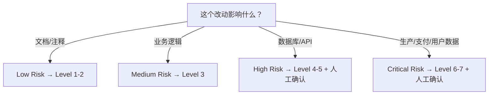

# Risk-Based Verification 风险分级验证

> 不是所有任务都需要同等强度的验证。根据风险选择合理级别。

## 风险分级

| 等级 | 名称 | 示例 | 最低验证级别 | 人工确认 |
| --- | --- | --- | --- | --- |
| Low | 低风险 | 改 README、改注释、改样式 | Level 1-2 | 不需要 |
| Medium | 中风险 | 修改普通业务逻辑、加功能 | Level 3 | 推荐 |
| High | 高风险 | 修改数据库结构、改 API、改认证 | Level 4-5 | 必须 |
| Critical | 极高风险 | 生产数据库、支付、用户数据、权限系统 | Level 6-7 | 必须 |

## 验证级别参考

| Level | 名称 | 说明 |
| --- | --- | --- |
| 0 | AI Claim | ❌ 永远不够 |
| 1 | Static | 文件存在、语法检查 |
| 2 | Build | 编译/构建通过 |
| 3 | Tests | 自动化测试通过 |
| 4 | Behavior | 手动触发功能正常 |
| 5 | Integration | 多模块协作正常 |
| 6 | Real Env | 真实环境验证 |
| 7 | Human | 用户确认 |

## 决策流程

## 延伸阅读

- [Verification System](./verification-system.md)
- [Definition of Done](./definition-of-done.md)
- [Human Approval Matrix](./human-approval-matrix.md)
