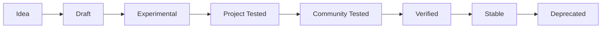

# Skill Lifecycle 技能生命周期

> 一个 Skill 从想法到成熟的完整过程。

## 生命周期



## 状态定义

| 状态 | 说明 | verified | 诚实标记 |
| --- | --- | --- | --- |
| Idea | 有想法，还没写 | false | 💡 Idea |
| Draft | 初稿，结构可能不完整 | false | 📝 Draft |
| Experimental | 结构完整，未在项目中测试 | false | ⚠️ Not Yet Verified |
| Project Tested | 在至少 1 个真实项目中用过 | false | 🔬 Project Tested |
| Community Tested | 社区用户反馈有效 | false | 👥 Community Tested |
| Verified | 有真实证据（测试输出/截图/可复现命令） | true | ✅ Verified |
| Stable | 长期稳定，多项目验证 | true | 🟢 Stable |
| Deprecated | 不再推荐，有更好替代 | false | ⛔ Deprecated |

## 当前 Core Skills 状态

| Skill | 状态 | verified | version |
| --- | --- | --- | --- |
| project-discovery | Experimental | false | 1.0.0 |
| requirement-analysis | Experimental | false | 1.0.0 |
| brainstorming | Experimental | false | 1.0.0 |
| architecture-design | Experimental | false | 1.0.0 |
| task-planning | Experimental | false | 1.0.0 |
| implementation | Experimental | false | 1.0.0 |
| systematic-debugging | Experimental | false | 1.0.0 |
| testing | Experimental | false | 1.0.0 |
| code-review | Experimental | false | 1.0.0 |
| verification-before-completion | Experimental | false | 1.0.0 |

> 10 个 Skill 全部处于 Experimental 阶段——结构完整，但未在真实项目中验证。版本号 1.0.0 表示结构成熟度，不表示行为验证。

## 如何升级到 Verified

```
1. 在真实项目中执行该 Skill
2. 记录执行过程（Prompt / AI 输出 / 验证结果）
3. 有客观证据（测试输出 / 运行截图 / 可复现命令）
4. 更新 verified: true + last_verified: 日期
```

> 版本号可以高于 1.0.0 但 verified 仍为 false——结构成熟 ≠ 行为验证。

## 延伸阅读

- [Verification Ladder](./verification-ladder.md) — 7 级验证等级
- [Core Skills Roadmap](../roadmap/core-skills-roadmap.md) — 路线图
