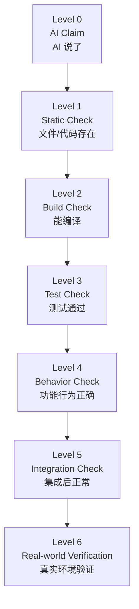

# Verification Ladder 验证阶梯

> ⚠️ Not Yet Verified — 验证等级已定义，尚未在真实项目中逐级验证。

## 核心原则

> **"AI 说完成"不属于验证。**

AI 声称"做完了"只是 Level 0（Claim）。只有逐级爬上验证阶梯，才算真正完成。

---

## 7 级验证等级



| Level | 名称 | 验证什么 | 方法 | 谁来判定 | 例子 |
| --- | --- | --- | --- | --- | --- |
| 0 | AI Claim | AI 说"做完了" | — | — | "登录功能已完成" |
| 1 | Static Check | 代码文件存在、有实际内容 | `ls` / `grep` / 文件检查 | 人/脚本 | `grep -r "login" src/` 有结果 |
| 2 | Build Check | 项目能编译/构建 | `npm run build` / `go build` | 构建工具 | build 成功，无报错 |
| 3 | Test Check | 自动化测试通过 | `npm test` / `pytest` | 测试框架 | 3/3 测试 ✅ |
| 4 | Behavior Check | 功能行为正确 | 手动操作 / curl / 浏览器 | 人 | 正常登录返回 200，密码错返回 401 |
| 5 | Integration Check | 与其他模块集成后正常 | 联调 / E2E 测试 | 人/E2E 工具 | 登录后跳转正确，session 持久化 |
| 6 | Real-world Verification | 真实环境（生产/staging）验证 | 部署到 staging 验证 | 人 | 在 staging 环境用真实数据验证 |

---

## 如何使用

### 每个功能至少要爬到哪级？

| 功能复杂度 | 最低要求 | 说明 |
| --- | --- | --- |
| 改文案 / 改样式 | Level 1 | 代码存在即可 |
| 修小 Bug | Level 3 | 测试通过 |
| 新增功能 | Level 4 | 行为正确 |
| 涉及多模块的功能 | Level 5 | 集成检查 |
| 涉及外部依赖（支付/通知） | Level 6 | 真实环境验证 |

### 等级越高越可信

- Level 0：AI 的话，不可信。
- Level 1-2：代码存在、能编译，但行为可能错。
- Level 3：测试过了，但测试可能覆盖不全。
- Level 4：手动验证了，但可能没测集成。
- Level 5：集成测了，但可能没在真实环境跑。
- Level 6：真实环境验证了，最可信。

> **爬到哪级由功能复杂度决定，但 Level 0 永远不算"验证通过"。**

---

## 验证报告格式

```
功能：<名称>
验证等级：Level X

Level 0 — AI Claim: "已完成"
Level 1 — Static Check: ✅ grep 有结果，3 个文件
Level 2 — Build Check: ✅ npm run build 成功
Level 3 — Test Check: ✅ 5/5 通过
Level 4 — Behavior Check: ✅ 正常路径 + 错误场景
Level 5 — Integration Check: ❌ 与通知模块联调失败
Level 6 — Real-world: ⬜ 未执行

结论：未完成（Level 5 未通过，回到实现阶段修复联调问题）
```

---

## 延伸阅读

- [Verification Before Completion Skill](../../skills/core/verification-before-completion/SKILL.md) — 完成前的逐条验证
- [Core Methodology](./core-methodology.md) — 9 步流程中的 Verify 步骤
- [Coding Constitution](./coding-constitution.md) — 原则 04：Evidence over claims
