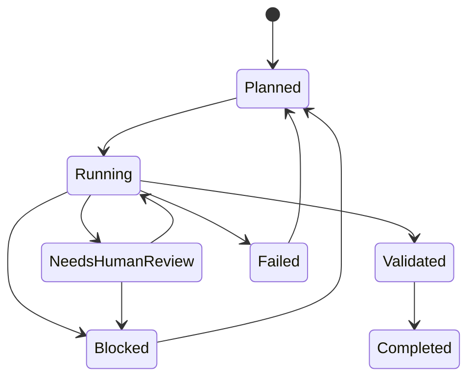

# Workflow State Machine 工作流状态机

> 所有 EasyVibeCoding Workflow 使用统一的状态模型。

## 状态图

## 状态定义

| 状态 | 说明 | 谁触发 |
| --- | --- | --- |
| Planned | 任务已规划，尚未开始 | AI 或人 |
| Running | AI 正在执行 | AI |
| Needs Human Review | 到了人工检查点 | AI 自动暂停 |
| Blocked | 遇到障碍无法继续 | AI |
| Validated | 验证通过 | AI 或人 |
| Completed | 任务完成 | 人确认 |
| Failed | 验证失败 | AI 或人 |

## 为什么不用 "Done"

> "Done" 太模糊——AI 说 Done 不代表真的做完了。用 Validated + Completed 区分：验证通过 ≠ 人确认完成。

## 延伸阅读

- [Workflow System](./workflow.md)
- [Workflow Matrix](./workflow-matrix.md)
- [Verification System](./verification-system.md)
