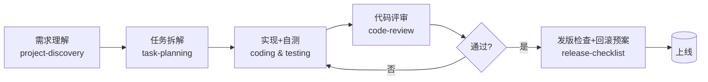

# Workflow 工作流

## 是什么

Workflow（工作流）是把多个 Skill 按固定顺序串成一条流程。大白话：一份"先做什么、再做什么、每步交给谁"的流水线安排。

单个 Skill 解决"这一类活怎么干"，Workflow 解决"完成一个大目标要走哪几步、每步用哪个 Skill"。

## 为什么重要

原则 02 Small tasks over giant prompts——大需求要拆成小任务。但拆完之后还需要把它们按正确顺序、正确交接关系串起来，否则各步对不上。Workflow 就是那张"装配图"。

它让流程可复现：同样一个发版流程，今天和下个月走的是同一套步骤，不会因为换个人就漏掉某步检查。

## 什么时候用

- 一个目标需要 3 步以上、且步骤有先后依赖
- 多个 Skill 之间需要传递中间产物（如"评审产出 → 修复 → 复评"）
- 想把团队流程固化下来，保证不漏步骤

## 怎么用：给个 Mermaid 例子

以"上线一个修复"为例，串起 4 个 Skill：

画法要点：

- 每个方框对应一个 Skill，标注技能名方便定位
- 用菱形表示判断分支（如评审是否通过）
- 回退边（不通过回到实现）一定要画出来，提醒流程不是单向的

更多现成流程见 [`workflows/`](../../workflows/)，比如发版流程 [`workflows/release`](../../workflows/)。

## 常见误用

- **把 Workflow 画成线性的，没有回退分支**：真实工程里评审不过、测试失败都会打回。不画回退边，执行时就容易"硬过"。
- **Workflow 和 Skill 混为一谈**：Skill 是"怎么干一类活"，Workflow 是"按什么顺序干多个活"。别在一个 Skill 文件里塞整条流水线。
- **步骤太细或太粗**：太细变成微操作清单难维护；太粗失去指导意义。一般 3–7 个主步骤比较合适。
- **画完不更新**：流程改进了图不改，图和现实脱节，反而误导。

## 相关资源

- Workflow 目录：[`workflows/`](../../workflows/)
- 发版流程：[`workflows/release`](../../workflows/)、[deployment](../best-practices/deployment.md)
- 拆任务的依据：[task-decomposition](../best-practices/task-decomposition.md)
- Skill 概念：[skill](./skill.md)
