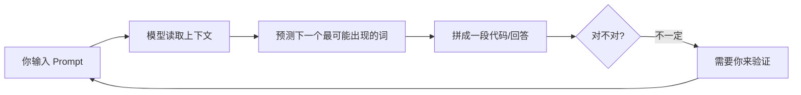

# 02 — AI 写代码的基本原理

> 你不需要懂数学，只需要搞懂 4 件事：模型、上下文、生成、不保证正确。

> 术语小贴士：本文会解释 **LLM / Token / 上下文窗口** 三个核心术语，每个都配一句大白话。

---

## 一个简单的流程图

**一句话总结**：AI 写代码 = 根据"你给的信息"，预测"接下来最可能出现的代码"。它是在**猜**，不是在**算**——所以不保证对。

---

## 三个核心术语（大白话版）

### 1. LLM = 大语言模型

> **大白话**：一个读过海量文本的 AI，能根据上文猜下文。就像一个读了整个图书馆的人，你给个开头，它能接着往下编。

- 它不是"懂编程"，而是"见过的代码够多，能模仿着写"。
- 常见的 LLM：GPT-4、Claude、Gemini 等。

### 2. Token = 模型计费 / 长度单位

> **大白话**：AI 不是按"字"算的，是按"词块"算的。一个 Token 粗略等于一个字或一个词块。Token 越多，越贵、越慢。

| 文本 | 大约 Token 数 |
| --- | --- |
| "Hello" | 1 |
| "你好" | 1–2 |
| 一行代码 `const x = 1;` | 约 5–6 |
| 一段 100 行的代码 | 约 300–500 |

为什么重要？
- **计费**：用 AI API 是按 Token 收费的，Token 越多越贵。
- **长度**：一次对话塞太多，会撑爆"上下文窗口"。

### 3. 上下文窗口 = 一次能塞多少信息

> **大白话**：AI 一次对话能"记住"的信息量有上限，就像一个房间只能装这么多人。塞满了，早进去的会被挤出去（遗忘）。

| 模型 | 上下文窗口（大致） | 能装多少 |
| --- | --- | --- |
| 老款 | 8K Token | 约 6000 字 / 一篇长文 |
| 主流 | 128K Token | 约 10 万字 / 一本小书 |
| 长上下文 | 1M Token | 约 75 万字 / 几本书 |

为什么重要？
- 如果你把整个大项目全塞给 AI，它可能"记不住"开头的要求。
- 这就是 Principle 02（拆小任务）的技术原因：一次别塞太多，AI 才记得住。

---

## 为什么"不保证正确"——所以要验证

AI 生成代码的本质是**预测概率最高的下一个词**，它：

- ✅ 能模仿见过的代码模式
- ❌ 不保证逻辑正确
- ❌ 可能编造不存在的函数 / 库（叫"幻觉"）
- ❌ 不知道你的项目真实环境

> 术语小贴士：**幻觉（Hallucination）**= AI 一本正经地胡说八道，比如编一个根本不存在的函数名，还写得像模像样。

所以 Principle 04（Evidence over claims / 要证据，别听 AI 自吹）是硬规则：

> AI 说"我写好了"——**不算写好**。
> 代码能跑、测试能过、bug 能复现修复——**才算写好**。

---

## 这对你意味着什么

1. **给全上下文**：AI 看不到你的项目，你不给信息它就猜，猜错就是 bug。
2. **小步走**：一次一小块，AI 记得住、错了好定位。
3. **永远验证**：别信 AI 的"完成了"，自己跑一遍、测一遍。
4. **控制成本**：别把整个项目无脑塞给 AI，Token 是要钱的。

---

## 下一步

- 启动你的第一个项目 → [03-first-project.md](03-first-project.md)
- 系统学习怎么和 AI 沟通 → [Level 1](../learning-path/level-1.md)

> ⚠️ Not Yet Verified：本文的 Token 数量为粗略估算，具体数值因模型和分词器而异，未做精确测量。
