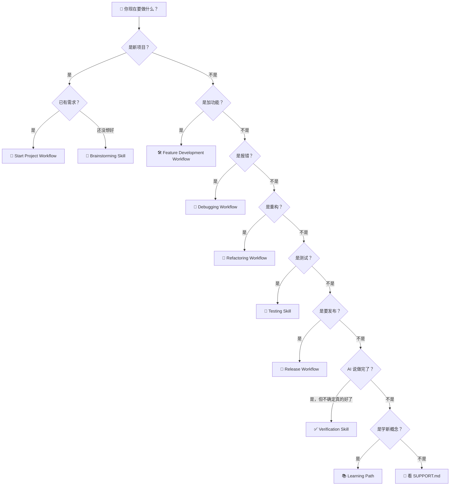

# Decision Tree 场景决策树

> ⚠️ Not Yet Verified — 决策树已定义，尚未在真实用户中验证导航效果。

来到 EasyVibeCoding，不知道该走哪条路？用这棵树。

---

## 决策树

---

## 场景速查表

| 你的场景 | 去这里 | 你需要的 Skill | 你需要的 Prompt |
| --- | --- | --- | --- |
| 我要做一个新项目 | [Start Project Workflow](../../workflows/start-project/README.md) | project-discovery → requirement-analysis → brainstorming → architecture-design → task-planning → implementation → testing → code-review → verification | [start-project](../../prompts/start-here/start-project.md) |
| 我要给已有项目加功能 | [Feature Development Workflow](../../workflows/feature-development/README.md) | requirement-analysis → task-planning → implementation → testing → code-review → verification | [implement-feature](../../prompts/coding/implement-feature.md) |
| 程序报错了 | [Debugging Workflow](../../workflows/debugging/README.md) | systematic-debugging → testing → verification | [debug-error](../../prompts/debugging/debug-error.md) |
| 代码能跑但很乱，想整理 | [Refactoring Workflow](../../workflows/refactoring/README.md) | implementation → testing → code-review → verification | [refactor-code](../../prompts/coding/refactor-code.md) |
| 我想给功能加测试 | [Testing Skill](../../skills/core/testing/SKILL.md) | testing → verification | [write-tests](../../prompts/testing/write-tests.md) |
| AI 说做完了，我想确认 | [Verification Skill](../../skills/core/verification-before-completion/SKILL.md) | verification-before-completion | [verify-feature](../../prompts/testing/verify-feature.md) |
| 我要发布上线 | [Release Workflow](../../workflows/release/README.md) | testing → code-review → verification | [release-checklist](../../prompts/deployment/release-checklist.md) |
| 我想从头理解一个项目 | [Project Discovery Skill](../../skills/core/project-discovery/SKILL.md) | project-discovery | [understand-project](../../prompts/start-here/understand-project.md) |
| 我想做 AI 聊天/搜索/RAG | [RAG Skill](../../skills/ai/rag/SKILL.md) | rag → context-engineering | [build-rag](../../prompts/ai-app/build-rag.md) |
| 我想让 AI 自主跑多步 | [Agent Skill](../../skills/ai/agent/SKILL.md) | agent → tool-calling | [build-agent](../../prompts/ai-app/build-agent.md) |

---

## 按难度选

| 你的水平 | 推荐起点 | 推荐案例 |
| --- | --- | --- |
| 🐣 完全不会编程 | [How to Use EasyVibeCoding](./how-to-use-easyvibecoding.md) → [Start Project Workflow](../../workflows/start-project/README.md) | [001-ai-chat](../../cases/golden/001-ai-chat/) |
| 🎯 有产品想法，不会写码 | [Start Project Workflow](../../workflows/start-project/README.md) → [requirement-analysis](../../skills/core/requirement-analysis/SKILL.md) | [001-ai-chat](../../cases/golden/001-ai-chat/) |
| 🛠 会写码，想加速 | [Feature Development Workflow](../../workflows/feature-development/README.md) → [implementation](../../skills/core/implementation/SKILL.md) | [002-rag-app](../../cases/golden/002-rag-app/) |
| 🤖 想学 AI 工程 | [Agent Skill](../../skills/ai/agent/SKILL.md) → [RAG Skill](../../skills/ai/rag/SKILL.md) | [003-ai-agent](../../cases/golden/003-ai-agent/) |

---

## 延伸阅读

- [How to Use EasyVibeCoding 小白指南](./how-to-use-easyvibecoding.md)
- [Learning Path 学习路径](../learning-path/roadmap.md)
- [Core Methodology 核心方法论](../concepts/core-methodology.md)
