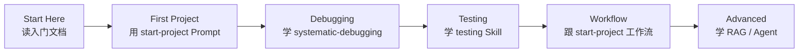

# How to Use EasyVibeCoding 小白使用指南

> ⚠️ Not Yet Verified — 指南内容已就位，尚未有真实小白用户完整走通验证。

---

## 我是小白，我应该先看什么？

**从这里开始**：

1. 读 [什么是 Vibe Coding](./01-what-is-vibe-coding.md)——理解你将用 AI 做什么
2. 读 [AI Coding 原理](./02-how-ai-coding-works.md)——理解 AI 怎么帮你写代码
3. 读 [核心方法论](../concepts/core-methodology.md)——理解 9 步流程
4. 读 [编程宪法](../concepts/coding-constitution.md)——理解 10 条底线

> 术语小贴士：**Vibe Coding**（凭感觉编程）= 你不写代码，用自然语言描述需求，让 AI 生成可运行代码。难点不在"生成"，而在"工程化"：怎么拆任务、怎么复用、怎么验证。

---

## 我应该复制哪个 Prompt？

根据你的场景，选一个开始：

| 你想做什么 | 用哪个 Prompt | 在哪 |
| --- | --- | --- |
| 启动一个新项目 | [start-project](../../prompts/start-here/start-project.md) | `prompts/start-here/` |
| 让 AI 先读懂你的项目 | [understand-project](../../prompts/start-here/understand-project.md) | `prompts/start-here/` |
| 正确地向 AI 提需求 | [ask-ai-correctly](../../prompts/start-here/ask-ai-correctly.md) | `prompts/start-here/` |
| 实现一个功能 | [implement-feature](../../prompts/coding/implement-feature.md) | `prompts/coding/` |
| 排查报错 | [debug-error](../../prompts/debugging/debug-error.md) | `prompts/debugging/` |
| 写测试 | [write-tests](../../prompts/testing/write-tests.md) | `prompts/testing/` |
| 代码评审 | [code-review](../../prompts/review/code-review.md) | `prompts/review/` |

> 不确定选哪个？看 [决策树](./decision-tree.md)。

---

## 我应该学哪个 Skill？

按这个顺序学，每个 Skill 配一个 Prompt：

| 顺序 | Skill | 大白话 | 配套 Prompt |
| --- | --- | --- | --- |
| 1 | [project-discovery](../../skills/core/project-discovery/) | 先搞懂项目再动手 | understand-project |
| 2 | [requirement-analysis](../../skills/core/requirement-analysis/) | 把需求拆给 AI | ask-ai-correctly |
| 3 | [task-planning](../../skills/core/task-planning/) | 拆小任务、定顺序 | write-development-plan |
| 4 | [implementation](../../skills/core/implementation/) | 一次一个小任务地写 | implement-feature |
| 5 | [systematic-debugging](../../skills/core/systematic-debugging/) | 出错时系统排查 | debug-error |
| 6 | [testing](../../skills/core/testing/) | 让 AI 写的代码可验证 | write-tests |
| 7 | [code-review](../../skills/core/code-review/) | 改完逐项评审 | code-review |
| 8 | [verification-before-completion](../../skills/core/verification-before-completion/) | 有证据才算完成 | verify-feature |

> 建议：先 core 后 ai，先读后练。完整路线见 [学习路径](../learning-path/roadmap.md)。

---

## 我应该做哪个 Case？

从最简单的开始：

| 顺序 | Case | 难度 | 你能学到什么 |
| --- | --- | --- | --- |
| 1 | [001-ai-chat](../../cases/golden/001-ai-chat/) | 入门 | 从零到一做一个 AI 聊天应用 |
| 2 | [002-rag-app](../../cases/golden/002-rag-app/) | 进阶 | 给 AI 加上"读文档"能力 |
| 3 | [003-ai-agent](../../cases/golden/003-ai-agent/) | 进阶 | 让 AI 自主规划步骤 |

> ⚠️ 以下 Case 尚未完整验证，跟做时可能遇到未填充的内容。

---

## 一条明确路径

| 阶段 | 你做什么 | 你能做什么了 |
| --- | --- | --- |
| Start Here | 读 4 篇入门文档 | 理解 Vibe Coding 是什么 |
| First Project | 用 start-project Prompt 启动项目 | 让 AI 帮你搭出项目骨架 |
| Debugging | 学 systematic-debugging Skill | 出错时能系统排查而不是乱改 |
| Testing | 学 testing Skill | 让 AI 写的代码有客观验证 |
| Workflow | 跟 start-project 工作流走 | 把多个 Skill 串成完整流程 |
| Advanced | 学 RAG / Agent | 接触更高级的 AI 能力 |

---

## 常见问题

**Q: 我完全不会编程，真的能用这个做软件吗？**

能。EasyVibeCoding 的设计目标就是"让不会编程的人也能用 AI 做出真正能运行的软件"。关键是：你不需要写代码，但需要**懂方法**——怎么拆任务、怎么验证据、怎么不让 AI 胡编。

**Q: 我需要装什么软件吗？**

V0.1 是纯 Markdown 知识库 + Python 校验器。你只需要一个能读 Markdown 的编辑器和能运行 AI 对话的工具（如 Claude、ChatGPT、Cursor 等）。

**Q: 这些内容验证过了吗？**

没有。V0.1 是初始版本，所有内容标 `⚠️ Not Yet Verified`。"完成"指内容已就位，不代表已跑通。

**Q: 我想贡献怎么办？**

读 [CONTRIBUTING.md](../../CONTRIBUTING.md) 和 [AGENTS.md](../../AGENTS.md)。

---

## 延伸阅读

- [决策树：我该用哪个 Workflow？](./decision-tree.md)
- [学习路径：由浅入深的路线图](../learning-path/roadmap.md)
- [常见错误](./04-common-mistakes.md)
- [FAQ](../faq/README.md)
