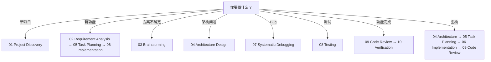

# Skill Selector 技能选择器

> 不知道该用哪个 Skill？按你的场景选。

## 决策树

## 速查表

| 你现在的状态 | 用哪个 Skill | 为什么 |
| --- | --- | --- |
| 我有一个想法但不知道怎么开始 | 02 Requirement Analysis | 先搞清楚"做什么" |
| 我进入一个已有项目 | 01 Project Discovery | 先理解项目再改 |
| 我不知道用什么技术方案 | 03 Brainstorming | 探索选项再选 |
| 我知道做什么但不知道怎么设计 | 04 Architecture Design | 设计模块和数据流 |
| 需求太大不知道从哪开始 | 05 Task Planning | 拆成小任务 |
| AI 写的代码跑不起来 | 07 Systematic Debugging | 用证据找根因 |
| 功能写完了不确定对不对 | 08 Testing | 写测试证明能跑 |
| 代码写完了但不确定质量 | 09 Code Review | 换视角检查 |
| AI 说"做完了" | 10 Verification | 逐条验收有证据才算完 |

## 按难度选

| 难度 | 推荐学习顺序 |
| --- | --- |
| 入门 | 01 → 02 → 05 → 06 → 10 |
| 进阶 | + 03 → 04 → 08 |
| 熟练 | + 07 → 09 |

## 延伸阅读

- [Using Core Skills](./using-core-skills.md) — 完整使用指南
- [Core Skills Matrix](../concepts/core-skills-matrix.md) — 一览表
- [Decision Tree](./decision-tree.md) — Workflow 选择
