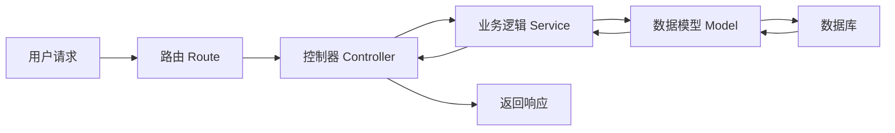

# Level 2 — 学会理解项目

> Level 1 你学会了"怎么问"，这一级你要学会"怎么把一个模糊想法，变成清晰的需求和结构"。

> 术语小贴士：**需求（Requirement）**= 你要做什么、做成什么样；**数据流（Data Flow）**= 数据从哪来、经过哪些处理、到哪去。理解数据流就理解了项目骨架。

---

## 目标

- 学会**读项目结构**：拿到一个项目，能看懂它分几个部分。
- 学会**理解模块和数据流**：知道数据怎么在系统里流动。
- 能把**一个模糊想法拆成需求清单**。

---

## 知识

### 1. 怎么读一个项目结构

一个典型项目长这样（以一个后端 API 服务为例）：

```text
my-app/
├── src/
│   ├── routes/      # 路由：哪些 URL 对应哪些处理
│   ├── controllers/ # 控制器：接收请求、返回响应
│   ├── services/    # 业务逻辑：核心规则写这里
│   ├── models/      # 数据模型：数据长什么样
│   └── utils/       # 工具函数：复用的小功能
├── tests/           # 测试
├── package.json     # 依赖和脚本
└── README.md        # 项目说明
```

> 术语小贴士：**路由（Route）**= URL 和处理函数的对应关系，比如 `/users` 对应"返回用户列表"；**控制器（Controller）**= 接收请求、调用业务逻辑、返回结果的中间层。

### 2. 理解数据流

一个请求从进来到出去，通常经过这几步：



**记住这条主线**：请求 → 路由 → 控制器 → 业务逻辑 → 数据 → 原路返回。

### 3. 把想法拆成需求清单

一个好需求清单长这样：

| # | 需求 | 类型 | 验收标准 | 优先级 |
| --- | --- | --- | --- | --- |
| 1 | 用户能注册账号 | 功能 | 输入邮箱密码，能创建账号并登录 | 高 |
| 2 | 用户能发帖 | 功能 | 登录后能发布标题+正文，列表能看到 | 高 |
| 3 | 页面加载 < 2s | 非功能 | 首屏 2 秒内渲染完 | 中 |

> 术语小贴士：**功能需求**= 系统能做什么；**非功能需求**= 系统做得怎么样（性能、安全、可用性）。

---

## Skills

- 🧠 [requirement-analysis](../../skills/core/requirement-analysis/SKILL.md) — 把模糊想法拆成可验收的需求
- 🧠 [brainstorming](../../skills/core/brainstorming/SKILL.md) — 头脑风暴，发散再收敛

> ⚠️ Not Yet Verified：以上 Skill 链接在 V0.1 为规划内容，可能尚未填充。

---

## Prompts

- 💬 [understand-project](../../prompts/start-here/understand-project.md) — 让 AI 帮你读懂一个项目结构
- 💬 [analyze-requirement](../../prompts/architecture/analyze-requirement.md) — 让 AI 帮你拆需求

> ⚠️ Not Yet Verified：以上 Prompt 链接在 V0.1 为规划内容，可能尚未填充。

---

## 练习

1. **读一个开源项目**：找一个 GitHub 上的小项目，让 AI 用 [understand-project](../../prompts/start-here/understand-project.md) 帮你解释目录结构，画出数据流图。
2. **拆需求**：拿你在 Level 1 写的 Project Brief，用 [analyze-requirement](../../prompts/architecture/analyze-requirement.md) 把它拆成至少 5 条带验收标准的需求。
3. **区分功能/非功能**：在你的需求清单里，标出哪些是功能需求、哪些是非功能需求。

---

## 项目（小项目建议）

> 选一个你熟悉的小软件（比如待办清单、记事本），完整拆解一遍。

产出：
- 项目结构图（分几个模块）
- 数据流图（Mermaid）
- 需求清单（至少 5 条，每条带验收标准）

---

## 毕业标准（可客观判断）

- [ ] 能对着一个项目结构图，说出**每个目录是干嘛的**。
- [ ] 能画出**一个请求的数据流图**（请求→路由→…→响应）。
- [ ] 能把一个想法拆成**至少 5 条需求**，且每条有**可判断的验收标准**。
- [ ] 能区分**功能需求**和**非功能需求**。

> 毕业检验：把你的需求清单给 AI 让它实现，看它会不会问一堆你没写清的问题——问得越少，说明你拆得越清楚。
