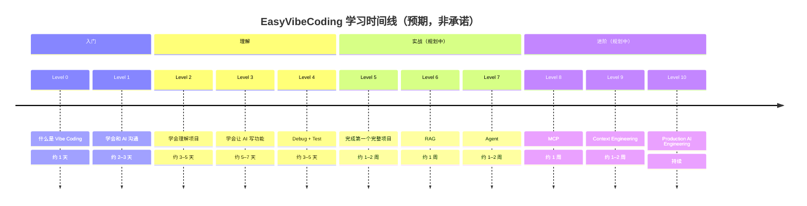

# 学习路线总览（Learning Path Roadmap）

> 从「完全不会编程的小白」到「能用 AI 工程化方式交付软件」的 11 级路线。

> 术语小贴士：**Vibe Coding**（凭感觉编程）= 你不写代码，用自然语言描述需求让 AI 生成代码。难点不在"生成"，而在"工程化"——拆任务、复用、验证、不让 AI 胡编。

---

## 一句话定位

这条路线把「用 AI 做软件」拆成 11 级，每一级有明确目标、关键产物和毕业标准。你不必按部就班，但**跳级容易在后面踩坑**——比如没学会拆任务就去写完整项目，往往会陷入"改了又改、越改越乱"的循环。

> ⚠️ **Not Yet Verified**：完成本路线是**学习目标**，**非能力认证**。本仓库尚未对任何真实学习者做追踪，以下"毕业"描述均为学习预期，不代表已验证的通过率。各级别 V0.1 仅 Level 0–4 有详细内容，Level 5–10 为规划阶段，见 [成熟度模型](maturity-model.md)。

---

## 7 条核心原则（贯穿全路线）

| # | 原则 | 大白话 | 在路线里的体现 |
| --- | --- | --- | --- |
| 01 | Understand before coding | 先搞懂再动手 | Level 0–2：先理解再写 |
| 02 | Small tasks over giant prompts | 拆小任务，别一句话塞太多 | Level 1、3：小步实现 |
| 03 | Reuse before reinvent | 先复用，别重造轮子 | Level 3：复用 Skill |
| 04 | Evidence over claims | 要证据，别听 AI 自吹 | Level 4：验证先行 |
| 05 | Human owns decisions | 关键决策人来拍板 | Level 3、9：人定架构 |
| 06 | Every mistake becomes knowledge | 每次犯错都沉淀成知识 | Level 4：Bug 变测试 |
| 07 | From Prompt to Production | 从提示词到能上线的软件 | Level 5–10：走向生产 |

---

## 级别总览

| Level | 目标 | 关键产物 |
| --- | --- | --- |
| [Level 0](level-0.md) | 什么是 Vibe Coding | 能说清 Vibe Coding 与"AI 直接写整个项目"的区别 |
| [Level 1](level-1.md) | 学会和 AI 沟通 | 用 start-project prompt 启动一个项目定义 |
| [Level 2](level-2.md) | 学会理解项目 | 把一个想法拆成需求清单 |
| [Level 3](level-3.md) | 学会让 AI 写功能 | 一个通过验收的 CRUD 小功能 |
| [Level 4](level-4.md) | Debug + Test | 修一个 Bug 并写出对应回归测试 |
| Level 5 *(规划中)* | 完成第一个完整项目 | 端到端可运行的小应用 |
| Level 6 *(规划中)* | RAG | 一个能检索自有文档的问答 demo |
| Level 7 *(规划中)* | Agent | 一个能自主拆解任务的小 Agent |
| Level 8 *(规划中)* | MCP | 一个自定义 MCP 工具 |
| Level 9 *(规划中)* | Context Engineering | 一套可复用的上下文管理策略 |
| Level 10 *(规划中)* | Production AI Engineering | 一个具备监控/灰度/回滚的上线服务 |

> 术语小贴士：**RAG**（检索增强生成）= 让 AI 先去你的资料库里找相关内容，再回答，避免它胡编；**Agent**（智能体）= 能自己拆任务、调用工具、多步执行的 AI；**MCP**（模型上下文协议）= 让 AI 能连外部工具（数据库、文件、API）的统一接口。

> Level 5–10 为 V0.1 规划内容，尚未填充详细文档。规划依据见 [成熟度模型](maturity-model.md)。完成后请回写本表链接。

---

## 学习时间线

> 以下时间为**学习预期**，非承诺。每个人的基础和投入不同，快慢差异很大。⚠️ Not Yet Verified。

---

## 怎么用这条路线

1. **别跳 Level 0–2**：很多人直接从 Level 3 开始，结果"一句话生成 → 跑不通 → 放弃"。先理解，再动手。
2. **每级带个小项目**：光读不练等于没学。每个 Level 都有"练习"和"项目"建议，做出来才算过。
3. **出错就回写**：踩的坑记进 `failures/` 或 `anti-patterns/`（Principle 06）。
4. **毕业自己打分**：毕业标准是**可客观判断**的，别自欺欺人。比如 Level 3 的"通过验收"= 真能跑、测试真能过。

---

## 配套资产导航

| 资产 | 作用 | 入口 |
| --- | --- | --- |
| Skills | 可复用的操作单元 | [skills/](../../skills/) |
| Prompts | 提示词模板 | [prompts/](../../prompts/) |
| Cases | 完整案例 | [cases/golden/](../../cases/golden/) |
| Anti-Patterns | 反模式（别这么做） | [anti-patterns/](../../anti-patterns/) |
| Failures | 失败教训 | [failures/](../../failures/) |

---

## 诚实声明

- 本路线是**学习目标**，**不是能力认证**，也不是"学完就能找到工作"的承诺。
- V0.1 **尚未对任何学习者做真实追踪**，没有通过率数据，没有就业数据。
- Level 5–10 的内容尚未编写，仅有方向性描述。
- 所有"毕业后能做 X"的表述，均为**学习预期**，不代表已验证的产出。
