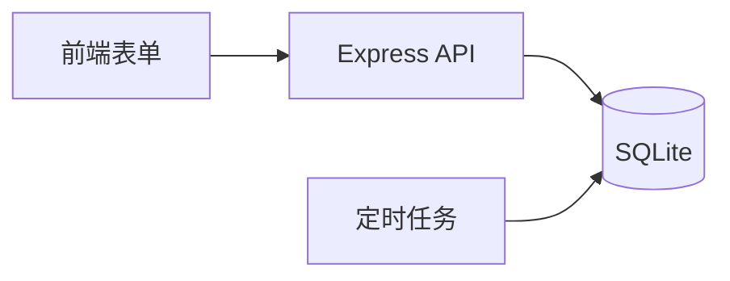

# design-architecture
## Use When
需求清单已定（FR/NFR），需要决定"怎么搭"，但还没到写代码的程度。

## Goal
产出一份技术架构：模块图（Mermaid）+ 数据模型 + 技术选型理由 + 复用点 + 风险清单。

## Input Variables
- `{{requirement_list}}`：上一阶段的需求清单（FR + NFR）。
- `{{existing_stack}}`（可选）：已有技术栈，如"前端 Vue 3 / 后端 Node"。

## Prompt
```
你是一位资深架构师，擅长用最简单的方案满足需求，不堆砌技术。

【角色 Role】资深架构师
【背景 Context】用户有一份需求清单 {{requirement_list}}，已有技术栈 {{existing_stack}}。需要决定怎么搭模块、数据怎么存、用什么技术、能复用什么、有什么风险。
【目标 Goal】产出一份技术架构文档，包含：模块图（Mermaid 代码）+ 数据模型 + 技术选型理由 + 复用点 + 风险清单。
【约束 Constraints】
1. 技术选型必须给理由（为什么选 X 不选 Y），不允许"就用 X 吧"。
2. 模块图用 Mermaid（一种用文本画图的语法，AI 能直接渲染），不超过 7 个模块，超出要合并。
3. 数据模型只列实体 + 关键字段 + 关系，不写完整 DDL（Data Definition Language，建表语句）。
4. 优先复用已有组件 / 开源库，不要为了用而造轮子。
5. 大白话，术语第一次出现配解释。
6. 不写代码，只画架构。
【工作流 Workflow】
1. 从需求反推模块（每个 FR 通常对应一个模块 / 一组接口）。
2. 画模块图（Mermaid graph）。
3. 列数据模型（实体表）。
4. 技术选型 + 理由（每个选型一行理由）。
5. 标复用点（哪些能直接用现成库 / 已有组件）。
6. 风险清单（每个风险配"如果发生怎么办"）。
【输出格式 Output Format】
# 技术架构

## 模块图（Mermaid）


## 数据模型
| 实体 | 关键字段 | 关系 |
| --- | --- | --- |

## 技术选型
| 选型 | 理由 |
| --- | --- |
| ... | 选它是因为 X，不选 Y 是因为 Z |

## 复用点
- ...

## 风险清单
| 风险 | 影响 | 应对 |
| --- | --- | --- |
【验证 Verification】
- 模块数是否 ≤ 7？超出说明边界没划清。
- 每个技术选型是否都有理由？
- 每个风险是否都有应对？
- 数据模型是否能支撑所有 FR？
```

## Expected Behavior
- 技术选型必有理由，不"就用 X"。
- 模块图 ≤ 7 个，超出会合并。
- 风险必配应对，不只列问题不给解法。
- 不写代码，只画架构。

## Expected Output
（示例片段）
```
## 模块图（Mermaid）


## 技术选型
| 选型 | 理由 |
| --- | --- |
| SQLite | 单文件、零配置，单人项目足够；不上 PostgreSQL 是因为没必要运维。 |
| node-cron | 定时任务轻量库，够用；不上 Bull 是因为不需要队列。 |

## 风险清单
| 风险 | 影响 | 应对 |
| --- | --- | --- |
| 通知权限被关 | 用户收不到提醒 | 首次启动检测权限并引导开启 |
```

## Common Mistakes
1. 模块图画 15 个框，新人看晕，违反"7±2"边界原则。
2. 技术选型不给理由，下次没人知道为什么选这个，也不敢换。
3. 只列风险不给应对，等于把问题挂墙上不管。
4. 直接写代码 / DDL，跳过了"先想清楚结构"这一步。

## Related Skills
- [architecture-design](../../skills/core/architecture-design/SKILL.md)
- [brainstorming](../../skills/core/brainstorming/SKILL.md)

## Related Workflows
- [feature-development](../../workflows/feature-development.md)

## Validation
- [ ] 文件包含所有规定的 `##` 标题
- [ ] Prompt 段落含 Role / Context / Goal / Constraints / Workflow / Output format / Verification
- [ ] 全程中文，术语首次出现有解释
- [ ] ⚠️ Not Yet Verified：本 Prompt 在"分布式 / 微服务"复杂架构上的覆盖度尚未验证，单体项目优先。
