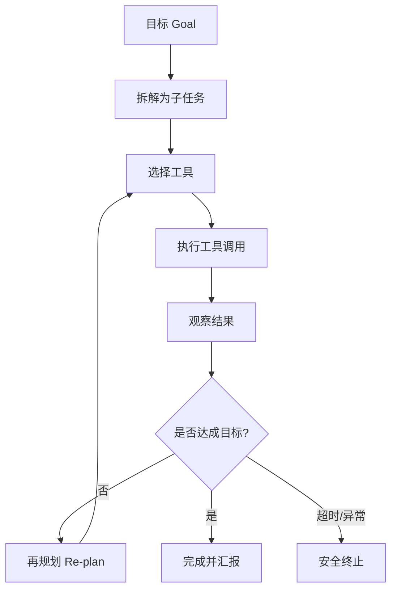

# Agent（智能体）

> ⚠️ Not Yet Verified — 本概念尚未在生产中实际验证。本文为 V0.1 概念介绍，非生产可用的成熟方案。

## 是什么（What）

Agent（智能体）= 让 AI 自主"规划 + 调用工具 + 多步执行"完成一个任务，而不是一问一答。

大白话：普通问答是"你问一句、AI 答一句"；Agent 是"你给个目标，AI 自己拆步骤、选工具、干活、看结果、再决定下一步，循环直到干完"。

## 解决什么问题（Problem）

- **单轮回答干不了复杂活**：查数据 + 改文件 + 再核对这种多步任务，一问一答做不了。
- **需要根据中间结果决策**：上一步结果决定下一步动作，预先写死流程行不通。
- **人与 AI 协作边界**：让人只给目标，重复 / 探索性步骤交给 AI 自动完成。

## 什么时候使用（When）

- 任务需要多步、且每一步依赖上一步的结果。
- 存在可用且可描述的工具（查库、调 API、读写文件、搜索等）。
- 目标清晰、可判断"是否完成"。
- 探索性 / 重复性工作，值得让 AI 自主循环。

不适合：单步能答的简单问答、高风险且不可回滚、或目标无法明确判定的场景。

## 基本架构（Architecture）

核心循环：**目标 → 拆解 → 选工具 → 执行 → 观察结果 → 再规划（循环）→ 完成**。

关键要素：

1. **规划器**：把目标拆成可执行子步骤。
2. **工具集**：AI 可调用的能力（需有清晰描述）。
3. **执行器**：真正运行工具并返回结果。
4. **记忆 / 状态**：记录中间结果，避免重复或丢失。
5. **终止条件**：达成目标、超时、或触发安全停止。

## 常见错误（Common Mistakes）

- **无终止条件**：循环不收敛，陷入死循环或无限调用。
- **工具权限过大**：直接给删除 / 转账等高危权限且无确认。
- **不记录中间状态**：上下文一长就"忘了"前面做过什么，重复或矛盾。
- **一次给太多目标**：目标过大导致规划发散、不可控。
- **工具描述不清**：AI 选错工具或传错参数。
- **无成本 / 步数上限**：跑飞了才发现烧了很多 token / 时间。

## Vibe Coding 怎么使用（How in Vibe Coding）

在 Vibe Coding 里，把 Agent 当作"能自己干活的 AI 助手"：

1. 先把目标写清楚，并定义"怎样算完成"的判定标准。
2. 列出可用工具及其描述，危险操作要求二次确认。
3. 给 Agent 设步数 / 时间 / token 上限，到顶即停。
4. 要求它每步简要汇报"做了什么、结果如何、下一步打算"。
5. 复杂任务先拆成小目标，逐个验证再串联。

注意：本仓库 V0.1 未提供可运行的 Agent 框架。先用 [`prompts/ai-app/build-agent.md`](../../../prompts/ai-app/build-agent.md) 让 AI 帮你搭一个最小循环原型，再逐步加工具与终止条件。

## 相关 Prompt（Related Prompts）

- [`prompts/ai-app/build-agent.md`](../../../prompts/ai-app/build-agent.md) — 搭建一个最小可用的 Agent 循环原型。

## 相关 Skill（Related Skills）

- [`skills/ai/tool-calling/SKILL.md`](../tool-calling/SKILL.md) — Agent 调用工具的底层机制。
- [`skills/ai/memory/SKILL.md`](../memory/SKILL.md) — Agent 跨步骤记住中间状态。

## 验证状态（Validation）

- 当前状态：`status: experimental` / `verified: false` / `last_verified: null`。
- 验证方式（尚未执行）：在受限任务集上观察目标达成率、平均步数、是否正常终止、是否触发安全边界。
- 在真实运行验证并取得证据前，本概念保持 `⚠️ Not Yet Verified`。
