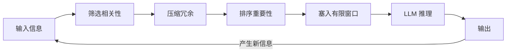

# Context Engineering（上下文工程）

> ⚠️ Not Yet Verified — 本概念尚未在生产中实际验证。本文为 V0.1 概念介绍，非生产可用的成熟方案。

## 是什么（What）

Context Engineering（上下文工程）= 决定 AI 当前这一步该看到哪些信息（选 / 压 / 排 / 丢），让有限上下文窗口用在刀刃上。

大白话：简单说，就是决定 AI 当前应该看到哪些信息。模型一次能"看"的字数有限，给它塞太多反而抓不住重点——上下文工程就是替它做"该留哪几条、该丢哪几条"的取舍。

## 解决什么问题（Problem）

- **窗口有限**：再大的上下文也有上限，全塞进去不现实。
- **信号被稀释**：无关内容越多，关键信息权重越低，模型越容易跑偏。
- **新旧混淆**：不区分历史与当前，模型可能拿过期信息当真。
- **成本失控**：塞满上下文 = 烧 token = 烧钱、变慢。

## 什么时候使用（When）

- 对话变长、上下文接近窗口上限。
- 检索 / 记忆 / 工具结果太多，需要取舍。
- 多轮任务中模型开始"忘事"或前后矛盾。
- 想在固定预算内最大化输出质量。

不适合：上下文极短、信息只有一两段、无须取舍的简单问答。

## 基本架构（Architecture）

四个动作（选 / 压 / 排 / 丢）：

1. **筛选（选）**：按相关性挑出与当前任务有关的信息。
2. **压缩（压）**：去冗余、合并重复、摘要化长段。
3. **排序（排）**：重要的靠前 / 靠后（依模型对位置敏感度调整）。
4. **丢弃（丢）**：低价值、过期、超预算的果断扔掉。

## 常见错误（Common Mistakes）

- **把整个代码库都塞进去**：超出预算、信号被稀释、还可能泄密。
- **不区分新旧信息**：过期决策与当前状态混在一起，模型拿错版本。
- **忽略 token 预算**：不留余量，多轮一来就溢出。
- **只塞不排**：重要信息淹没在噪声里。
- **不压缩历史**：长对话原样累积，很快撑爆窗口。

## Vibe Coding 怎么使用（How in Vibe Coding）

在 Vibe Coding 里，把上下文工程当作"给 AI 准备一份精炼的临时简报"：

1. 每一步先问"这一步模型必须知道什么"，再问"可以不知道什么"。
2. 给上下文设 token 预算，先留出输出空间，再倒推能塞多少输入。
3. 长对话定期摘要压缩，保留结论与关键决策，丢掉过程性废话。
4. 检索片段按相关性排序，并显式标注来源与时效。
5. 用 [`prompts/ai-app/build-context.md`](../../../prompts/ai-app/build-context.md) 让 AI 帮你写一套上下文组装规则。

注意：本仓库 V0.1 未提供可运行的上下文管理器。先用配套提示词搭一个"取舍规则"原型，再迭代压缩与排序策略。

## 相关 Prompt（Related Prompts）

- [`prompts/ai-app/build-context.md`](../../../prompts/ai-app/build-context.md) — 编写上下文筛选 / 压缩 / 排序规则。

## 相关 Skill（Related Skills）

- [`skills/ai/rag/SKILL.md`](../rag/SKILL.md) — 检索是上下文工程的主要信息来源之一。
- [`skills/ai/memory/SKILL.md`](../memory/SKILL.md) — 记忆决定哪些历史信息可被注入上下文。

## 验证状态（Validation）

- 当前状态：`status: experimental` / `verified: false` / `last_verified: null`。
- 验证方式（尚未执行）：对同一任务比较不同上下文组装策略的输出质量与 token 消耗，找帕累托较优的组合。
- 在真实运行验证并取得证据前，本概念保持 `⚠️ Not Yet Verified`。
