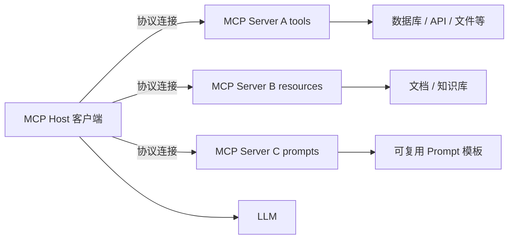

# MCP（模型上下文协议）

> ⚠️ Not Yet Verified — 本概念尚未在生产中实际验证。本文为 V0.1 概念介绍，非生产可用的成熟方案。

## 是什么（What）

MCP（Model Context Protocol，模型上下文协议）= 给 AI 接工具 / 数据 / 资源的标准协议，像"AI 的 USB"，让不同工具能被不同模型通用接入。

大白话：以前每接一个工具给一个模型都要单独写适配；MCP 定了个统一插口——工具按这个标准做成"U 盘"，任何支持 MCP 的模型 / 客户端即插即用。

## 解决什么问题（Problem）

- **M×N 适配地狱**：M 个模型 × N 个工具，要写 M×N 套对接。
- **工具与模型强耦合**：换个模型，工具全得重接。
- **暴露方式不统一**：有的塞函数、有的塞 API，安全与版本难以管理。
- **资源 / Prompt 难复用**：每个应用各搞一套，无法沉淀。

MCP 把"工具 / 资源 / Prompt"标准化暴露，让一份实现服务多端。

## 什么时候使用（When）

- 同一套工具要给多个不同模型 / 客户端用。
- 想把工具能力沉淀成可复用、可分发的"服务"。
- 希望工具与模型解耦，方便升级与替换。
- 团队要统一管控对 AI 暴露的能力与权限。

不适合：只用单一模型、工具极少、且无复用 / 分发需求的简单场景。

## 基本架构（Architecture）

两端结构：

1. **MCP Host（客户端）**：模型侧或应用侧，连接各个 Server，把暴露的能力交给模型使用。
2. **MCP Server（服务端）**：按协议暴露三类能力：
   - **tools**：可被模型调用的工具（同 tool-calling）。
   - **resources**：可被读取的数据 / 文档资源。
   - **prompts**：可复用的提示词模板。

协议负责"发现、描述、调用、回传"的标准约定，让两端解耦、可替换。

## 常见错误（Common Mistakes）

- **把不安全操作直接暴露**：删库 / 改密等高危动作无确认就开放。
- **工具粒度过细或过粗**：过细调用爆炸、过粗复用性差。
- **不版本化**：协议或工具改了不升版本，调用方莫名失效。
- **权限不收敛**：Server 拿了远超所需的系统 / 网络权限。
- **暴露敏感资源**：把凭据 / 隐私数据当 resource 直接吐出。

## Vibe Coding 怎么使用（How in Vibe Coding）

在 Vibe Coding 里，把 MCP 当作"给 AI 做一排标准插座"：

1. 先想清要暴露哪些 tools / resources / prompts，按职责拆成若干 Server。
2. 每个 Server 严格收敛权限，高危操作默认不开放或要求确认。
3. 给 Server 与暴露项打版本号，变更走显式升级。
4. Host 侧按需启用 Server，避免一次性灌入过多能力造成选择困难。
5. 用 [`prompts/ai-app/build-mcp-tool.md`](../../../prompts/ai-app/build-mcp-tool.md) 让 AI 帮你生成 Server 骨架与暴露项定义。

注意：本仓库 V0.1 未提供可运行的 MCP Server / Host。先用配套提示词搭一个最小 Server 原型，再逐步加 tools / resources / prompts 与权限治理。

## 相关 Prompt（Related Prompts）

- [`prompts/ai-app/build-mcp-tool.md`](../../../prompts/ai-app/build-mcp-tool.md) — 生成 MCP Server 骨架与暴露项定义（亦可用于普通工具调用）。

## 相关 Skill（Related Skills）

- [`skills/ai/tool-calling/SKILL.md`](../tool-calling/SKILL.md) — MCP 的 tools 能力即标准化的工具调用。
- [`skills/ai/agent/SKILL.md`](../agent/SKILL.md) — Agent 可通过 MCP 接入多种工具完成多步任务。

## 验证状态（Validation）

- 当前状态：`status: experimental` / `verified: false` / `last_verified: null`。
- 验证方式（尚未执行）：检查暴露项是否最小必要、是否版本化、危险操作是否被确认机制拦截、能否被至少两种 Host 接入复用。
- 在真实运行验证并取得证据前，本概念保持 `⚠️ Not Yet Verified`。
