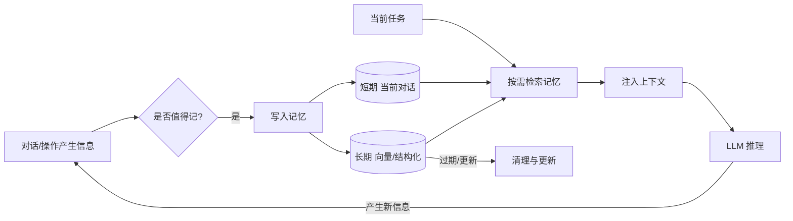

# Memory（记忆）

> ⚠️ Not Yet Verified — 本概念尚未在生产中实际验证。本文为 V0.1 概念介绍，非生产可用的成熟方案。

## 是什么（What）

Memory（记忆）= 让 AI 跨会话 / 跨步骤记住关键信息（用户偏好 / 项目决策 / 已做过的），避免每次重复说明。

大白话：普通对话"关了就忘"；加记忆就是给 AI 配一个"笔记本"，下次开场先把相关笔记翻出来再看，不用你重讲一遍。

## 解决什么问题（Problem）

- **每次重讲背景**：用户偏好、项目约定要反复说明，体验差。
- **跨会话失忆**：换个对话窗口，之前做的决策全没了。
- **多步任务掉链子**：长任务中途丢状态，重复执行或前后矛盾。
- **个性化难**：没记忆就只能千篇一律地回答。

## 什么时候使用（When）

- 用户有稳定偏好 / 项目有长期约定，需要跨会话保留。
- 多步任务需要引用前面的中间结果。
- 想让 AI 越用越懂这个用户 / 这个项目。
- 对话变长，靠原始上下文装不下全部历史。

不适合：一次性问答、敏感信息不该存的场景、或记忆反而引入噪音的小任务。

## 基本架构（Architecture）

三层结构：

1. **短期记忆**：当前对话内的上下文（窗口内）。
2. **长期记忆**：向量库（语义检索）或结构化表（键值 / 字段）存储跨会话信息。
3. **检索注入**：按当前任务检索相关记忆，塞进上下文。

配套机制：写入判定（值不值得记）、检索（找相关）、更新 / 清理（过期就改或删）。

## 常见错误（Common Mistakes）

- **什么都记**：噪音淹没信号，检索时全是无用条目。
- **不更新过期信息**：项目已改方向，AI 还拿旧决策当真。
- **记敏感信息**：密码 / 凭据 / 隐私进了记忆库，等于留了后门。
- **只存不索引**：记了一堆但检索不出来，等于没记。
- **不分长短期的边界**：把短期闲聊也持久化，长期库迅速膨胀。

## Vibe Coding 怎么使用（How in Vibe Coding）

在 Vibe Coding 里，把记忆当作"给 AI 配一本会自动翻的项目笔记本"：

1. 明确"值得记"的标准：用户偏好、关键决策、已完成的任务、重要约束。
2. 持久化用长期库（向量或结构化），并按主题 / 项目分桶。
3. 每次开场先按当前任务检索相关记忆，再注入上下文。
4. 定期更新与清理：过期的改、重复的合、敏感的删。
5. 用 [`prompts/ai-app/build-memory.md`](../../../prompts/ai-app/build-memory.md) 让 AI 帮你定义"记什么、怎么存、怎么取"的规则。

注意：本仓库 V0.1 未提供可运行的记忆模块。先用配套提示词搭一个"记忆规则"原型，再接具体存储。

## 相关 Prompt（Related Prompts）

- [`prompts/ai-app/build-memory.md`](../../../prompts/ai-app/build-memory.md) — 定义记忆的写入、存储与检索规则。

## 相关 Skill（Related Skills）

- [`skills/ai/context-engineering/SKILL.md`](../context-engineering/SKILL.md) — 记忆注入是上下文工程的一部分。

## 验证状态（Validation）

- 当前状态：`status: experimental` / `verified: false` / `last_verified: null`。
- 验证方式（尚未执行）：构造需要跨会话记忆的任务，检查写入正确率、检索命中率、过期清理是否生效、是否误存敏感信息。
- 在真实运行验证并取得证据前，本概念保持 `⚠️ Not Yet Verified`。
