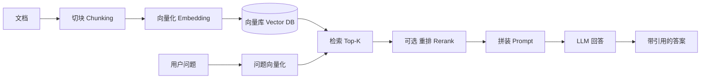

# RAG（检索增强生成）

> ⚠️ Not Yet Verified — 本概念尚未在生产中实际验证。本文为 V0.1 概念介绍，非生产可用的成熟方案。

## 是什么（What）

RAG（Retrieval-Augmented Generation，检索增强生成）= 先从你的文档里检索相关片段，再把它塞进 AI 的提问里，让 AI 基于你的资料回答，而不是凭空编。

大白话：与其让 AI 凭"记忆"硬答，不如先把"参考书"翻到对的那一页，再把那页内容连同问题一起递给它。

## 解决什么问题（Problem）

- **幻觉**：大模型凭参数记忆回答，常编造看似正确实则错误的细节。
- **知识滞后**：模型训练有截止日期，无法覆盖最新或私有信息。
- **不可追溯**：纯生成无法告诉用户"答案出自哪份文档第几段"。
- **领域专属**：企业内部资料、个人笔记，模型从未见过。

RAG 把"生成"建立在"检索"之上，让回答有据可依、可更新、可引用。

## 什么时候使用（When）

- 回答必须基于你的私有文档 / 知识库 / 产品手册。
- 答案需要给出来源出处、可被核验。
- 知识更新频繁，重新训练模型不现实。
- 用户问题涉及最新数据或长尾事实。

不适合：纯开放式创作、闲聊，或文档量极小（直接整段塞进上下文即可）的场景。

## 基本架构（Architecture）

核心环节：

1. **切块（Chunking）**：把长文档切成片段，块大小影响召回粒度。
2. **向量化（Embedding）**：用 Embedding 模型把文本转成向量。
3. **存向量库**：按向量相似度检索。
4. **检索 Top-K**：取与问题最相关的 K 个片段。
5. **拼装 Prompt**：把片段塞进提示，交 LLM 生成。
6. **（可选）重排（Rerank）**：用更精细的模型对 Top-K 重新排序。

## 常见错误（Common Mistakes）

- **切块太大**：单块塞太多内容，检索粒度粗、命中不准。
- **切块太小**：上下文断裂，语义不完整。
- **不重排（Rerank）**：仅靠向量相似度排序，Top-K 里混入无关片段。
- **检索内容塞过多**：超出上下文窗口或稀释信号，模型反而抓不住重点。
- **不引用来源**：用户无法核验，幻觉无法被发现。
- **只检索单轮**：多跳问题需要"检索—再检索"的迭代。

## Vibe Coding 怎么使用（How in Vibe Coding）

在 Vibe Coding 里，把 RAG 当作"给 AI 配一个能查资料的助手"：

1. 先把项目文档 / 需求 / 设计稿放进知识库并切块向量化。
2. 让 AI 在回答前先检索相关片段，再基于片段作答。
3. 要求 AI 在答案末尾标注引用来源（文件名 + 片段编号）。
4. 遇到不确定的问题，优先触发检索而非直接猜测。
5. 用真实问题集回归检索召回率，迭代切块策略。

注意：本仓库 V0.1 未提供可运行的 RAG 流水线。先用 [`prompts/ai-app/build-rag.md`](../../../prompts/ai-app/build-rag.md) 让 AI 帮你搭一个原型，再逐步替换切块与检索策略。

## 相关 Prompt（Related Prompts）

- [`prompts/ai-app/build-rag.md`](../../../prompts/ai-app/build-rag.md) — 搭建一个最小可用的 RAG 原型。

## 相关 Skill（Related Skills）

- [`skills/ai/context-engineering/SKILL.md`](../context-engineering/SKILL.md) — 决定把哪些检索片段塞进有限的上下文窗口。

## 验证状态（Validation）

- 当前状态：`status: experimental` / `verified: false` / `last_verified: null`。
- 验证方式（尚未执行）：用 20+ 条已知答案的问题测量召回率（Recall@K）与答案忠实度（是否含未检索到的断言）。
- 在真实运行验证并取得证据前，本概念保持 `⚠️ Not Yet Verified`。
