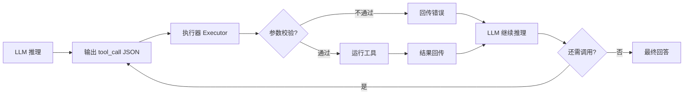

# Tool Calling（工具调用）

> ⚠️ Not Yet Verified — 本概念尚未在生产中实际验证。本文为 V0.1 概念介绍，非生产可用的成熟方案。

## 是什么（What）

Tool Calling（工具调用）= 让 AI 按约定格式输出"我要调用某工具 + 参数"，由外部真正执行（查数据库 / 调 API / 读写文件）再把结果回给 AI。

大白话：AI 自己不能真去查库、发请求，但它能"填一张调用单"说清楚要调哪个工具、传什么参数；真正干活的是外部执行器，干完把结果交还，AI 接着往下推理。

## 解决什么问题（Problem）

- **模型有脑无手**：能想不能做，无法触达实时数据与真实副作用。
- **直接生成不可靠**：让模型直接"输出一段 SQL"容易出错且无法校验。
- **能力边界固定**：模型训练后能力就锁死，工具让它可外接扩展。
- **副作用需可控**：执行要走外部执行器，便于校验、限权、留痕。

## 什么时候使用（When）

- 需要实时数据（查库、搜索、调外部 API）。
- 需要真实副作用（读写文件、发消息、下单）。
- 需要 AI 触发可校验、可限权的操作。
- 模型自身知识 / 能力不足以直接完成任务。

不适合：纯文本生成、或任务完全在模型能力内的场景。

## 基本架构（Architecture）

一次完整往返：

1. **LLM 输出 tool_call**：按约定 JSON 给出工具名 + 参数。
2. **执行器校验 + 运行**：校验参数合法性、检查权限，再真正执行。
3. **结果回传**：把执行结果（或错误）以 tool 消息形式塞回上下文。
4. **LLM 继续推理**：基于结果决定是否再调一次，或给出最终回答。

## 常见错误（Common Mistakes）

- **工具描述不清**：AI 选错工具或传错参数（描述要写清"做什么、何时用、参数含义"）。
- **不校验参数**：恶意 / 越界参数直接执行，导致数据损坏或越权。
- **允许危险操作无确认**：删除 / 转账 / 发邮件等高危动作直接放行。
- **结果回传不结构化**：把杂乱文本塞回去，模型看不懂、用不对。
- **工具粒度不当**：粒度太细每次要拼多个调用，太粗复用性差。

## Vibe Coding 怎么使用（How in Vibe Coding）

在 Vibe Coding 里，把工具调用当作"给 AI 一份工具菜单 + 严格下单流程"：

1. 为每个工具写清三件套：名称、一句话描述、参数 schema（类型 / 必填 / 取值范围）。
2. 执行器先校验参数与权限，再运行，结果用结构化 JSON 回传。
3. 高危操作（删、改、发）一律二次确认，默认不允许静默执行。
4. 一次调用失败要回传清晰错误，让 AI 能据此修正重试或换工具。
5. 用 [`prompts/ai-app/build-mcp-tool.md`](../../../prompts/ai-app/build-mcp-tool.md) 让 AI 帮你生成工具定义与执行器骨架。

注意：本仓库 V0.1 未提供可运行的工具调用运行时。先用配套提示词搭一个"工具定义 + 执行器"原型，再接具体工具。

## 相关 Prompt（Related Prompts）

- [`prompts/ai-app/build-mcp-tool.md`](../../../prompts/ai-app/build-mcp-tool.md) — 生成工具定义与执行器骨架（同样适用于 MCP 工具）。

## 相关 Skill（Related Skills）

- [`skills/ai/agent/SKILL.md`](../agent/SKILL.md) — Agent 用工具调用作为执行手段完成多步任务。

## 验证状态（Validation）

- 当前状态：`status: experimental` / `verified: false` / `last_verified: null`。
- 验证方式（尚未执行）：构造工具选择测试集，测量选对率、参数合法率、危险操作是否被正确拦截。
- 在真实运行验证并取得证据前，本概念保持 `⚠️ Not Yet Verified`。
