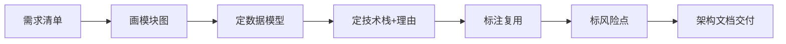

# Architecture Design（架构设计）

## Purpose（目的）

写代码之前先定技术架构：模块划分、数据流、技术选型、外部边界。让后续 AI 实现有依据、可复用，而不是边写边想。

> 术语解释：
> - **模块（Module）**：把大程序拆成各管一摊的小块。笔记网站可拆成"笔记管理""存储""界面"。
> - **数据流（Data Flow）**：数据从输入到输出经过哪些模块。如：用户输入 → 界面模块 → 存储模块 → 数据库。

## When to Use（何时使用）

- 需求清单已确认
- 进入编码前
- 多个任务/多人需要统一架构依据

## Trigger Conditions（触发条件）

- 用户说"开始做吧""怎么搭"
- 需求清单已产出但无架构
- 实现前需要明确模块边界

## Preconditions（前置条件）

- 需求清单（FR/NFR）存在
- 关键选型已通过 brainstorming 收敛

## Workflow（工作流）

1. **画模块图（Mermaid）**：划分模块与依赖关系。
2. **定数据模型**：核心实体与字段。
3. **定技术栈并说明理由**：每项选型绑定需求/约束。
4. **标注哪些用现成库（Reuse before reinvent）**：优先复用，别造轮子。
5. **标风险点**：架构层面的风险与应对。

## Rules（规则）

- 架构必须有图（Mermaid），不能只有文字。
- 优先复用现成库，造轮子要给理由（Reuse before reinvent）。
- 选型理由要绑定需求，不能是"流行"。
- 避免过度设计——MVP 只搭够用的架子。
- 数据模型只列核心实体，不全量铺开。

## Anti-Patterns（反模式）

- ❌ 自己造数据库、造框架
- ❌ 架构只有文字没有图
- ❌ 过度设计（MVP 上微服务/消息队列）
- ❌ 技术栈没理由，只说"大家都用"

## Validation（验证）

验证状态：⚠️ Not Yet Verified — 待按 Expected Validation Steps 实际运行后更新。

**Expected Validation Steps：**
1. 拿真实需求清单产出架构文档。
2. 检查模块图、数据模型、技术栈理由、复用标注、风险是否齐全。
3. 让实现者仅凭架构文档能否独立开始编码。

## Output Format（输出格式）

1. 模块图（Mermaid）
2. 数据模型（实体 + 字段）
3. 技术栈表（项 | 用途 | 理由 | 复用/自研）
4. 风险与应对

## Example（示例）

见 `examples/README.md`：笔记网站架构（前端 Vue / 后端 Node+SQLite / REST 接口）+ Mermaid 模块图。
