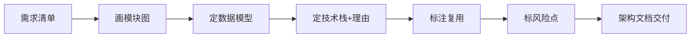

# Architecture Design（架构设计）

## Purpose（目的）

写代码之前先定技术架构：模块划分、数据流、技术选型、外部边界。让后续 AI 实现有依据、可复用，而不是边写边想。

> 术语解释：
> - **模块（Module）**：把大程序拆成各管一摊的小块。笔记网站可拆成"笔记管理""存储""界面"。
> - **数据流（Data Flow）**：数据从输入到输出经过哪些模块。如：用户输入 → 界面模块 → 存储模块 → 数据库。

## What Problem Does It Solve?（解决什么问题）

把需求转换成简单、可实现的系统设计，避免过度设计。需求清单只说"做什么"，没说"模块怎么切、数据怎么流、用什么栈、复用什么库、风险在哪"。直接开写会让 AI 边写边改、模块重复、技术栈选型没依据。架构设计补上这层"图纸"，让后续实现有据可依。

## When to Use（何时使用）

- 需求清单已确认
- 进入编码前
- 多个任务/多人需要统一架构依据

## When Not to Use（何时不要用）

- 纯前端小改动（改文案、调样式、加一个按钮）
- 已有架构只需加一个接口时
- 技术栈已完全锁定、改动极小的功能扩展

## Beginner Explanation（小白解释）

架构设计就是"先画一张图纸再盖房子"——确定几个模块、它们怎么连、数据怎么流，而不是直接砌砖。

## Trigger Conditions（触发条件）

- 用户说"开始做吧""怎么搭"
- 需求清单已产出但无架构
- 实现前需要明确模块边界

## Preconditions（前置条件）

- 需求清单（FR/NFR）存在
- 关键选型已通过 brainstorming 收敛

## Inputs（输入）

- 需求文档（FR/NFR 清单）
- 技术栈约束（团队熟悉度 / 已锁定栈 / 必须支持的平台）
- 已知限制（预算、部署环境、第三方服务依赖）

## Outputs（输出）

- 架构图，包含：
  - 模块（模块划分与依赖关系）
  - 数据流（输入到输出的流转路径）
  - API（模块间/前后端接口）
  - 数据库（核心实体与字段）
  - 安全（鉴权、权限、敏感数据处理）
  - 错误处理（统一错误码 / 异常策略）
  - 部署（运行环境、依赖服务、配置）

## Workflow（工作流）

1. **画模块图（Mermaid）**：划分模块与依赖关系。
2. **定数据模型**：核心实体与字段。
3. **定技术栈并说明理由**：每项选型绑定需求/约束。
4. **标注哪些用现成库（Reuse before reinvent）**：优先复用，别造轮子。
5. **标风险点**：架构层面的风险与应对。

```mermaid
flowchart LR
    A[需求清单] --> B[画模块图]
    B --> C[定数据模型]
    C --> D[定技术栈+理由]
    D --> E[标注复用]
    E --> F[标风险点]
    F --> G[架构文档交付]
```

## Rules（规则）

- 架构必须有图（Mermaid），不能只有文字。
- 优先复用现成库，造轮子要给理由（Reuse before reinvent）。
- 选型理由要绑定需求，不能是"流行"。
- 避免过度设计——MVP 只搭够用的架子。
- 数据模型只列核心实体，不全量铺开。

## Human Checkpoints（人工确认点）

- **关键架构决策由人确认**：影响后续开发的重大决策必须人工拍板，包括但不限于：
  - 前后端是否分离
  - 数据库选择（关系型 / 文档型 / 嵌入式）
  - 是否引入第三方服务（鉴权、支付、对象存储）

## Anti-Patterns（反模式）

- ❌ 自己造数据库、造框架
- ❌ 架构只有文字没有图
- ❌ 过度设计（MVP 上微服务/消息队列）
- ❌ 技术栈没理由，只说"大家都用"

## Validation（验证）

验证状态：⚠️ Not Yet Verified — 待按 Expected Validation Steps 实际运行后更新。

**Expected Validation Steps：**
1. 拿真实需求清单产出架构文档。
2. 检查模块图、数据模型、技术栈理由、复用标注、风险是否齐全。
3. 让实现者仅凭架构文档能否独立开始编码。

## Output Format（输出格式）

1. 模块图（Mermaid）
2. 数据模型（实体 + 字段）
3. 技术栈表（项 | 用途 | 理由 | 复用/自研）
4. 风险与应对

## Example（示例）

见 `examples/README.md`：笔记网站架构（前端 Vue / 后端 Node+SQLite / REST 接口）+ Mermaid 模块图。

## Related Prompts（相关提示词）

- [design-architecture](../../../prompts/architecture/design-architecture.md)
- [write-development-plan](../../../prompts/architecture/write-development-plan.md)

## Related Workflows（相关工作流）

- [Start Project](../../../workflows/new-project/README.md)
- [Feature Development](../../../workflows/feature-development/README.md)

## Related Cases（相关案例）

- [AI Chat](../../../cases/golden/001-ai-chat/README.md)
