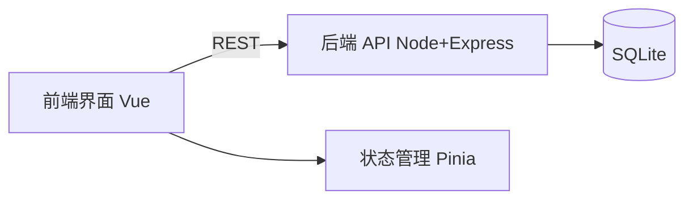

# 示例：笔记网站架构

## 输入（需求清单摘要）

FR：新建/编辑/删除/列表/持久化笔记。NFR：首页 <1s、浏览器关闭数据不丢。

## 1. 模块图



## 2. 数据模型

```
Note（笔记）
- id: number (主键)
- title: string
- content: text
- createdAt: datetime
- updatedAt: datetime
```

## 3. 技术栈

| 项 | 用途 | 理由 | 复用/自研 |
|----|------|------|-----------|
| Vue 3 | 前端界面 | 生态成熟、上手快 | 复用 |
| Pinia | 状态管理 | Vue 官方推荐、轻量 | 复用 |
| Node + Express | 后端 API | 单语言全栈、社区资源多 | 复用 |
| SQLite | 存储 | 单文件、零部署、MVP 够用 | 复用 |
| better-sqlite3 | DB 驱动 | 同步 API、简单 | 复用 |

## 4. 风险与应对

- 风险：SQLite 并发写入受限 → MVP 单人用，暂无问题；多用户时迁移 Postgres。
- 风险：前后端跨域 → Express 配置 cors 中间件。
- 风险：数据无备份 → 定期导出 .db 文件（P1）。

## 要点

- 有 Mermaid 模块图
- 技术栈每项都有理由，全部复用现成库
- MVP 架构只搭够用的架子，不上微服务
