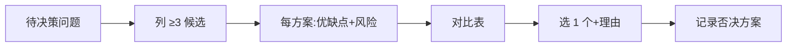

# Brainstorming（方案发散与收敛）

## Purpose（目的）

方案还没定、有多种可能时，结构化地"发散→收敛"：先列至少 3 个候选，再对比优缺点与风险，最后选一个并说明理由。避免一上来就锁死第一个想到的方案。

> 小白常见误区：想到"用 localStorage"就立刻动手，结果后期发现存不下/不能同步。先发散再收敛，能少走弯路。

## When to Use（何时使用）

- 面临技术选型（存哪、用什么框架、同步还是本地）
- 有多个可行路径，不确定哪个好
- 在 architecture-design（架构设计）定技术栈之前

## Trigger Conditions（触发条件）

- 用户问"A 还是 B"或"用什么好"
- 出现开放性技术决策
- 想到的第一个方案没人质疑时

## Preconditions（前置条件）

- 有一个明确的待决策问题
- 决策维度已清楚（如成本、复杂度、性能）

## Workflow（工作流）

1. **列至少 3 个候选方案**：穷举可能选项，哪怕看起来不靠谱。
2. **每方案列优缺点 + 风险**：客观列。
3. **用一张对比表**：横向对比。
4. **选一个并说明理由**：基于项目实际（MVP、用户、约束）。
5. **记录被否决方案（why）**：避免以后重复讨论。

## Rules（规则）

- 至少 3 个方案，不允许只列 1 个。
- 不允许"我觉得这个好"无理由——必须给依据。
- 选定理由要绑定项目约束（MVP 规模、谁用、预算）。
- 否决方案要写原因，不是删掉。

## Anti-Patterns（反模式）

- ❌ 只列 1 个方案就开干
- ❌ 理由是"感觉""大家都用"
- ❌ 否决方案直接删掉不留记录
- ❌ 对比表没有风险列

## Validation（验证）

验证状态：⚠️ Not Yet Verified — 待按 Expected Validation Steps 实际运行后更新。

**Expected Validation Steps：**
1. 取真实选型题（如"笔记存储方案"），产出对比表。
2. 检查方案数 ≥ 3，每方案优缺点/风险齐全。
3. 让另一人仅看对比表能否复现选定结论。

## Output Format（输出格式）

| 方案 | 优点 | 缺点 | 风险 |
|------|------|------|------|
| A | … | … | … |
| B | … | … | … |
| C | … | … | … |

**选定**：X — 理由：…
**否决**：Y（因为…）、Z（因为…）

## Example（示例）

见 `examples/README.md`：笔记存储方案对比（localStorage vs SQLite vs 云数据库）。
