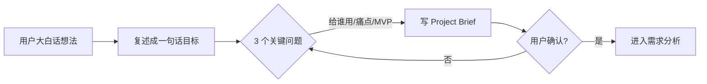
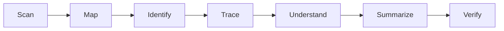

# Project Discovery（项目发现）

## Purpose（目的）

在动手写代码之前，先搞清楚"到底要做什么"。把用户一个模糊的想法，变成一份清晰、可被 AI 理解的项目定义：**一句话目标 + 茁壮性边界 + 给谁用 + 为什么**。

> 小白最容易踩的坑：想法还没说清楚，就开始问"用 Vue 还是 React"。目标不清，后面全是返工。本技能就是把"想做"变成"明确要做"。

## When to Use（何时使用）

- 用户刚提出一个想法，但只有一句话或几句话
- 项目刚启动，还没有任何文档
- 你（AI）不确定用户到底要做什么时
- 在进入 requirement-analysis（需求分析）之前

## Trigger Conditions（触发条件）

- 用户输入包含"我想做个""帮我做一个""能不能搞个"等表述
- 用户描述了一个场景但没说清目标
- 还没有 Project Brief 存在时

## Preconditions（前置条件）

- 用户愿意用大白话讲想法
- 暂时不讨论技术实现（先聚焦"做什么"）

## Workflow（工作流）

1. **听用户用大白话讲想法**：鼓励用户用最普通的话描述，不用术语。
2. **复述成一句"项目目标句"**：把用户的话浓缩成一句话——"做一个 X，让 Y 能做 Z"。
3. **问 3 个关键问题**：
   - 给谁用？（用户画像，哪怕一句话）
   - 解决什么痛点？（没有它会怎样）
   - MVP 最小可用版本是啥？（砍到不能再砍的核心）
4. **写出 Project Brief**：按 Output Format 输出。
5. **用户确认**：把 Brief 回给用户，问"这跟你想的一致吗"，不一致就改。



## Project Understanding（已有项目理解）

> 小白解释：为什么 AI 不能一进入项目就直接写代码？因为 AI 不像人，它没有"直觉"。如果不先搞清楚项目用什么技术、入口在哪、哪些模块互相依赖，AI 改一个地方就会碰倒一片。

当 AI 进入一个已有项目时，必须按以下 8 步系统理解：

### 8 步理解流程



| 步骤 | 做什么 | 大白话 |
| --- | --- | --- |
| Scan | 扫描目录结构、配置文件、依赖 | 先看项目长什么样 |
| Map | 画出模块关系图 | 谁调用谁，谁依赖谁 |
| Identify | 找到入口点、核心模块 | 从哪里启动，哪些是骨架 |
| Trace | 追踪一条核心调用链 | 跟一个请求从头走到尾 |
| Understand | 理解业务逻辑和数据流 | 这个项目在做什么 |
| Summarize | 写一份 Project Understanding | 把理解写下来 |
| Verify | 让用户确认理解对不对 | 别理解歪了 |

### 14 项检测清单

AI 理解一个项目，至少要搞清楚这 14 项：

| # | 检测项 | 要回答的问题 | 找不到怎么办 |
| --- | --- | --- | --- |
| 1 | Project Overview | 这个项目是做什么的？ | 读 README / package.json / pom.xml |
| 2 | Tech Stack | 用了什么语言、框架、数据库？ | 查 package.json / requirements.txt / go.mod |
| 3 | Directory Structure | 目录怎么组织的？各放什么？ | 看 ls / tree 输出 |
| 4 | Entry Points | 程序从哪个文件启动？ | 找 main() / index.js / app.py |
| 5 | Dependencies | 依赖了哪些库？版本？ | 查 lock 文件 / vendor 目录 |
| 6 | Configuration | 配置怎么管？环境变量？ | 找 .env / config/ / settings |
| 7 | Database | 用了什么数据库？表结构？ | 找 migration / schema / ORM 模型 |
| 8 | API | 有哪些接口？路由怎么组织？ | 找 routes/ / controllers/ / openapi.yaml |
| 9 | Business Modules | 核心业务模块有哪些？ | 看 src/ 或 app/ 下的目录划分 |
| 10 | Tests | 测试在哪？怎么跑？ | 找 test/ / spec/ / __tests__/ |
| 11 | Build / Run | 怎么构建？怎么运行？ | 找 Makefile / package.json scripts / Dockerfile |
| 12 | External Services | 用了哪些第三方服务？ | 查 env 变量、SDK 引用 |
| 13 | Important Constraints | 有哪些必须遵守的约定？ | 读 AGENTS.md / CONTRIBUTING.md / .editorconfig |
| 14 | Potential Risks | 哪里最容易出问题？ | 看技术债、TODO/FIXME 注释、复杂度高 |

### Bad vs Good

**❌ Bad：直接改用户指定的文件**

```
用户：登录有问题，帮我改 UserController
AI：好的，直接改了 UserController。
→ 实际问题在 AuthenticationService
→ 改了正确的文件但没改对地方
→ 还把 UserController 里不相关的逻辑碰坏了
```

**✅ Good：先理解项目结构和调用链**

```
用户：登录有问题，帮我改 UserController
AI：我先理解一下项目结构。
→ Scan: 扫目录，发现 auth/ 模块
→ Map: UserController 调用 AuthenticationService
→ Identify: 入口是 UserController.login()，核心是 AuthenticationService.verify()
→ Trace: 跟 login() → verify() → DB 查询的调用链
→ 理解了：问题可能在 AuthenticationService 的密码比对逻辑
→ 再动手改，改对地方，不碰无关代码
```

### Output Format

```
# Project Understanding：<项目名>

## Tech Stack
- 语言：<>
- 框架：<>
- 数据库：<>

## Entry Points
- 启动文件：<>
- 启动命令：<>

## Module Map
<简要模块关系图>

## Core Flow
<一条核心调用链的描述>

## Constraints
<项目约定、风格、禁止事项>

## Risks
<技术债、易出错的地方>
```

## Rules（规则）

- 目标不超过 1 句话；写不下说明还没想清。
- MVP 只保留核心功能，能砍则砍。
- 先不谈技术栈、不谈框架、不谈数据库。
- 必须由用户确认 Brief，不能 AI 单方面定。
- 用大白话写，术语首次出现配一句解释。

## Anti-Patterns（反模式）

- ❌ 一上来就问技术栈（Vue/React/Node）
- ❌ 目标写成一段话，什么都想要
- ❌ 跳过用户确认，直接往下做
- ❌ MVP 里塞一堆"锦上添花"功能

## Validation（验证）

验证状态：⚠️ Not Yet Verified — 待按 Expected Validation Steps 实际运行后更新。

**Expected Validation Steps（预期验证步骤）：**
1. 取 3 个真实小白想法（如"做个记笔记的网站""做个记账小程序"），跑完整 Workflow。
2. 检查每个输出是否含一句话目标、给谁用、痛点、MVP。
3. 让 3 位非技术用户确认 Brief 是否准确反映其意图。
4. 统计是否出现技术栈字眼（应为 0）。

## Output Format（输出格式）

```
# Project Brief：<项目名>

## 一句话目标
做一个 <X>，让 <目标用户> 能 <做什么>。

## 给谁用
<用户画像，1-2 句>

## 解决什么痛点
没有它，用户会 <遭遇什么>。

## MVP（最小可用版本）
- 核心 1：<功能>
- 核心 2：<功能>
- 暂不做：<列出明确砍掉的功能>

## 为什么
<1-2 句动机/价值>
```

## Example（示例）

见 `examples/README.md`：一个"给我做个能记笔记的网站"的想法 → Project Brief 输出。
