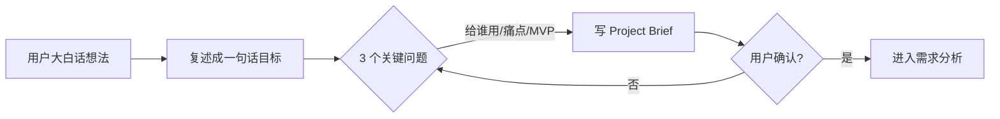

# Project Discovery（项目发现）

## Purpose（目的）

在动手写代码之前，先搞清楚"到底要做什么"。把用户一个模糊的想法，变成一份清晰、可被 AI 理解的项目定义：**一句话目标 + 茁壮性边界 + 给谁用 + 为什么**。

> 小白最容易踩的坑：想法还没说清楚，就开始问"用 Vue 还是 React"。目标不清，后面全是返工。本技能就是把"想做"变成"明确要做"。

## When to Use（何时使用）

- 用户刚提出一个想法，但只有一句话或几句话
- 项目刚启动，还没有任何文档
- 你（AI）不确定用户到底要做什么时
- 在进入 requirement-analysis（需求分析）之前

## Trigger Conditions（触发条件）

- 用户输入包含"我想做个""帮我做一个""能不能搞个"等表述
- 用户描述了一个场景但没说清目标
- 还没有 Project Brief 存在时

## Preconditions（前置条件）

- 用户愿意用大白话讲想法
- 暂时不讨论技术实现（先聚焦"做什么"）

## Workflow（工作流）

1. **听用户用大白话讲想法**：鼓励用户用最普通的话描述，不用术语。
2. **复述成一句"项目目标句"**：把用户的话浓缩成一句话——"做一个 X，让 Y 能做 Z"。
3. **问 3 个关键问题**：
   - 给谁用？（用户画像，哪怕一句话）
   - 解决什么痛点？（没有它会怎样）
   - MVP 最小可用版本是啥？（砍到不能再砍的核心）
4. **写出 Project Brief**：按 Output Format 输出。
5. **用户确认**：把 Brief 回给用户，问"这跟你想的一致吗"，不一致就改。



## Rules（规则）

- 目标不超过 1 句话；写不下说明还没想清。
- MVP 只保留核心功能，能砍则砍。
- 先不谈技术栈、不谈框架、不谈数据库。
- 必须由用户确认 Brief，不能 AI 单方面定。
- 用大白话写，术语首次出现配一句解释。

## Anti-Patterns（反模式）

- ❌ 一上来就问技术栈（Vue/React/Node）
- ❌ 目标写成一段话，什么都想要
- ❌ 跳过用户确认，直接往下做
- ❌ MVP 里塞一堆"锦上添花"功能

## Validation（验证）

验证状态：⚠️ Not Yet Verified — 待按 Expected Validation Steps 实际运行后更新。

**Expected Validation Steps（预期验证步骤）：**
1. 取 3 个真实小白想法（如"做个记笔记的网站""做个记账小程序"），跑完整 Workflow。
2. 检查每个输出是否含一句话目标、给谁用、痛点、MVP。
3. 让 3 位非技术用户确认 Brief 是否准确反映其意图。
4. 统计是否出现技术栈字眼（应为 0）。

## Output Format（输出格式）

```
# Project Brief：<项目名>

## 一句话目标
做一个 <X>，让 <目标用户> 能 <做什么>。

## 给谁用
<用户画像，1-2 句>

## 解决什么痛点
没有它，用户会 <遭遇什么>。

## MVP（最小可用版本）
- 核心 1：<功能>
- 核心 2：<功能>
- 暂不做：<列出明确砍掉的功能>

## 为什么
<1-2 句动机/价值>
```

## Example（示例）

见 `examples/README.md`：一个"给我做个能记笔记的网站"的想法 → Project Brief 输出。
