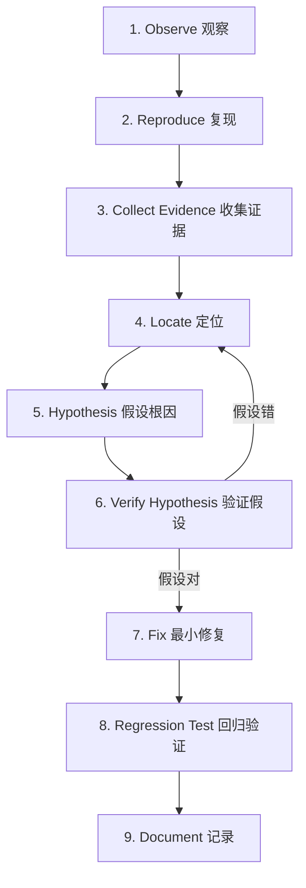
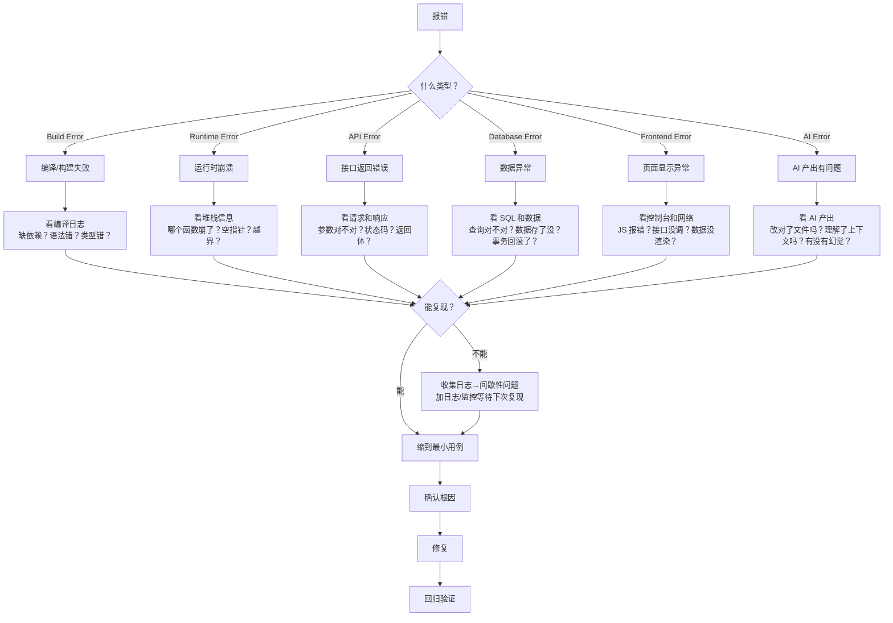

# Systematic Debugging（系统化排障）

> ⚠️ Not Yet Verified

## Purpose

定位 Bug 不靠猜。用一套固定流程把"不知道哪坏了"一步步收窄到"就是这一行"，找到**根因**再修，修完还要确认没把别的地方改坏。

## When to Use

- 功能报错或行为不对，需要排查。
- 测试挂了，不知道为什么。
- AI 改了几轮 Bug 越改越乱时。

## Trigger Conditions

- 用户报告"这个功能不工作 / 报错 / 结果不对"。
- 测试失败且原因不明。
- 修复后问题又复现（说明上次没修到根因）。

## Preconditions

1. 能访问项目代码与运行环境。
2. 有一个能复现 Bug 的操作步骤（哪怕是大致的）。
3. 排障前不要急着改代码——先看清楚。

## Workflow

1. **Observe（观察）**：先看清报什么错、什么时候错、哪些功能受影响。不要急着改——先收集信息。
2. **Reproduce（稳定复现）**：找到一组必现的操作步骤。如果 Bug 时有时无，先把它变成"必现"，否则后面所有步骤都站不住。
3. **Collect Evidence（收集证据）**：看日志、报错信息、浏览器控制台、网络请求、数据库状态。证据决定下一步往哪个方向查。
4. **Locate（定位）**：在嫌疑代码范围内，二分注释 / 回退，看 Bug 还在不在。在→根因在这一半；不在→根因在另一半。重复直到锁定具体位置。
5. **Hypothesis（假设根因）**：基于定位结果，提出"为什么会这样"的假设。例：报错是"列表为空"，假设根因是"查询条件多写了一个过滤"。
6. **Verify Hypothesis（验证假设）**：用最小手段验证假设是否成立——加日志、打断点、写临时测试。假设错了就回第 4 步重新定位。
7. **Fix（最小修复）**：只改导致根因的那一处，不连带改别的。
8. **Regression Test（回归验证）**：跑一遍原 Bug 用例确认不再复现，再跑一遍相关测试确认没把别的地方改坏。
9. **Document（记录）**：把 Bug 现象、根因、修复方法记下来。如果是反复出现的问题，沉淀到 failures/。



### Debugging Decision Tree

> 小白解释：先分类"是什么类型的错"，再走对应路线。不同类型的错排查方法不同。



### 术语解释

- **根因**：真正导致 Bug 的原因，不是报错信息本身。例：报错是"列表为空"，根因可能是"查询条件多写了一个过滤"。
- **二分定位**：把代码砍一半看还错不错，快速缩小范围。每砍一次，嫌疑范围减半。
- **证据**：日志、报错、测试输出、请求响应——一切能指向问题方向的事实。不是"我觉得应该是"。

## Rules

- **修复前先复现**。不能复现的 Bug 没法验证是否修好。
- **禁止"我也不知道改了啥但好像好了"**。改了什么、为什么能修好，必须说得清。
- **修复后必须回归验证**。不能只看原 Bug 没了就收工，要确认没引入新问题。
- 一次只修一个 Bug。多个 Bug 交叉排查会互相干扰。
- 找根因，别只消表象。把报错"盖住"不等于修好了。
- **禁止猜测式修改**——"可能是这里的问题，改了试试"不是 Debug，是赌博。
- **禁止一次修改大量文件**——改得越多越不知道是哪处修好的，也越容易引入新问题。
- **禁止没有验证就宣布完成**——Bug 是否修好由回归测试判定，不是由 AI 声明判定。
- **超过 3 轮没修好就停**——回到第 1 步重新观察，或请求人工协助。无限循环只会越改越乱。

## Anti-Patterns

- ❌ AI 无限改 Bug 循环——改十次碰运气，越改越乱。
- ❌ 改一堆地方看哪个碰巧好——等于没定位。
- ❌ 只消掉报错信息不找根因——Bug 会换个姿势回来。
- ❌ 修完不跑回归——可能把别的功能改坏了还不知道。

## Validation

> 本技能 V0.1 新写，尚未经实际运行验证。

**Expected Validation Steps**：
1. 在真实项目里用本流程排查 3 个不同 Bug。
2. 检查每个案例是否：有复现步骤、有根因说明、有回归验证。
3. 对比"瞎改"与"系统化排障"的修复轮次差异。
4. 收集至少 2 个真实使用案例后，更新 verified 与 last_verified 字段。

验证状态：⚠️ Not Yet Verified — 待按 Expected Validation Steps 实际运行后更新。

## Output Format

每次完成一个 Bug 排查，产出：

```
Bug 现象：<一句话>
复现步骤：<最小用例>
定位过程：<二分/排查的路径>
根因：<为什么会这样>
修复改动：<改了哪一处>
回归验证：<原用例 + 相关测试结果>
```

## Example

Bug：笔记保存后，列表不刷新。

走完整 6 步：

```
Bug 现象：新建笔记后，列表页不显示新笔记。
```

**1. 稳定复现**：每次"新建笔记 → 返回列表"都必现。✅

**2. 缩到最小用例**：不点其他按钮，只做"新建 → 看列表"，依然必现。最小用例确定。

**3. 二分定位**：
- 嫌疑范围：保存接口、列表查询接口、前端刷新逻辑。
- 先测保存接口：查数据库，新笔记确实存进去了 → 保存没问题。
- 再测列表查询接口：直接请求 `/api/notes`，返回的数据里有新笔记 → 查询没问题。
- 剩下前端刷新逻辑。二分到"返回列表后前端没重新拉取数据"。

**4. 找根因**：
- 表象：列表不显示新笔记。
- 根因：保存成功后前端代码没调用 `fetchNotes()`，列表数据没更新（不是接口坏了，是没触发刷新）。

**5. 最小修复**：只在保存成功的回调里加一行 `fetchNotes()`。

```js
// 修复前
await createNote(data);
// 缺了刷新

// 修复后
await createNote(data);
fetchNotes();  // 保存成功后重新拉列表
```

**6. 回归验证**：
- 原用例：新建笔记 → 列表立刻显示 ✅
- 回归：编辑笔记、删除笔记功能正常 ✅，相关测试全过 ✅

```
Bug 现象：新建笔记后列表不刷新
复现步骤：新建笔记 → 返回列表
定位过程：保存✓ 查询✓ → 锁定前端刷新逻辑
根因：保存成功后未调用 fetchNotes()
修复改动：保存回调加一行 fetchNotes()
回归验证：原用例✅ 编辑/删除正常✅ 测试全过✅
```
