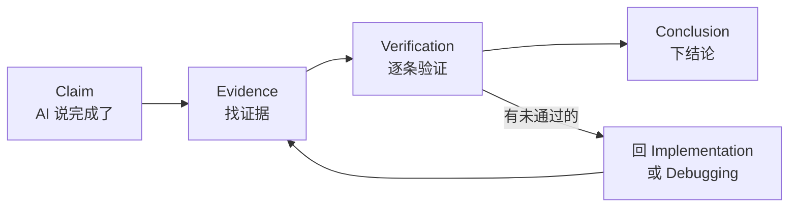

# Verification Before Completion（完成前验证）

> ⚠️ Not Yet Verified

## Purpose

完成判定不靠 AI 自己说"做完了"，而是**按验收标准逐条核对**。每条都要有客观证据（跑了测试 / 手动复现确认），全部通过才算完成。

AI 最常见的问题：自己说"已完成"，但实际有功能没测、有报错没修、有验收点没过。这个技能就是堵住这个口子。

## When to Use

- AI 说"这个功能做完了 / 实现好了"——别直接信，先验证。
- 一个任务准备结束、要进入下一个任务前。
- 需要给"完成"下客观结论时。

## Trigger Conditions

- AI 输出"已完成 / 实现完成 / 功能已就绪"等完成声明。
- 任务清单里某任务标记为"待验证"。
- 用户问"这个功能做完了吗"。

## Preconditions

1. 验收标准清单已定义（每条可验证）。
2. 功能已实现，代码已过 code-review。
3. 有可执行的验证手段（测试 / 手动复现）。

## Workflow

1. **取该任务的验收标准清单**：从 task-planning 或需求文档取出所有验收点。
2. **逐条客观验证**：对每条标准，用测试跑或手动复现来确认。不能是"我觉得应该对了"，要有可指向的证据。
3. **标 ✅ / ❌**：通过标 ✅（附证据），不通过标 ❌（附原因）。
4. **有 ❌ 回到 implementation / debugging**：未通过的标准不能忽略，回到对应技能去修。
5. **全 ✅ 才算完成**：所有验收点通过，才判定本任务完成。遗留问题必须明文列出，不准藏。

## Rules

- **不接受 AI 的"已完成"声明**（原则 04 Evidence over claims）。必须有客观证据，不是声明。
- **遗留问题必须列出**，不准藏。哪怕只有一条没过，也要写明"这条没过，原因是 X"。
- 验证证据要可指向：测试名、请求结果、截图说明，不能是"测过了"三个字。
- 全部 ✅ 之前，任务状态保持"进行中"。

## Anti-Patterns

- ❌ AI 说"完成"就信——没有任何验证。
- ❌ 跳过验收直接进入下一功能——上一个功能可能根本没做完。
- ❌ 把已知问题藏着不报——假装全过。
- ❌ 验收标准模糊（"好用就行"）——无法客观验证。

## Validation

> 本技能 V0.1 新写，尚未经实际运行验证。

**Expected Validation Steps**：
1. 在真实项目里对 3 个功能做完成前验证。
2. 检查是否：每条标准有证据、有 ❌ 时回到实现/排障、遗留问题全列出。
3. 故意留一个未通过项，确认流程能拦截"假完成"。
4. 收集至少 2 个真实使用案例后，更新 verified 与 last_verified 字段。

验证状态：⚠️ Not Yet Verified — 待按 Expected Validation Steps 实际运行后更新。

## Output Format

```
任务：<名称>
验收标准核对：
  1. <标准> → ✅（证据：<测试名/请求结果>）
  2. <标准> → ❌（原因：<...>）
  ...
遗留问题：<列出，无则写"无">
完成判定：完成 / 未完成（待修复 N 条）
```

## Claim → Evidence → Verification → Conclusion

> 小白解释：AI 说"我做完了"叫 Claim（声明）。你得找 Evidence（证据）来 Verify（验证），最后才下 Conclusion（结论）。声明 ≠ 验证。



### 多级验证示例

AI 说："登录功能已经完成。"

不能直接信。逐级验证：

| 验证级别 | 验证什么 | 方法 | AI 声称通过？ | 实际 |
| --- | --- | --- | --- | --- |
| 代码存在 | 登录相关文件有实际代码 | `grep -r "login" src/` | — | ✅ 有 |
| Build 成功 | 项目能编译 | `npm run build` | "能编译" | ✅ 通过 |
| 测试通过 | 登录测试跑过 | `npm test -- --grep login` | "测试过了" | ✅ 3/3 通过 |
| 接口能调用 | POST /api/login 能返回 | `curl -X POST /api/login` | "能调" | ✅ 返回 200 |
| 错误场景正常 | 密码错返回 401 | `curl -X POST -d 'wrong'` | "做了" | ❌ 返回 500 |
| 数据库正确 | 登录后写 session | 查 DB session 表 | — | ❌ 没写 |

**结论**：登录功能 **未完成**（4/6 通过，2 项 ❌）。AI 说"完成了"是过度声明。

> **核心原则**：AI 的"已完成"声明只是 Claim，不构成验证。只有客观证据才能下结论。

## Example

验收"创建笔记"功能的 3 条标准，逐条给证据。

验收标准：
1. 正常请求返回 201 + 笔记数据
2. 空 title 返回 400
3. 超长 title 返回 400

逐条验证：

```
任务：创建笔记
验收标准核对：
  1. 正常请求返回 201 + 笔记数据
     → ✅ 证据：测试 test('正常创建笔记返回 201') 通过
              curl 请求返回 201 + {id:1, title:"标题", content:"内容"}
  2. 空 title 返回 400
     → ✅ 证据：测试 test('空标题返回 400') 通过
              curl 请求返回 400 + {error:"title 不能为空"}
  3. 超长 title 返回 400
     → ✅ 证据：测试 test('超长标题返回 400') 通过
              curl 请求返回 400
遗留问题：无
完成判定：完成（3/3 ✅）
```

三条标准全有客观证据（测试 + 请求结果），不是"我觉得做完了"。全部 ✅ → 判定完成，可以进入下一个任务。
