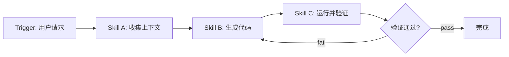
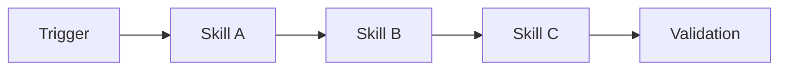

# Workflow 模板说明（Workflow Template）

一个「工作流（Workflow）」把多个技能串成一条 **Trigger → Skill A → Skill B → Skill C → Validation** 的流水线。每个工作流是一个目录 `workflows/<workflow-name>/README.md`。

## 必需形态

一个工作流的 `README.md` 必须展示：

1. **Trigger（触发）** — 什么启动该工作流。
2. **Steps（步骤）** — 有序的技能调用（Skill A → Skill B → Skill C）。
3. **Validation（验证）** — 最终输出如何被验证。

## Mermaid 示例



## 模板正文（复制下方内容到你的工作流 README）

````markdown
# {{Workflow Name（工作流名称）}}

## Trigger（触发）

> 什么启动本工作流。

## Steps（步骤）

1. Skill A — `skills/<category>/<skill-a>/SKILL.md`
2. Skill B — `skills/<category>/<skill-b>/SKILL.md`
3. Skill C — `skills/<category>/<skill-c>/SKILL.md`

## Mermaid



## Validation（验证）

> 工作流最终输出如何被验证。
````

## 相关

- 工作流通过 [`../../scripts/validate-registry.py`](../../scripts/validate-registry.py)（经 `registry/workflows.yaml`）校验。
- 注册表：[`../../registry/workflows.yaml`](../../registry/workflows.yaml)
