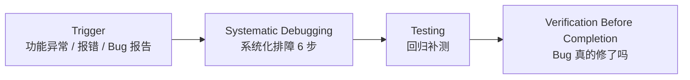

# Debugging · 系统化排障

> 🎯 **一句话**：遇到 Bug 别乱改，按步骤找到根因再修，修完还要确认没再坏别的地方。

⚠️ **Not Yet Verified — 流程已定义，尚未在真实项目中完整跑通。**

---

## Trigger · 什么情况下启动本流程

当你出现下面任意一种情况时，就启动本流程：

- **功能运行异常**（点按钮没反应 / 页面白屏 / 数据不对）
- 有**报错信息 / 堆栈 / 错误日志**（不管是控制台、后端还是 CI 里）
- QA / 用户报告了一个**可复现的 Bug**
- 你怀疑"这块逻辑可能有问题，但还没证明确实有问题"

> 💡 小贴士：如果是想"改善结构"但功能本身没错，走 [refactoring](../refactoring/README.md)。排障过程中发现代码结构太乱，也可以先补一个小重构流程。

---

## Skill Chain · 技能链

---

## Steps · 步骤详解

### Step 1 — Systematic Debugging · 系统化排障（6 步）

这是一个**单技能的 6 子步骤**，核心是：别急着改代码，先锁定根因。

#### 1-1 复现（Reproduce）
先**稳定复现**。写下触发 Bug 的**最小步骤**（Step 1 / Step 2 / Step 3）和期望/实际结果。  
如果连复现都不稳定，先不要修。

#### 1-2 最小用例（Minimal Repro）
把触发条件缩到最小：关掉无关模块、减少输入、去掉装饰。  
目标是用"尽可能短的输入 + 尽可能少的代码"复现同一个 Bug。

#### 1-3 二分定位（Binary Search / Bisect）
用**二分法**找 Bug 是哪一段代码引入的：
- 有 git：`git bisect` 或手动 checkout 到一半的版本
- 没 git：注释掉一半代码 / 改一半逻辑，观察 Bug 是否还在
- 锁定到具体**函数 / 模块 / 一行**

#### 1-4 根因分析（Root Cause）
回答 3 个问题：
1. Bug 的**直接原因**是什么？（"变量 A 空了"）
2. 为什么会出现？（"上游接口可能返回 null，但没做空判断"）
3. 更深层的根本原因？（"没写异常处理 / 没加单测 / 需求漏了边界条件"）

建议写一张 RCA（Root Cause Analysis）小条子，一两百字也行。

#### 1-5 最小修复（Minimal Fix）
只做"**刚好能修 Bug**"的最小代码改动。  
**不要顺手**：不要顺手改命名、不要顺手优化性能、不要顺手加功能。  
改了什么就为什么服务，其他事情开别的流程。

#### 1-6 回归确认（Regression Check）
跑一遍最小用例：Bug 真的没了 ✅  
再跑一遍受影响功能的旧用例：没把别的带坏 ⚠️

关联技能：
- [../../skills/core/systematic-debugging/README.md](../../skills/core/systematic-debugging/README.md)
- [../../skills/core/systematic-debugging/SKILL.md](../../skills/core/systematic-debugging/SKILL.md)

关联 Prompt：
- [../../prompts/debugging/debug-error.md](../../prompts/debugging/debug-error.md) · 通用报错排查
- [../../prompts/debugging/analyze-stacktrace.md](../../prompts/debugging/analyze-stacktrace.md) · 有堆栈时用
- [../../prompts/debugging/fix-regression.md](../../prompts/debugging/fix-regression.md) · 修完后回归出问题时用

---

### Step 2 — Testing · 回归补测

目标：把"这次 Bug 涉及 + 被影响"的功能都测一遍，防止修一个炸三个。

关键动作：
- 给这次的 Bug 写一个**针对性单测 / 集成测**（防止下次再犯）
- 跑受影响模块的全部**旧测试**（回归测试）
- 没自动化测试的，至少列出**手测清单**并一条条过
- 有失败 → 回 Step 1-5，改完再跑，直到全绿

关联技能：
- [../../skills/core/testing/README.md](../../skills/core/testing/README.md)
- [../../skills/core/testing/SKILL.md](../../skills/core/testing/SKILL.md)

关联 Prompt：
- [../../prompts/testing/write-tests.md](../../prompts/testing/write-tests.md)
- [../../prompts/testing/verify-feature.md](../../prompts/testing/verify-feature.md)

---

### Step 3 — Verification Before Completion · 完工核查

目标：确认 Bug 真的修了，而且没搞出新 Bug。

关键动作：
- 用最小复现步骤再跑一遍，**截图 / 日志留存**，证明 Bug 消失
- 验收 3 条：① Bug 不复现 ② 旧功能正常 ③ 新补测试全绿
- 记录：下次怎么避免？（加单测 / 加判断 / 补文档）

关联技能：
- [../../skills/core/verification-before-completion/README.md](../../skills/core/verification-before-completion/README.md)
- [../../skills/core/verification-before-completion/SKILL.md](../../skills/core/verification-before-completion/SKILL.md)

---

## Validation · 流程完成判定标准

满足下面**全部 5 条**才算本流程真的做完：

1. ✅ 有**可稳定复现的最小步骤**文档
2. ✅ 明确写出了**根因**（不是只写了"修好了"）
3. ✅ 用最小修改修好了 Bug，并且**没有顺便改别的**
4. ✅ 补了**针对性测试**，加上旧回归测试**全部通过**
5. ✅ 核查通过：最小复现步骤 + 受影响旧功能 + 新测试 100% ✅

---

## Common Deviations · 常见偏离

| 偏离 | 长什么样 | 后果 | 怎么纠偏 |
|---|---|---|---|
| ⚠️ **改 A 坏 B，到处乱改** | 看到症状就改这改那，改完出现更多报错 | 陷入"无限修 Bug 循环" | 立即停止改代码，回 Step 1-1 ~ 1-4 老实定位根因 |
| ⚠️ **不复现就修** | 没复现就凭感觉改了一处，说"应该好了" | Bug 依然存在，甚至把代码改坏 | 先稳定复现，否则不提交修复 |
| ⚠️ **不做回归测试** | 修完就交，没跑旧测试 | 上线发现 3 个旧功能挂了 | 回 Step 2，强制跑受影响模块的旧测试 |
| ⚠️ **修 Bug 顺手大改结构** | 修 Bug 顺便重构一堆模块 | Review 看不出真正修复点，引入新 Bug | 重构单独开 [refactoring](../refactoring/README.md) 流程，先把 Bug 修最小版 |
| ⚠️ **写根因=写报错文字** | 根因写"xxxError"就完事 | 下次还会犯同类错误 | 必须回答 1-4 的 3 个问题：直接原因 / 为什么出现 / 深层根本原因 |

> 🔔 延伸阅读：容易陷入无限排障循环的同学，请看 [../../anti-patterns/endless-debug-loop.md](../../anti-patterns/endless-debug-loop.md)。

---

## Related Workflows · 关联流程

- 🔗 [**feature-development**](../feature-development/README.md) — 加新功能时 Bug 最多，Debug 是它的好兄弟。
- 🔗 [**refactoring**](../refactoring/README.md) — 代码烂才难排 Bug，排完想顺便整理结构走它。
- 🔗 [**start-project**](../start-project/README.md) — 新项目跑起来出错，先 Debug 再继续做其他功能。
- 🔗 [**release**](../release/README.md) — 发布前最后一次 Bug 清扫，先过 Debug 再上 Release。
- 🛑 [**anti-patterns/endless-debug-loop**](../../anti-patterns/endless-debug-loop.md) — 防止"越修越乱"。
