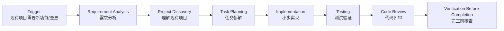

# Feature Development · 给现有项目加一个功能

> 🎯 **一句话**：在已经存在的项目上，安全地加新功能 / 修一个需求级变更。

⚠️ **Not Yet Verified — 流程已定义，尚未在真实项目中完整跑通。**

---

## Trigger · 什么情况下启动本流程

当你出现下面任意一种情况时，就启动本流程：

- **现有项目想加一个新功能**（比如加收藏 / 加导出 / 加支付）
- 产品 / 需求文档里提出了一个**需求级变更**（不是小 typo 那种）
- 想把一个旧模块"升级"成新版行为（如旧版登录 → OAuth 登录）

> 💡 小贴士：如果项目还不存在、是从 0 到 1 启动，走 [start-project](../start-project/README.md)。如果只是代码报错，走 [debugging](../debugging/README.md)。

---

## Skill Chain · 技能链

---

## Steps · 步骤详解

### Step 1 — Requirement Analysis · 需求分析

目标：弄清楚"加的到底是什么"、"和现有模块的关系"、"怎么才算做对了"。

关键动作：
- 先读现有项目的 README / 架构 / 相关代码，搞懂现在是怎么跑的
- 输出需求条目：**FR（功能需求）+ NFR（非功能需求）+ 验收条件**
- 特别写清楚：**对现有功能的影响**（哪些会变 / 哪些绝对不能变）

关联技能：
- [../../skills/core/requirement-analysis/README.md](../../skills/core/requirement-analysis/README.md)
- [../../skills/core/requirement-analysis/SKILL.md](../../skills/core/requirement-analysis/SKILL.md)

关联 Prompt：
- [../../prompts/start-here/understand-project.md](../../prompts/start-here/understand-project.md) · 理解现有项目结构
- [../../prompts/architecture/analyze-requirement.md](../../prompts/architecture/analyze-requirement.md)

---

### Step 2 — Task Planning · 任务拆解

目标：把"加功能"拆成 ≤ 半天能做完的小任务，标出依赖。

关键动作：
- 每个任务：标题 + 预计工时（≤ 4 小时）+ 输入 + 产出
- 显式列出 **"回归测试任务"**（确认旧功能没被破坏）
- 产出开发计划，可以直接当 Checklist 用

关联技能：
- [../../skills/core/task-planning/README.md](../../skills/core/task-planning/README.md)
- [../../skills/core/task-planning/SKILL.md](../../skills/core/task-planning/SKILL.md)

关联 Prompt：
- [../../prompts/architecture/write-development-plan.md](../../prompts/architecture/write-development-plan.md)

---

### Step 3 — Implementation · 小步实现

目标：一个任务一个任务做，每个任务做完立刻验证效果。

关键动作：
- 保持与现有代码风格一致（看一下周围代码怎么写的）
- 每做完一个任务，跑一下当前能用的最小版本
- 不要"顺便"修别的 bug / 改别的模块，专注当前任务

关联技能：
- [../../skills/core/implementation/README.md](../../skills/core/implementation/README.md)
- [../../skills/core/implementation/SKILL.md](../../skills/core/implementation/SKILL.md)

关联 Prompt：
- [../../prompts/coding/implement-feature.md](../../prompts/coding/implement-feature.md)
- [../../prompts/coding/explain-code.md](../../prompts/coding/explain-code.md) · 不理解现有代码时用它问 AI

---

### Step 4 — Testing · 测试验证

目标：新功能要对、旧功能不能坏。

关键动作：
- **新功能测试**：单测 + 集成测 + 关键路径手测
- **回归测试**（Regression）：把本模块 + 被影响模块的旧测试全跑一遍
- 把跑不通的地方记下来，回到实现去修，不要"假装没看到"

关联技能：
- [../../skills/core/testing/README.md](../../skills/core/testing/README.md)
- [../../skills/core/testing/SKILL.md](../../skills/core/testing/SKILL.md)

关联 Prompt：
- [../../prompts/testing/write-tests.md](../../prompts/testing/write-tests.md)
- [../../prompts/testing/verify-feature.md](../../prompts/testing/verify-feature.md)
- [../../prompts/debugging/fix-regression.md](../../prompts/debugging/fix-regression.md) · 跑出回归错误时用它修

---

### Step 5 — Code Review · 代码评审

目标：用结构化清单 Review，看新代码有没有踩坑、有没有破坏风格。

关键动作：
- 用 Code Review Checklist 逐条过：命名 / 风格一致 / 异常处理 / 安全 / 性能
- **重点检查**：对原有代码的改动是否合理，有没有"不该动的地方动了"
- 记录评审结论：OK / 修改项列表 → 修改后再 Review

关联技能：
- [../../skills/core/code-review/README.md](../../skills/core/code-review/README.md)
- [../../skills/core/code-review/SKILL.md](../../skills/core/code-review/SKILL.md)

关联 Prompt：
- [../../prompts/review/code-review.md](../../prompts/review/code-review.md)

---

### Step 6 — Verification Before Completion · 完工前核查

目标：最后过一遍，确认新功能真的做对了、旧的真的没坏。

关键动作：
- 对需求验收条件，逐条 ✅
- 跑一遍端到端 Demo（先跑新功能，再跑受影响的旧功能）
- 填写"已验证 / 未验证 / 风险项"三栏，风险项必须写缓解措施

关联技能：
- [../../skills/core/verification-before-completion/README.md](../../skills/core/verification-before-completion/README.md)
- [../../skills/core/verification-before-completion/SKILL.md](../../skills/core/verification-before-completion/SKILL.md)

---

## Validation · 流程完成判定标准

满足下面**全部 6 条**才算本流程真的做完：

1. ✅ 有需求文档（FR+NFR+验收条件，含对旧功能影响说明）
2. ✅ 有开发计划，且所有小任务都已标记完成
3. ✅ 新功能在本地主流程跑通，可 Demo
4. ✅ **新功能 + 回归**测试 ≥ 1 组，且全部通过
5. ✅ 完成 ≥ 1 次结构化 Code Review，修改项已落地
6. ✅ 完工前核查 100% 打勾，未验证项 ≤ 0

---

## When to Pause · 何时暂停 / 人工确认

| 检查点 | 原因 | 谁来拍板 |
| --- | --- | --- |
| 验收标准写完后（Step 1 结束） | "做到什么算完成"决定方向，AI 写的验收点可能遗漏边界 | 人确认验收标准 |
| 实现完成后、进入 Review 前 | 代码刚写完，可能有隐藏问题，AI 不会自己质疑 | 人做 Code Review |
| Review 发现架构级问题 | 超出本功能范围，需要改架构，继续做只会错上加错 | 人决定是暂停还是继续 |

> 💡 原则 05 Human owns decisions——验收标准和 Review 结论必须由人确认，AI 不能自己拍板说"做完了"。

## Human Approval Gates · 人工审批门

> 哪些操作可以让 AI 自动完成，哪些必须人确认。

| Gate | 位置 | AI 可以自动做 | 必须人确认 |
| --- | --- | --- | --- |
| Gate 1 | 需求分析后 | 分析需求、列验收点 | MVP 范围、需求优先级 |
| Gate 2 | 项目理解后 | 扫描目录、读配置 | 哪些模块可以改、哪些不能动 |
| Gate 3 | 任务拆解后 | 拆子任务、排依赖 | 任务顺序、是否可以并行 |
| Gate 4 | 实现过程中 | 写代码、跑构建 | 架构级变更、跨模块改动 |
| Gate 5 | Code Review 后 | 修 lint 问题、补注释 | 合入主分支、发布 |

> 原则：AI 写代码和跑测试可以自动，但"这个功能做完了可以合入"必须人拍板。

## Common Deviations · 常见偏离

| 偏离 | 长什么样 | 后果 | 怎么纠偏 |
|---|---|---|---|
| ⚠️ **不拆任务一次写完** | 坐下来一口气把整个功能写完再看结果 | Bug 攒一堆，排不动，自己都忘了写了啥 | 回 Step 2，拆成 ≤ 4 小时小任务，一个一个做 |
| ⚠️ **没理解现有项目就上手** | 不读 README / 不看现有代码，照着印象写 | 风格不一致、重复造轮子、破坏既有约定 | 先跑 [understand-project.md](../../prompts/start-here/understand-project.md)，搞懂项目再动手 |
| ⚠️ **不跑旧测试** | 只测了新功能，旧测试全跳过 | "改 A 坏 B"，上线才发现一堆老功能挂了 | 回 Step 4，强制跑回归，直到全绿 |
| ⚠️ **顺便改其他东西** | 做新功能时"顺手"把不相关的命名 / 结构也改了 | Review 很难看出真正的变化，容易引入隐 bug | 单独开一个 [refactoring](../refactoring/README.md) 流程做重构，和功能分离 |
| ⚠️ **需求没写验收条件** | 需求写得很飘，比如"做个好看的 UI" | 做完双方对"算不算做完"争议很大 | 回 Step 1，每条 FR 都补一条能客观判断的验收条件 |

---

## Related Workflows · 关联流程

- 🔗 [**start-project**](../start-project/README.md) — 如果项目还没启动，先走它。
- 🔗 [**debugging**](../debugging/README.md) — 加功能时发现 Bug，走它。
- 🔗 [**refactoring**](../refactoring/README.md) — 写完发现代码丑想拆，走它。
- 🔗 [**release**](../release/README.md) — 功能 OK 想发布，走它。
