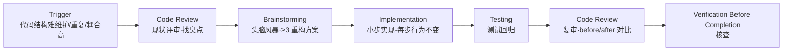

# Refactoring · 在不改变行为前提下改善结构

> 🎯 **一句话**：功能对的就是写得烂，想把代码变漂亮 / 更易维护，但外部行为一点都不能变。

⚠️ **Not Yet Verified — 流程已定义，尚未在真实项目中完整跑通。**

---

## Trigger · 什么情况下启动本流程

当你出现下面任意一种情况时，就启动本流程：

- **代码结构难维护**（一个函数 200 行 / 一个文件塞 10 个类 / 改一处牵十处）
- **代码重复高**（Copy-Paste 出 3 份几乎一样的逻辑，想合并）
- **耦合太高**（模块 A 和 B 互相乱调用，牵一发动全身）
- 想**命名更清楚 / 注释更完整 / 删掉死代码**等纯结构改进
- 看到"代码坏味道"（Code Smell）想整理

> 💡 **红线**：重构 ≠ 加新功能 ≠ 修 Bug。行为不能变。想加功能走 [feature-development](../feature-development/README.md)，想修 Bug 走 [debugging](../debugging/README.md)。

---

## Skill Chain · 技能链

---

## Steps · 步骤详解

### Step 1 — Code Review · 现状评审（找臭点）

目标：先看清楚"哪里烂"，列个清单，不要盲目大刀阔斧。

关键动作：
- 用 Code Review Checklist 扫一遍目标区域
- 输出"**臭点清单**"：重复代码 / 长函数 / 命名差 / 耦合 / 死代码 / 缺注释 ...
- 每个臭点给**严重度**（高/中/低）和**影响范围**，标出本次准备处理的范围

关联技能：
- [../../skills/core/code-review/README.md](../../skills/core/code-review/README.md)
- [../../skills/core/code-review/SKILL.md](../../skills/core/code-review/SKILL.md)

关联 Prompt：
- [../../prompts/review/code-review.md](../../prompts/review/code-review.md)

---

### Step 2 — Brainstorming · 头脑风暴（≥3 重构方案）

目标：别一上来就照着感觉拆，至少想 3 种拆法，选最稳的。

关键动作：
- 列出 **3 种以上重构方案**（例：拆函数 / 抽类 / 引入设计模式 / 改模块边界）
- 对比表：改动量 / 风险 / 可读性收益 / 后续可扩展性
- 选一个方案，**明确本次不做什么**（避免 Scope 膨胀）

关联技能：
- [../../skills/core/brainstorming/README.md](../../skills/core/brainstorming/README.md)
- [../../skills/core/brainstorming/SKILL.md](../../skills/core/brainstorming/SKILL.md)

---

### Step 3 — Implementation · 小步实现（每步行为不变）

目标：一小步一小步改，每改一步都"能跑、行为和原来一模一样"。

关键动作：
- 把重构拆成**若干独立小步**（≤ 4 小时/步，每步独立可回退）
- 每小步结束：跑一遍现有测试 / 最小 Demo，**行为和之前完全一致**
- 严格：**不顺便加功能、不顺便修 Bug、不顺便改对外 API**
- 每一步做 Before → After 的小对比，方便后面复审

关联技能：
- [../../skills/core/implementation/README.md](../../skills/core/implementation/README.md)
- [../../skills/core/implementation/SKILL.md](../../skills/core/implementation/SKILL.md)

关联 Prompt：
- [../../prompts/coding/refactor-code.md](../../prompts/coding/refactor-code.md)

---

### Step 4 — Testing · 测试回归

目标：证明"改了结构，但行为 100% 没变"。

关键动作：
- **先确保有测试**：没有就先补一组覆盖关键路径的测试（重构前先写）
- 跑**全部相关测试**（单测 + 集成 + 手测关键路径）
- 重构前后都跑一次，结果要**一模一样**（除了你预期变快的性能外）
- 有失败 → 回上一小步，检查哪一步行为变了

关联技能：
- [../../skills/core/testing/README.md](../../skills/core/testing/README.md)
- [../../skills/core/testing/SKILL.md](../../skills/core/testing/SKILL.md)

关联 Prompt：
- [../../prompts/testing/write-tests.md](../../prompts/testing/write-tests.md)
- [../../prompts/testing/verify-feature.md](../../prompts/testing/verify-feature.md)

---

### Step 5 — Code Review · 复审（Before / After 对比）

目标：对比重构前后，确认"变的是结构，不是行为"。

关键动作：
- 做一张 **Before vs After 对照表**：结构、模块边界、关键函数签名
- 用 Code Review Checklist 复审：有没有改到不该改的地方 / 有没有留下死代码
- 如果对比出来"行为变了"，退回 Step 3 修，直到行为全一致

关联技能：
- [../../skills/core/code-review/README.md](../../skills/core/code-review/README.md)
- [../../skills/core/code-review/SKILL.md](../../skills/core/code-review/SKILL.md)

关联 Prompt：
- [../../prompts/review/code-review.md](../../prompts/review/code-review.md)

---

### Step 6 — Verification Before Completion · 完工核查

目标：最后打勾，交付物齐全、行为没变、臭点真的清了。

关键动作：
- 臭点清单：每条标记 ✅（清了） / 🔴（留到下次，附理由）
- Before/After 对比有文档；测试重构前后结果一致 ✅
- 记录"后续还要做的重构"，留个 TODO 给下次

关联技能：
- [../../skills/core/verification-before-completion/README.md](../../skills/core/verification-before-completion/README.md)
- [../../skills/core/verification-before-completion/SKILL.md](../../skills/core/verification-before-completion/SKILL.md)

---

## Validation · 流程完成判定标准

满足下面**全部 6 条**才算本流程真的做完：

1. ✅ 有**臭点清单** + 严重度 + 范围，每条要么清了要么有不处理理由
2. ✅ 做过 ≥ 3 个重构方案对比，有选型理由
3. ✅ 拆成了多步独立小改动，每步都能回退
4. ✅ **有测试**（没有就补过），重构前后测试结果一致
5. ✅ 有 Before / After 对比并完成结构化复审
6. ✅ 完工核查 100% 打勾

---

## When to Pause · 何时暂停 / 人工确认

| 检查点 | 原因 | 谁来拍板 |
| --- | --- | --- |
| 影响分析完成后（Step 1 结束） | 重构范围决定风险大小，AI 可能低估影响面 | 人确认重构范围 |
| 重构方案出来后（Step 2 结束） | 方案决定改动方式，AI 的方案可能过度或遗漏 | 人确认重构方案 |
| 重构完成后、合入前 | 需要确认行为没变，AI 不会自动质疑自己的产出 | 人确认测试全绿 + Code Review |

> 💡 重构的底线：行为不变。如果测试没过就不能合入，必须人确认。

## Common Deviations · 常见偏离

| 偏离 | 长什么样 | 后果 | 怎么纠偏 |
|---|---|---|---|
| ⚠️ **重构顺便加功能** | 拆函数的同时"顺手加了个导出按钮" | 没人知道 Bug 是重构带的还是新功能带的，Review 巨难 | 立刻停掉新功能的部分，先把纯重构做完，新功能开 feature-development 流程 |
| ⚠️ **无测试就大改** | 一个测试都没有就把大模块整个拆了 | 行为变了没人知道，排 Bug 到哭 | 先补关键路径测试，再重构。测试不补不拆 |
| ⚠️ **没有 Before/After 对比** | 改完了，但说不清"改了啥、为什么这么改" | 复审时一眼瞎，下次想改回去都不知道原来长啥样 | 强制 Step 5 做对照表，改前截图 / 留片段 |
| ⚠️ **一步改太多** | 把 5 个函数 + 2 个类 + 模块边界一次改完 | 出问题根本不知道哪一步的锅，回退困难 | 回 Step 3，拆成独立小步，每步结束都跑一遍测试 |
| ⚠️ **Scope 越改越大** | 本来想"改个函数名"，结果改了整个模块的架构 | 做不完，延期严重，心理上还挫败 | Step 2 里写清楚"本次不做什么"，列在墙上，超了就下次再说 |

---

## Related Workflows · 关联流程

- 🔗 [**debugging**](../debugging/README.md) — 代码烂导致 Bug 多，先 Debug 再 Refactor，或反过来。
- 🔗 [**feature-development**](../feature-development/README.md) — 做新功能时顺便想拆结构，先做完功能，再单独开重构。
- 🔗 [**code-review skill**](../../skills/core/code-review/README.md) — Step 1 和 Step 5 都用它，核心技能。
- 🔗 [**testing skill**](../../skills/core/testing/README.md) — 重构的安全网，没它别拆。
- 🔗 [**release**](../release/README.md) — 发布前想做大重构？一般不推荐，除非有完整测试 + 回滚方案。
