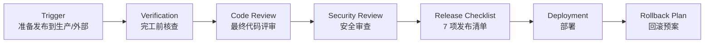

# Release · 发布前检查清单 + 回滚预案

> 🎯 **一句话**：准备上线 / 发外部版本时，别带 bug、别带密钥、失败了能一键退回来。

⚠️ **Not Yet Verified — 流程已定义，尚未在真实项目中完整跑通。**

---

## Trigger · 什么情况下启动本流程

当你出现下面任意一种情况时，就启动本流程：

- **准备发布到生产环境**（线上真实用户用的环境）
- **准备发给外部用户 / 客户**使用（不管是安装包还是在线地址）
- 准备打**正式版本标签**（Tag / Release / v1.x.x）
- 要部署到**非开发环境**（Staging 预发 / UAT 用户验收 / Production 生产）

> 💡 小贴士：只是本地开发跑通了、还没想过给别人用，先别急着走 Release。做完其他流程再说。

---

## Skill Chain · 技能链

---

## Steps · 步骤详解

### Step 1 — Verification Before Completion · 完工前核查

目标：在发布前，把前面流程交付物再逐条过一遍，别漏。

关键动作：
- 拿出项目 / 功能流程的"核查清单"，重新打勾一遍
- 跑一遍端到端 Demo（从启动到核心功能走完全程），**录屏留档**
- 记录"本次发布内容"和"本次**不**发什么"（避免 Scope 漂移）

关联技能：
- [../../skills/core/verification-before-completion/README.md](../../skills/core/verification-before-completion/README.md)
- [../../skills/core/verification-before-completion/SKILL.md](../../skills/core/verification-before-completion/SKILL.md)

---

### Step 2 — Code Review · 最终代码评审

目标：最后一次从代码层面挡低级错误。

关键动作：
- 用 Code Review Checklist **整仓库扫一遍**（关键路径优先）
- 重点看：生产环境不会进的 DEBUG 开关、注释掉的代码、临时补丁
- 把评审发现的问题按严重度排队，**严重的必须修完再继续**

关联技能：
- [../../skills/core/code-review/README.md](../../skills/core/code-review/README.md)
- [../../skills/core/code-review/SKILL.md](../../skills/core/code-review/SKILL.md)

关联 Prompt：
- [../../prompts/review/code-review.md](../../prompts/review/code-review.md)

---

### Step 3 — Security Review · 安全审查

目标：上线前把"硬编码密钥 / 注入 / 泄露"这些经典坑堵上。

关键动作：
- 扫一遍仓库：有没有 AK/SK / Token / Password / 私有 IP **硬编码**
- 查输入校验：用户输入有没有长度 / 类型 / 格式校验（防注入）
- 查权限 / 认证：管理员接口是不是谁都能调、敏感数据是否脱敏
- 发现严重问题 → 走 [debugging](../debugging/README.md) 修完再继续

关联 Prompt：
- [../../prompts/review/security-review.md](../../prompts/review/security-review.md)

> 🔔 反模式提醒：硬编码密钥是典型失误，详见 [../../anti-patterns/secret-leak.md](../../anti-patterns/secret-leak.md)。

---

### Step 4 — Release Checklist · 发布清单（强制 7 项）

> 本 Step 配套完整清单模板：[../../prompts/deployment/release-checklist.md](../../prompts/deployment/release-checklist.md)

**7 项必须全部 ✅，少一项不发布**：

| # | 项目 | 说明 | 通过标志 |
|---|---|---|---|
| 1 | 🧪 **测试全部通过** | 单测 + 集成测 + 手测关键路径，结果全绿 | CI 截图 / 运行日志 |
| 2 | ✅ **验收完成** | 需求验收条件逐条勾完，Demo 录屏留档 | 核查文档 + 录屏 |
| 3 | 🔐 **密钥已清** | 仓库/配置无硬编码密钥；生产密钥通过环境变量或密钥管理注入 | 安全扫描结果 + 审查记录 |
| 4 | 📖 **文档更新** | README / 部署文档 / 使用文档 / 变更说明都更新了 | 文档 Diff / 已读签字 |
| 5 | ⏪ **回滚方案** | 见 Step 6，必须提前写好，并在预发演练过一次 | 回滚 SOP + 演练记录 |
| 6 | 🏷️ **版本号** | 按语义化版本（SemVer：主.次.补丁）打好版本号 / Tag | Tag 截图 |
| 7 | 📝 **Changelog** | 本次发布"新增 / 修复 / 变更 / 废弃 / 已知问题"，写清楚 | CHANGELOG.md 条目 |

---

### Step 5 — Deployment · 部署

目标：把发布包 / 代码部署到目标环境，并**立刻验证部署成功**。

关键动作：
- 优先走预发（Staging）环境部署 → 验证 → 再到生产（Production）
- 部署后立刻跑：**冒烟测试**（Smoke Test，5 分钟内能走完的关键路径）
- 盯关键指标：错误率 / 响应时间 / 核心接口成功率
- 有异常 → 不要慌，直接执行 Step 6 的回滚预案

---

### Step 6 — Rollback Plan · 回滚预案

目标：**出问题时一键退回上一版**，别现场琢磨怎么回滚。

至少写清楚下面 5 件事：

1. **触发条件**：什么情况必须回滚？（例：错误率 > 5% 持续 5 分钟 / 核心接口 4xx/5xx / 冒烟失败）
2. **回滚命令**：具体到可复制粘贴的 1 条或几条命令（例：`git revert <tag>` + `kubectl rollout undo`）
3. **回滚到的版本**：明确"上一个稳定版"的 Tag / 版本号
4. **回滚后验证**：回滚完跑哪些冒烟测来证明"回到正常"
5. **联系人与优先级**：谁有权执行回滚、出大事先喊谁（留联系方式 + 响应 SLA）

**强烈建议**：预发环境**演练一次回滚**，确认命令真的能用，不要等出了故障再试。

---

## Validation · 流程完成判定标准

满足下面**全部 7 条**才算本流程真的做完（发布成功）：

1. ✅ 完工前核查 100% 打勾，Demo 录屏留档
2. ✅ 最终 Code Review 通过，严重问题 0
3. ✅ Security Review 通过，硬编码密钥 0
4. ✅ **7 项 Release Checklist 全部 ✅**，每项有通过证据
5. ✅ 预发 / 生产冒烟测试全过，核心指标正常
6. ✅ 回滚预案写完整，并在预发**演练过一次**成功
7. ✅ 版本号 Tag 打好，CHANGELOG 已更新到线上可查看

---

## Common Deviations · 常见偏离

| 偏离 | 长什么样 | 后果 | 怎么纠偏 |
|---|---|---|---|
| ⚠️ **Release Checklist 走形式** | 清单一眼不看就全打勾 | 漏项上线，出问题才发现密钥没清 / 文档没更 | 清单每项必须有"证据"（截图 / 日志），没证据不打勾 |
| ⚠️ **没有回滚方案** | 直接发布，说"出问题再想办法" | 真出事了手忙脚乱，故障时间被拉长 N 倍 | Step 6 必须写完 + 预发演练一次，才允许上生产 |
API_KEY = "$YOUR_PROD_KEY"  <!-- safe: placeholder --> (must come from env var, never hardcode)
| ⚠️ **跳过预发直接上生产** | "反正我本地测过了"，直接推生产 | 真实环境差异（配置 / 数据库 / 网络）直接炸用户 | 强制 Staging → 测过 → 再 Production；没预发环境就搭一个最小的 |
| ⚠️ **没写 Changelog / 版本号乱打** | 版本一会 v0.1-beta2 一会 v1.0.0，Change 全靠猜 | 用户不知道更新了啥，出问题无法定位是哪版 | 强制语义化版本（SemVer）+ 每条发布补 CHANGELOG |
| ⚠️ **发布后不盯指标** | 发布完就去干别的了 | 挂了 2 小时才有人发现，已经炸了一大片 | 发布后至少盯 30 分钟关键指标；设告警阈值，触发就报警 |

---

## Related Workflows · 关联流程

- 🔗 [**start-project**](../start-project/README.md) — 新项目第一次上线，把 start-project 的收尾 + release 串起来用。
- 🔗 [**feature-development**](../feature-development/README.md) — 加完功能准备发版，通常 feature-development → release 是一条线。
- 🔗 [**debugging**](../debugging/README.md) — 发布前扫到问题，或者上线冒烟失败，先 Debug 修。
- 🔗 [**refactoring**](../refactoring/README.md) — 大重构后想发布，风险极高，Release Checklist 和回滚预案请做足。
- 🧾 [**release-checklist Prompt**](../../prompts/deployment/release-checklist.md) — Step 4 配套的发布清单，直接照抄打勾。
- 🛡️ [**security-review Prompt**](../../prompts/review/security-review.md) — Step 3 安全审查详细模板。
